## item_237_hybrid_ai_generation_mode_and_mermaid_safety_validation_in_mermaid_generator_skill - Hybrid AI generation mode and Mermaid safety validation in mermaid-generator skill
> From version: 1.21.1+item237 (refreshed)
> Schema version: 1.0
> Status: Done
> Understanding: 97%
> Confidence: 91%
> Progress: 100% (refreshed)
> Complexity: High
> Theme: Logics kit skills and Mermaid quality
> Reminder: Update status/understanding/confidence/progress and linked task references when you edit this doc.

Derived from `logics/request/req_128_add_a_logics_mermaid_generator_skill_with_hybrid_ai_and_deterministic_fallback.md`

# Problem

The deterministic Mermaid templates (extracted in item_236) produce syntactically valid diagrams but semantically thin ones — they re-label a fixed shape without understanding the document content. With hybrid AI providers available (Ollama, OpenAI, Gemini), the skill can dispatch a compact bounded prompt to produce semantically richer diagrams, validated against the Mermaid safety rules before use.

**Gated on** item_236 being complete (skill package and fallback in place).

# Scope
- In: hybrid AI generation mode dispatching to providers in `ollama-first` policy order with a compact prompt built from doc kind, title, and key sections (`# Needs`, `# Acceptance criteria`, `# Plan`); `proposal-only` mode (returns a validated Mermaid block string, does not write to disk); Mermaid safety rule validation of AI output before acceptance; silent fallback to deterministic when no provider is ready or AI output fails validation; 8-second bounded timeout.
- Out: skill package scaffold (item_236), wiring into flow manager call sites (item_238), streaming or interactive Mermaid refinement.

```mermaid
%% logics-kind: backlog
%% logics-signature: backlog|hybrid-ai-generation-mode-and-mermaid-sa|req-128-add-a-logics-mermaid-generator-s|the-deterministic-mermaid-templates-extr|ac1-the-skill-supports-a-hybrid
flowchart LR
    Request[req_128_add_a_logics_mermaid_generator_ski] --> Problem[The deterministic Mermaid templates extrac]
    Problem --> Scope[Hybrid AI generation mode and Mermaid]
    Scope --> Acceptance[AC1: The skill supports a hybrid]
    Acceptance --> Tasks[task_112_orchestration_delivery_for_req_12]
```

# Acceptance criteria
- AC1: The skill supports a hybrid AI generation mode that dispatches to the configured provider (Ollama, OpenAI, or Gemini, in policy order) with a compact prompt built from the document kind (`request`, `backlog`, `task`), the document title, and the key content sections (`# Needs` or `# Problem`, `# Acceptance criteria`, `# Plan`). The hybrid flow is `proposal-only` — the skill returns a validated Mermaid block string, does not write to disk. The flow follows the shared hybrid contract: structured input, validated output, bounded Codex fallback, audit and measurement logging. A bounded timeout of 8 seconds applies — if exceeded, the skill falls back to deterministic immediately.
- AC2: The skill enforces the full Mermaid safety rule set before accepting any AI-generated output: ASCII labels only; no Markdown formatting inside node labels; no raw route syntax or braces in labels; flowchart direction `TD` for requests, `LR` for backlogs and tasks; node count bounded at max 8; `%% logics-kind` and `%% logics-signature` metadata comments present and correctly formed. Any AI output that fails these checks is rejected and the deterministic fallback is used silently.

# AC Traceability
- AC1 -> Maps to req_128 AC2. Proof: skill invoked with a request doc dispatches to Ollama when healthy; measurement log contains the run; returned string is a valid Mermaid block; if Ollama is unavailable, falls back to deterministic silently.
- AC2 -> Maps to req_128 AC5. Proof: AI output with a Unicode label is rejected and the deterministic block is returned instead; audit log records the rejection reason; operator sees no error.

# Decision framing
- Product framing: Not needed
- Architecture framing: Not needed

# Links
- Product brief(s): (none yet)
- Architecture decision(s): (none yet)
- Request: `logics/request/req_128_add_a_logics_mermaid_generator_skill_with_hybrid_ai_and_deterministic_fallback.md`
- Primary task(s): `logics/tasks/task_112_orchestration_delivery_for_req_124_to_req_128_across_hybrid_efficiency_claude_parity_and_mermaid_skill.md`

# AI Context
- Summary: Add the hybrid AI generation mode to the logics-mermaid-generator skill with ollama-first dispatch, a compact prompt from doc kind and key sections, Mermaid safety rule validation, silent fallback to deterministic on validation failure, and an 8-second bounded timeout.
- Keywords: hybrid AI, ollama-first, Mermaid safety rules, ASCII labels, flowchart TD LR, node count, proposal-only, safety validation, bounded timeout, deterministic fallback
- Use when: Implementing the hybrid dispatch path and safety validator in the logics-mermaid-generator skill after item_236 is complete.
- Skip when: Work is about the skill package scaffold (item_236) or wiring the skill into the flow manager (item_238).

# Priority
- Impact: High — enables semantically richer Mermaid diagrams across all workflow docs
- Urgency: Normal — depends on item_236 being complete first

# Notes
