## item_238_wire_logics_mermaid_generator_into_flow_manager_at_all_mermaid_call_sites - Wire logics-mermaid-generator into flow manager at all Mermaid call sites
> From version: 1.21.1+item238 (refreshed)
> Schema version: 1.0
> Status: Done
> Understanding: 98%
> Confidence: 93%
> Progress: 100% (refreshed)
> Complexity: Medium
> Theme: Logics kit skills and Mermaid quality
> Reminder: Update status/understanding/confidence/progress and linked task references when you edit this doc.

Derived from `logics/request/req_128_add_a_logics_mermaid_generator_skill_with_hybrid_ai_and_deterministic_fallback.md`

# Problem

The flow manager (`logics_flow_support.py` and `logics_flow.py`) calls the deterministic Mermaid template functions directly at all generation call sites (`new request`, `new backlog`, `new task`, and `sync refresh-mermaid-signatures`). After items 236-237 introduce the `logics-mermaid-generator` skill with hybrid AI support, these call sites must be updated to route through the skill so the hybrid path is used when providers are available.

**Gated on** items 236 and 237 being complete.

# Scope
- In: flow manager updated at all four Mermaid generation call sites to call the skill instead of invoking the deterministic functions directly; deterministic functions remain in place as the fallback implementation inside the skill (not removed); `sync refresh-mermaid-signatures` can optionally regenerate the full block via hybrid when content has changed substantially.
- Out: skill package scaffold (item_236), hybrid dispatch implementation (item_237).

```mermaid
%% logics-kind: backlog
%% logics-signature: backlog|wire-logics-mermaid-generator-into-flow-|req-128-add-a-logics-mermaid-generator-s|the-flow-manager-logics-flow-support-py-|ac1-the-flow-manager-logics-flow-support
flowchart LR
    Request[req_128_add_a_logics_mermaid_generator_ski] --> Problem[The flow manager logics_flow_support.py an]
    Problem --> Scope[Wire logics-mermaid-generator into flow ma]
    Scope --> Acceptance[AC1: The flow manager logics_flow_support]
    Acceptance --> Tasks[task_112_orchestration_delivery_for_req_12]
```

# Acceptance criteria
- AC1: The flow manager (`logics_flow_support.py` and `logics_flow.py`) is updated to call the `logics-mermaid-generator` skill at all existing Mermaid generation call sites: `new request`, `new backlog`, `new task`, and `sync refresh-mermaid-signatures`. The deterministic functions `_render_request_mermaid`, `_render_backlog_mermaid`, `_render_task_mermaid` remain in place inside the skill as the fallback implementation but are no longer the primary call path in the flow manager.

# AC Traceability
- AC1 -> Maps to req_128 AC4. Proof: `new request` and `new backlog` invocations route through the skill entry point; a test with a healthy Ollama provider confirms the hybrid path is taken; a test with no provider confirms the deterministic fallback is used transparently; `sync refresh-mermaid-signatures` passes through the skill.

# Decision framing
- Product framing: Not needed
- Architecture framing: Not needed

# Links
- Product brief(s): (none yet)
- Architecture decision(s): (none yet)
- Request: `logics/request/req_128_add_a_logics_mermaid_generator_skill_with_hybrid_ai_and_deterministic_fallback.md`
- Primary task(s): `logics/tasks/task_112_orchestration_delivery_for_req_124_to_req_128_across_hybrid_efficiency_claude_parity_and_mermaid_skill.md`

# AI Context
- Summary: Update all Mermaid generation call sites in logics_flow_support.py and logics_flow.py (new request, new backlog, new task, sync refresh-mermaid-signatures) to route through the logics-mermaid-generator skill entry point instead of calling the deterministic functions directly.
- Keywords: flow manager, logics_flow.py, logics_flow_support.py, call sites, new request, new backlog, new task, sync refresh-mermaid-signatures, logics-mermaid-generator, wiring
- Use when: Updating the flow manager to delegate all Mermaid generation to the new skill after items 236 and 237 are complete.
- Skip when: Work is about the skill package scaffold (item_236) or the hybrid dispatch implementation (item_237).

# Priority
- Impact: High — completes the skill integration and makes hybrid Mermaid the default path
- Urgency: Normal — depends on items 236 and 237 being complete

# Notes
