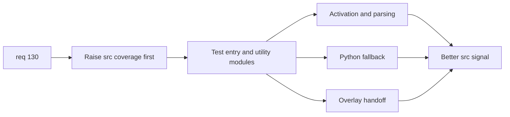

## item_244_raise_plugin_src_coverage_on_high_return_entry_and_utility_modules - Raise plugin src coverage on high-return entry and utility modules
> From version: 1.22.0
> Schema version: 1.0
> Status: Ready
> Understanding: 95%
> Confidence: 89%
> Progress: 0%
> Complexity: Medium
> Theme: Testing, coverage governance, plugin runtime, and webview reliability
> Reminder: Update status/understanding/confidence/progress and linked task references when you edit this doc.

# Problem
- Make plugin coverage actionable by raising `src/` protection first on the smallest high-return surfaces.
- Improve regression confidence quickly without waiting on the larger workflow modules or the separate `media/` measurement problem.
- Turn the current low coverage on small core modules into behavior-focused tests that exercise activation, parsing, fallback behavior, and launch handoff paths.

# Scope
- In:
  - add or expand tests for `src/extension.ts`
  - add or expand tests for `src/logicsViewMessages.ts`
  - add or expand tests for `src/pythonRuntime.ts`
  - add or expand tests for `src/logicsOverlaySupport.ts`
  - preserve or improve `src` coverage signal with behavior-focused assertions
- Out:
  - large scenario-driven tests for `src/logicsProviderUtils.ts` or `src/logicsCodexWorkflowController.ts`
  - `media/*.js` instrumentation or reporting changes
  - broad refactors unrelated to making these modules durably testable

# Acceptance criteria
- AC1: Behavior-focused tests are added for `src/extension.ts`, covering activation, command registration, watcher setup, and refresh-related behavior at a level appropriate for the current seams.
- AC2: Behavior-focused tests are added for `src/logicsViewMessages.ts`, covering successful parsing and rejection of invalid or incomplete message payloads.
- AC3: Behavior-focused tests are added for `src/pythonRuntime.ts`, covering runtime candidate selection, missing-runtime guidance, fallback behavior, and representative error handling paths.
- AC4: Behavior-focused tests are added for `src/logicsOverlaySupport.ts`, covering successful handoff behavior and the guard paths that intentionally do nothing when launch prerequisites are absent.
- AC5: The work improves or preserves the `src/` coverage signal without depending on `media/` governance changes, and validation remains green with the repository's standard TypeScript test flow.

# AC Traceability
- req130-AC2 -> This backlog slice. Proof: tests land for `src/extension.ts`, `src/logicsViewMessages.ts`, `src/pythonRuntime.ts`, and `src/logicsOverlaySupport.ts`.
- req130-AC6 -> This backlog slice. Proof: assertions cover runtime behavior and fallback decisions rather than only snapshots or package contents.

# Decision framing
- Product framing: Not required
- Product signals: none
- Product follow-up: none
- Architecture framing: Consider
- Architecture signals: runtime and boundaries, contracts and integration
- Architecture follow-up: create or link an architecture note only if seam extraction becomes necessary.

# Links
- Product brief(s): (none yet)
- Architecture decision(s): (none yet)
- Request: `req_130_make_plugin_coverage_actionable_with_targeted_src_gains_and_honest_webview_measurement`
- Primary task(s): `task_XXX_example`

# AI Context
- Summary: Raise plugin `src` coverage quickly on the smallest high-return entry and utility modules so the repository gets a more actionable baseline before larger workflow or webview measurement work.
- Keywords: src coverage, extension tests, message parsing tests, python runtime tests, overlay handoff tests, quick wins, behavior focused tests
- Use when: Use when delivering the first coverage wave for req 130.
- Skip when: Skip when the work is primarily about `media` coverage reporting or large workflow-controller scenarios.

# References
- `logics/request/req_130_make_plugin_coverage_actionable_with_targeted_src_gains_and_honest_webview_measurement.md`
- `src/extension.ts`
- `src/logicsViewMessages.ts`
- `src/pythonRuntime.ts`
- `src/logicsOverlaySupport.ts`
- `tests/logicsViewProvider.test.ts`
- `tests/pythonRuntime.test.ts`

# Priority
- Impact: High
- Urgency: High

# Notes
- Derived from request `req_130_make_plugin_coverage_actionable_with_targeted_src_gains_and_honest_webview_measurement`.
- Source file: `logics/request/req_130_make_plugin_coverage_actionable_with_targeted_src_gains_and_honest_webview_measurement.md`.
- Keep this backlog item as one bounded delivery slice; create sibling backlog items for the remaining request coverage instead of widening this doc.
