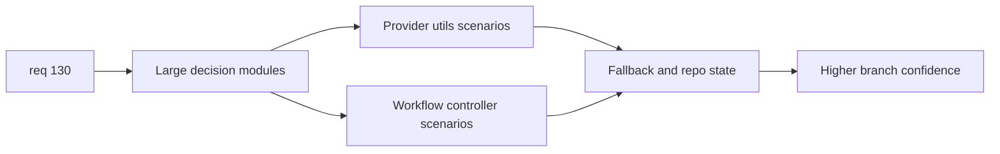

## item_245_add_scenario_driven_coverage_for_plugin_workflow_and_utility_decision_paths - Add scenario-driven coverage for plugin workflow and utility decision paths
> From version: 1.22.0
> Schema version: 1.0
> Status: Done
> Understanding: 95%
> Confidence: 89%
> Progress: 100%
> Complexity: High
> Theme: Testing, coverage governance, plugin runtime, and webview reliability
> Reminder: Update status/understanding/confidence/progress and linked task references when you edit this doc.

# Problem
- Improve branch confidence on the plugin's larger decision-heavy TypeScript modules.
- Cover the workflow and utility paths where fallback logic, remediation logic, and repository-state decisions matter more than raw line count.
- Avoid shallow happy-path-only tests on the modules that carry the most orchestration risk.

# Scope
- In:
  - add scenario-driven tests for `src/logicsProviderUtils.ts`
  - add scenario-driven tests for `src/logicsCodexWorkflowController.ts`
  - allow small seam extraction when it materially improves durable testability
  - focus on fallback paths, remediation decisions, and repository-state branches
- Out:
  - quick-win coverage on the smaller utility files from the first slice
  - `media/*.js` measurement and reporting changes
  - broad architectural rewrites unrelated to bounded testability improvements

# Acceptance criteria
- AC1: Scenario-driven tests are added for `src/logicsProviderUtils.ts` that exercise representative bootstrap, workspace-root, path-normalization, and repository-state decision paths rather than only basic helpers.
- AC2: Scenario-driven tests are added for `src/logicsCodexWorkflowController.ts` that cover representative bootstrap offers, remediation prompts, update or copy flows, and guard paths for unavailable or already-healthy states.
- AC3: The test suite explicitly covers fallback or no-op branches that would otherwise remain easy to break during future runtime and bootstrap changes.
- AC4: Any seam extraction introduced to support testing remains bounded and improves clarity rather than introducing broad structural churn.
- AC5: The work improves branch confidence on these modules and keeps the repository's standard TypeScript validation flow green.

# AC Traceability
- req130-AC3 -> This backlog slice. Proof: scenario-driven tests raise branch confidence on `src/logicsProviderUtils.ts` and `src/logicsCodexWorkflowController.ts`.
- req130-AC6 -> This backlog slice. Proof: new tests focus on decisions, fallback paths, and user-observable outcomes rather than only static structure.

# Decision framing
- Product framing: Not required
- Product signals: none
- Product follow-up: none
- Architecture framing: Consider
- Architecture signals: runtime and boundaries, contracts and integration
- Architecture follow-up: capture an architecture note only if testability requires meaningful seam extraction.

# Links
- Product brief(s): (none yet)
- Architecture decision(s): (none yet)
- Request: `req_130_make_plugin_coverage_actionable_with_targeted_src_gains_and_honest_webview_measurement`
- Primary task(s): `task_114_orchestration_delivery_for_req_130_and_req_131_plugin_coverage_governance_and_under_1000_line_modularization`

# AI Context
- Summary: Add scenario-driven coverage on the larger plugin decision modules so req 130 improves branch confidence where fallback and remediation logic matter most.
- Keywords: workflow controller tests, provider utils tests, branch coverage, fallback paths, remediation prompts, scenario driven tests, plugin orchestration
- Use when: Use when delivering the second coverage wave for req 130.
- Skip when: Skip when the work is only about quick-win small modules or coverage reporting.

# References
- `logics/request/req_130_make_plugin_coverage_actionable_with_targeted_src_gains_and_honest_webview_measurement.md`
- `src/logicsProviderUtils.ts`
- `src/logicsCodexWorkflowController.ts`
- `tests/logicsViewProvider.test.ts`
- `tests/logicsCodexWorkspace.test.ts`

# Priority
- Impact: High
- Urgency: Medium

# Notes
- Derived from request `req_130_make_plugin_coverage_actionable_with_targeted_src_gains_and_honest_webview_measurement`.
- Source file: `logics/request/req_130_make_plugin_coverage_actionable_with_targeted_src_gains_and_honest_webview_measurement.md`.
- Keep this backlog item as one bounded delivery slice; create sibling backlog items for the remaining request coverage instead of widening this doc.
