## item_246_separate_src_and_media_plugin_coverage_reporting_thresholds_and_webview_measurement - Separate src and media plugin coverage reporting thresholds and webview measurement
> From version: 1.22.0
> Schema version: 1.0
> Status: Done
> Understanding: 95%
> Confidence: 89%
> Progress: 100%
> Complexity: Medium
> Theme: Testing, coverage governance, plugin runtime, and webview reliability
> Reminder: Update status/understanding/confidence/progress and linked task references when you edit this doc.

# Problem
- Make plugin coverage reporting honest enough to guide engineering decisions.
- Stop a single misleading blended percentage from hiding the difference between extension-side `src` coverage and browser-side `media` runtime measurement.
- Introduce staged thresholds that improve confidence without turning inaccurate webview measurement into a brittle gate.

# Scope
- In:
  - separate or otherwise make explicit the reporting of `src` and `media` plugin coverage
  - introduce or update progressive thresholds with `src` gated first
  - improve the trustworthiness of `media` measurement or govern it separately while that improvement is pending
  - keep `media` visible in reporting even if it is excluded from the first enforced gate
- Out:
  - broad new behavior coverage work for specific plugin modules
  - unrelated CI hardening outside plugin coverage governance
  - hiding `media` entirely from engineering visibility

```mermaid
%% logics-kind: backlog
%% logics-signature: backlog|separate-src-and-media-plugin-coverage-r|req-130-make-plugin-coverage-actionable-|make-plugin-coverage-reporting-honest-en|ac1-coverage-reporting-distinguishes-src
flowchart LR
    Request[req_130_make_plugin_coverage_actionable_wi] --> Problem[Make plugin coverage reporting honest enou]
    Problem --> Scope[Separate src and media plugin coverage]
    Scope --> Acceptance[AC1: Coverage reporting distinguishes src]
    Acceptance --> Tasks[task_114_orchestration_delivery_for_req_13]
```

# Acceptance criteria
- AC1: Coverage reporting distinguishes `src` and `media` concerns clearly enough that engineers can see which surface improved and which surface remains under-measured.
- AC2: The first enforced thresholds are aligned with the clarified strategy for req 130, with `src` gated before any single global plugin threshold that is still distorted by `media` measurement limitations.
- AC3: `media` remains visible in reporting through a separate report, separate metric, or another explicit governance mechanism even if it is not part of the first enforced gate.
- AC4: If `media` measurement is improved in this slice, the new approach is trustworthy enough to support future ratcheting rather than simply changing the headline percentage.
- AC5: The repository's local and CI coverage flows remain understandable and maintainable after the reporting or threshold changes.

# AC Traceability
- req130-AC1 -> This backlog slice. Proof: plugin coverage reporting separates `src` and `media` concerns in a visible way.
- req130-AC4 -> This backlog slice. Proof: `media` is measured credibly or governed separately from `src`.
- req130-AC5 -> This backlog slice. Proof: thresholds are progressive and aligned with the current baseline.

# Decision framing
- Product framing: Not required
- Product signals: none
- Product follow-up: none
- Architecture framing: Consider
- Architecture signals: runtime and boundaries, contracts and integration
- Architecture follow-up: none unless tooling changes require a durable design note.

# Links
- Product brief(s): (none yet)
- Architecture decision(s): (none yet)
- Request: `req_130_make_plugin_coverage_actionable_with_targeted_src_gains_and_honest_webview_measurement`
- Primary task(s): `task_114_orchestration_delivery_for_req_130_and_req_131_plugin_coverage_governance_and_under_1000_line_modularization`

# AI Context
- Summary: Separate plugin `src` and `media` coverage governance so coverage becomes an honest signal, with progressive thresholds and explicit visibility for the under-measured webview runtime.
- Keywords: coverage governance, src coverage, media coverage, vitest coverage, thresholds, reporting split, webview measurement, ci ratchet
- Use when: Use when implementing the reporting and gating part of req 130.
- Skip when: Skip when the work is primarily about adding new module tests.

# References
- `logics/request/req_130_make_plugin_coverage_actionable_with_targeted_src_gains_and_honest_webview_measurement.md`
- `vitest.config.mts`
- `tests/webviewHarnessTestUtils.ts`
- `coverage/plugin/coverage-summary.json`

# Priority
- Impact: High
- Urgency: Medium

# Notes
- Derived from request `req_130_make_plugin_coverage_actionable_with_targeted_src_gains_and_honest_webview_measurement`.
- Source file: `logics/request/req_130_make_plugin_coverage_actionable_with_targeted_src_gains_and_honest_webview_measurement.md`.
- Keep this backlog item as one bounded delivery slice; create sibling backlog items for the remaining request coverage instead of widening this doc.
