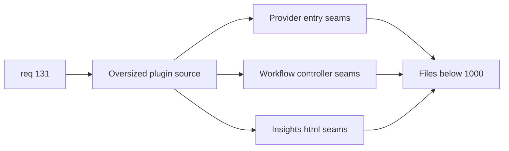

## item_247_split_oversized_plugin_source_entry_and_orchestration_surfaces_below_1000_lines - Split oversized plugin source entry and orchestration surfaces below 1000 lines
> From version: 1.22.0+docs
> Schema version: 1.0
> Status: Done
> Understanding: 96%
> Confidence: 91%
> Progress: 100%
> Complexity: High
> Theme: Architecture, modularity, maintainability, and testability
> Reminder: Update status/understanding/confidence/progress and linked task references when you edit this doc.

# Problem
- Reduce the maintenance cost of the oversized plugin source entry and orchestration files that still exceed the repository's intended `1000`-line ceiling.
- Split central edit surfaces along stable responsibilities while preserving obvious entry points and current behavior.
- Improve ownership and testability without replacing one large file with several weakly named fragments.

# Scope
- In:
  - split `src/logicsViewProvider.ts` below `1000` lines by responsibility seams such as refresh or data loading, message routing, palette or command actions, and view-state helpers
  - split `media/main.js` below `1000` lines by bootstrap, action wiring, state synchronization, and render-coordination seams while keeping it as the visible webview entry surface
  - split `src/logicsCodexWorkflowController.ts` below `1000` lines by workflow or remediation responsibilities where the current file structure allows it
  - split `src/logicsHybridInsightsHtml.ts` below `1000` lines by rendering or content-building seams if it still exceeds the threshold after bounded extraction
  - preserve visible entrypoint readability in the remaining top-level files
- Out:
  - splitting plugin test suites
  - broad plugin architecture rewrites unrelated to the oversized source surfaces above

# Acceptance criteria
- AC1: `src/logicsViewProvider.ts` is reduced below `1000` lines by moving coherent subordinate responsibilities into clearly named modules while keeping the provider entry surface understandable.
- AC2: `media/main.js` is reduced below `1000` lines through seam-driven extraction that preserves current behavior and keeps the webview entry surface understandable.
- AC3: `src/logicsCodexWorkflowController.ts` is reduced below `1000` lines through seam-driven extraction that preserves current behavior and keeps remediation or launch flows discoverable.
- AC4: `src/logicsHybridInsightsHtml.ts` is reduced below `1000` lines or receives a documented exception if a further split would materially harm discoverability.
- AC5: The resulting module boundaries improve ownership clarity and do not introduce circular dependencies or fragmented wrapper modules.
- AC6: Plugin validation remains green for the touched surfaces.

# AC Traceability
- req131-AC1 -> This backlog slice. Proof: the oversized plugin source files covered here are reduced below the target or have documented exceptions.
- req131-AC2 -> This backlog slice. Proof: splits follow real seams such as orchestration, message routing, or rendering helpers rather than arbitrary chunking.
- req131-AC3 -> This backlog slice. Proof: the known oversized plugin source files in this slice are addressed.
- req131-AC7 -> This backlog slice. Proof: plugin behavior is preserved with appropriate validation.
- req131-AC8 -> This backlog slice. Proof: entrypoint readability remains intact after extraction.

# Decision framing
- Product framing: Not required
- Product signals: none
- Product follow-up: none
- Architecture framing: Required
- Architecture signals: runtime and boundaries, contracts and integration
- Architecture follow-up: create or link an architecture note if the extraction reshapes provider or controller ownership materially.

# Links
- Product brief(s): (none yet)
- Architecture decision(s): `adr_002_keep_the_plugin_webview_as_a_modular_vanilla_frontend`, `adr_014_keep_plugin_safety_and_repository_governance_explicit_bounded_and_modular`
- Request: `req_131_reduce_all_remaining_active_source_and_test_files_below_1000_lines_with_seam_driven_refactors`
- Primary task(s): `logics/tasks/task_114_orchestration_delivery_for_req_130_and_req_131_plugin_coverage_governance_and_under_1000_line_modularization.md`

# AI Context
- Summary: Reduce the largest remaining plugin source entry and orchestration files below 1000 lines through seam-driven extraction while preserving readable entry surfaces.
- Keywords: modularization, logicsViewProvider, main.js, workflow controller, insights html, entrypoint, source split, under 1000 lines
- Use when: Use when delivering the first plugin-source slice of req 131.
- Skip when: Skip when the work is primarily about oversized plugin tests or Python workflow-manager modules.

# References
- `logics/request/req_131_reduce_all_remaining_active_source_and_test_files_below_1000_lines_with_seam_driven_refactors.md`
- `src/logicsViewProvider.ts`
- `media/main.js`
- `src/logicsCodexWorkflowController.ts`
- `src/logicsHybridInsightsHtml.ts`

# Priority
- Impact: High
- Urgency: High

# Notes
- Derived from request `req_131_reduce_all_remaining_active_source_and_test_files_below_1000_lines_with_seam_driven_refactors`.
- Source file: `logics/request/req_131_reduce_all_remaining_active_source_and_test_files_below_1000_lines_with_seam_driven_refactors.md`.
- Keep this backlog item as one bounded delivery slice; create sibling backlog items for the remaining structural work instead of widening this doc.
