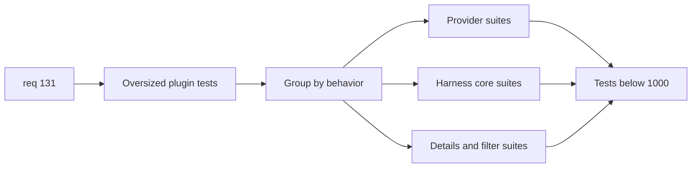

## item_248_split_oversized_plugin_test_suites_by_behavior_domain_below_1000_lines - Split oversized plugin test suites by behavior domain below 1000 lines
> From version: 1.22.0
> Schema version: 1.0
> Status: Ready
> Understanding: 95%
> Confidence: 90%
> Progress: 0%
> Complexity: Medium
> Theme: Architecture, modularity, maintainability, and testability
> Reminder: Update status/understanding/confidence/progress and linked task references when you edit this doc.

# Problem
- Reduce the maintenance cost and failure noise of the oversized plugin test suites that still exceed `1000` lines.
- Split monolithic test files by behavior domain so future assertions are easier to locate, extend, and debug.
- Improve test ownership and readability without lowering behavioral coverage.

# Scope
- In:
  - split `tests/logicsViewProvider.test.ts` by behavior family such as provider lifecycle, message handling, workspace-root handling, and palette or command actions
  - split `tests/webview.harness-core.test.ts` by coherent harness behavior domains
  - split `tests/webview.harness-details-and-filters.test.ts` by coherent details, filter, selection, and related interaction domains
  - extract shared fixtures or helpers when they reduce duplication and improve test readability
- Out:
  - plugin source refactors
  - Python workflow-manager tests
  - purely mechanical test splitting with no behavior-domain rationale

# Acceptance criteria
- AC1: `tests/logicsViewProvider.test.ts` is reduced below `1000` lines by splitting it into coherent behavior-domain suites.
- AC2: `tests/webview.harness-core.test.ts` and `tests/webview.harness-details-and-filters.test.ts` are reduced below `1000` lines by splitting them into coherent behavior-domain suites.
- AC3: Shared test helpers or fixtures are extracted only when they improve maintainability and do not obscure the intent of the assertions.
- AC4: The resulting test layout preserves or improves behavioral coverage and makes failure attribution clearer than before.
- AC5: Plugin test validation remains green after the split.

# AC Traceability
- req131-AC1 -> This backlog slice. Proof: oversized plugin test files are reduced below the target or receive documented temporary exceptions during the split.
- req131-AC2 -> This backlog slice. Proof: test-suite splits follow behavior domains rather than arbitrary chunking.
- req131-AC4 -> This backlog slice. Proof: the oversized plugin test files listed in the request are addressed.
- req131-AC7 -> This backlog slice. Proof: regression confidence is preserved or improved after reorganization.

# Decision framing
- Product framing: Not required
- Product signals: none
- Product follow-up: none
- Architecture framing: Consider
- Architecture signals: testability and boundaries
- Architecture follow-up: none unless a new shared harness structure needs documenting.

# Links
- Product brief(s): (none yet)
- Architecture decision(s): (none yet)
- Request: `req_131_reduce_all_remaining_active_source_and_test_files_below_1000_lines_with_seam_driven_refactors`
- Primary task(s): `task_XXX_example`

# AI Context
- Summary: Split the oversized plugin test suites by behavior domain so they fall below 1000 lines and become easier to extend and debug.
- Keywords: test suite split, behavior domains, logicsViewProvider tests, webview harness tests, fixtures, under 1000 lines
- Use when: Use when delivering the plugin-test slice of req 131.
- Skip when: Skip when the work is primarily about source refactors or Python tests.

# References
- `logics/request/req_131_reduce_all_remaining_active_source_and_test_files_below_1000_lines_with_seam_driven_refactors.md`
- `tests/logicsViewProvider.test.ts`
- `tests/webview.harness-core.test.ts`
- `tests/webview.harness-details-and-filters.test.ts`
- `tests/webviewHarnessTestUtils.ts`

# Priority
- Impact: Medium
- Urgency: Medium

# Notes
- Derived from request `req_131_reduce_all_remaining_active_source_and_test_files_below_1000_lines_with_seam_driven_refactors`.
- Source file: `logics/request/req_131_reduce_all_remaining_active_source_and_test_files_below_1000_lines_with_seam_driven_refactors.md`.
- Keep this backlog item as one bounded delivery slice; create sibling backlog items for the remaining structural work instead of widening this doc.
