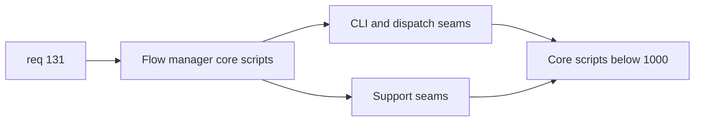

## item_249_split_oversized_flow_manager_cli_and_support_scripts_below_1000_lines - Split oversized flow manager CLI and support scripts below 1000 lines
> From version: 1.22.0+docs
> Schema version: 1.0
> Status: Ready
> Understanding: 96%
> Confidence: 91%
> Progress: 0%
> Complexity: High
> Theme: Architecture, modularity, maintainability, and testability
> Reminder: Update status/understanding/confidence/progress and linked task references when you edit this doc.

# Problem
- Reduce the maintenance cost of the oversized flow-manager CLI and support surfaces that still exceed `1000` lines.
- Preserve discoverable workflow-manager entrypoints while moving subordinate command, reporting, and support responsibilities into clearer modules.
- Improve navigability and safer change isolation across the most central Python workflow surfaces.

# Scope
- In:
  - split `logics/skills/logics-flow-manager/scripts/logics_flow.py` below `1000` lines by CLI parsing, command dispatch, orchestration, mutation, or reporting seams as appropriate
  - split `logics/skills/logics-flow-manager/scripts/logics_flow_support.py` below `1000` lines by coherent support responsibilities
  - preserve discoverable CLI anchor behavior and operator-facing command flow
  - allow bounded support-module extraction where it materially improves ownership and testing
- Out:
  - hybrid-runtime-specific splits
  - workflow audit refactors
  - the giant Python test suite split

# Acceptance criteria
- AC1: `logics_flow.py` is reduced below `1000` lines through seam-driven extraction that preserves its role as the discoverable CLI anchor.
- AC2: `logics_flow_support.py` is reduced below `1000` lines through seam-driven extraction that improves support-module ownership and readability.
- AC3: The resulting structure clarifies command-routing, orchestration, and support responsibilities rather than merely moving code into generic helper files.
- AC4: Python validation for the touched workflow-manager surfaces remains green.
- AC5: Any remaining above-threshold exception is explicitly documented and justified.

# AC Traceability
- req131-AC1 -> This backlog slice. Proof: the repository applies the below-1000 target on these active maintained Python files.
- req131-AC2 -> This backlog slice. Proof: splits are seam-driven and responsibility-based.
- req131-AC5 -> This backlog slice. Proof: the oversized workflow-manager core and support scripts listed here are decomposed.
- req131-AC7 -> This backlog slice. Proof: workflow-manager behavior is preserved with validation.
- req131-AC8 -> This backlog slice. Proof: `logics_flow.py` remains a readable CLI entry surface.

# Decision framing
- Product framing: Not required
- Product signals: none
- Product follow-up: none
- Architecture framing: Required
- Architecture signals: runtime and boundaries, contracts and integration
- Architecture follow-up: capture an architecture note if the split changes CLI ownership boundaries materially.

# Links
- Product brief(s): (none yet)
- Architecture decision(s): `adr_011_keep_hybrid_assist_runtime_contracts_shared_backend_agnostic_and_safely_bounded`, `adr_014_keep_plugin_safety_and_repository_governance_explicit_bounded_and_modular`
- Request: `req_131_reduce_all_remaining_active_source_and_test_files_below_1000_lines_with_seam_driven_refactors`
- Primary task(s): `task_XXX_example`

# AI Context
- Summary: Split the oversized flow-manager CLI and support scripts below 1000 lines while preserving the discoverable Python workflow entrypoint and current command behavior.
- Keywords: logics_flow, logics_flow_support, cli split, support split, workflow manager, python modularization, under 1000 lines
- Use when: Use when delivering the core Python flow-manager slice of req 131.
- Skip when: Skip when the work is primarily about hybrid runtime modules, audit, or tests.

# References
- `logics/request/req_131_reduce_all_remaining_active_source_and_test_files_below_1000_lines_with_seam_driven_refactors.md`
- `logics/skills/logics-flow-manager/scripts/logics_flow.py`
- `logics/skills/logics-flow-manager/scripts/logics_flow_support.py`

# Priority
- Impact: High
- Urgency: Medium

# Notes
- Derived from request `req_131_reduce_all_remaining_active_source_and_test_files_below_1000_lines_with_seam_driven_refactors`.
- Source file: `logics/request/req_131_reduce_all_remaining_active_source_and_test_files_below_1000_lines_with_seam_driven_refactors.md`.
- Keep this backlog item as one bounded delivery slice; create sibling backlog items for the remaining structural work instead of widening this doc.
