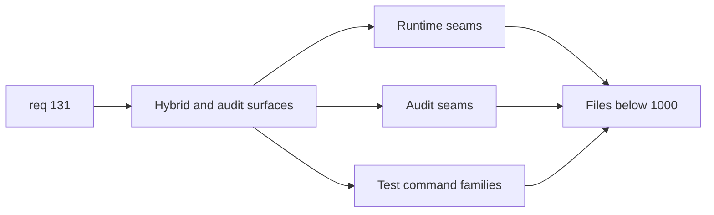

## item_250_split_oversized_flow_manager_hybrid_audit_and_test_surfaces_below_1000_lines - Split oversized flow manager hybrid audit and test surfaces below 1000 lines
> From version: 1.22.0+docs
> Schema version: 1.0
> Status: Done
> Understanding: 96%
> Confidence: 91%
> Progress: 100%
> Complexity: High
> Theme: Architecture, modularity, maintainability, and testability
> Reminder: Update status/understanding/confidence/progress and linked task references when you edit this doc.

# Problem
- Reduce the maintenance cost of the oversized hybrid-runtime, audit, and Python test surfaces that still exceed `1000` lines.
- Split these files by runtime responsibility or test command family so they become safer to evolve and easier to debug.
- Preserve current hybrid runtime and audit behavior while improving test ownership and navigability.

# Scope
- In:
  - split `logics/skills/logics-flow-manager/scripts/logics_flow_hybrid.py` below `1000` lines
  - split `logics/skills/logics-flow-manager/scripts/logics_flow_hybrid_transport.py` below `1000` lines
  - split `logics/skills/logics-flow-manager/scripts/workflow_audit.py` below `1000` lines
  - split `logics/skills/tests/test_logics_flow.py` below `1000` lines by command family, runtime flow, or other coherent behavior domains
  - keep hybrid runtime and audit entry surfaces understandable after extraction
- Out:
  - the core `logics_flow.py` CLI split
  - plugin source or plugin test refactors
  - broad runtime redesign unrelated to structural decomposition

# Acceptance criteria
- AC1: `logics_flow_hybrid.py`, `logics_flow_hybrid_transport.py`, and `workflow_audit.py` are reduced below `1000` lines or receive documented exceptions only where a further split would clearly reduce discoverability.
- AC2: `test_logics_flow.py` is reduced below `1000` lines by splitting it into coherent suites aligned with command families, runtime families, or other stable behavior domains.
- AC3: The resulting structure improves ownership and failure attribution instead of replacing one monolith with several arbitrary fragments.
- AC4: Validation remains green for the affected Python workflow-manager and test surfaces.
- AC5: Any extracted shared helpers improve readability or reuse without creating circular dependencies or opaque indirection.

# AC Traceability
- req131-AC1 -> This backlog slice. Proof: the below-1000 target is applied to these active maintained runtime and test files.
- req131-AC2 -> This backlog slice. Proof: splits follow runtime and behavior-domain seams.
- req131-AC5 -> This backlog slice. Proof: the oversized hybrid, audit, and test surfaces listed here are decomposed.
- req131-AC7 -> This backlog slice. Proof: validation remains green and behavior confidence is preserved.
- req131-AC9 -> This backlog slice. Proof: shared helpers reduce duplication or clarify ownership without degenerating into fragmented indirection.

# Decision framing
- Product framing: Not required
- Product signals: none
- Product follow-up: none
- Architecture framing: Required
- Architecture signals: runtime and boundaries, contracts and integration, testability
- Architecture follow-up: capture an architecture note if the hybrid runtime split materially changes runtime ownership boundaries.

# Links
- Product brief(s): (none yet)
- Architecture decision(s): `adr_011_keep_hybrid_assist_runtime_contracts_shared_backend_agnostic_and_safely_bounded`, `adr_014_keep_plugin_safety_and_repository_governance_explicit_bounded_and_modular`
- Request: `req_131_reduce_all_remaining_active_source_and_test_files_below_1000_lines_with_seam_driven_refactors`
- Primary task(s): `logics/tasks/task_114_orchestration_delivery_for_req_130_and_req_131_plugin_coverage_governance_and_under_1000_line_modularization.md`

# AI Context
- Summary: Split the oversized hybrid-runtime, audit, and Python workflow-manager test surfaces below 1000 lines with responsibility-driven extraction and test-family decomposition.
- Keywords: logics_flow_hybrid, transport, workflow audit, test_logics_flow, python test split, runtime modularization, under 1000 lines
- Use when: Use when delivering the hybrid-runtime and Python-test slice of req 131.
- Skip when: Skip when the work is primarily about plugin code or the core CLI split.

# References
- `logics/request/req_131_reduce_all_remaining_active_source_and_test_files_below_1000_lines_with_seam_driven_refactors.md`
- `logics/skills/logics-flow-manager/scripts/logics_flow_hybrid.py`
- `logics/skills/logics-flow-manager/scripts/logics_flow_hybrid_transport.py`
- `logics/skills/logics-flow-manager/scripts/workflow_audit.py`
- `logics/skills/tests/test_logics_flow.py`

# Priority
- Impact: High
- Urgency: Medium

# Notes
- Derived from request `req_131_reduce_all_remaining_active_source_and_test_files_below_1000_lines_with_seam_driven_refactors`.
- Source file: `logics/request/req_131_reduce_all_remaining_active_source_and_test_files_below_1000_lines_with_seam_driven_refactors.md`.
- Keep this backlog item as one bounded delivery slice; create sibling backlog items for the remaining structural work instead of widening this doc.
