## item_251_harden_async_refresh_pipeline_against_partial_promise_rejection - Harden async refresh pipeline against partial Promise rejection
> From version: 1.22.0
> Schema version: 1.0
> Status: Done
> Understanding: 100%
> Confidence: 95%
> Progress: 100%
> Complexity: Medium
> Theme: Runtime
> Reminder: Update status/understanding/confidence/progress and linked task references when you edit this doc.

# Problem
- In `src/logicsViewProvider.ts`, `refresh()` calls `indexLogics(root)` at line 301 then runs a `Promise.all` at line 303 grouping four async operations: `getGitChangedPaths`, `inspectRuntimeLaunchers`, `inspectLogicsEnvironment`, `inspectGitHubReleaseCapability`.
- This `Promise.all` has no try/catch wrapper. If any of these operations rejects (more likely on Windows due to git/path/environment differences), `postData({ items })` at line 314 is never reached and the board stays completely empty.
- This is the most probable cause of the empty board on first load.

# Scope
- In: wrap the `Promise.all` in `refresh()` so that `postData` is always called with at least `{ items }`, even when non-critical diagnostics fail. Ensure `indexLogics` errors are also caught gracefully.
- Out: path normalization (item_252), test coverage (item_253), watcher reliability.

```mermaid
%% logics-kind: backlog
%% logics-signature: backlog|harden-async-refresh-pipeline-against-pa|req-132-fix-empty-board-on-windows-due-t|in-src-logicsviewprovider-ts-refresh-cal|ac1-postdata-items-is-always-called
flowchart LR
    Request[req_132_fix_empty_board_on_windows_due_to_] --> Problem[In src logicsViewProvider.ts refresh calls]
    Problem --> Scope[Harden async refresh pipeline against part]
    Scope --> Acceptance[AC1: postData items is always called]
    Acceptance --> Tasks[task_115_fix_windows_empty_board_orchestra]
```

# Acceptance criteria
- AC1: `postData({ items })` is always called after `indexLogics` completes, even if one or more non-critical async diagnostics reject. Use `Promise.allSettled` or individual try/catch blocks.
- AC2: When a non-critical diagnostic fails (git changed paths, runtime launchers, environment snapshot, release capability), the board still renders with items and the failed fields fall back to safe defaults.
- AC3: If `indexLogics(root)` itself throws, the board shows an error message instead of staying silently empty.

# AC Traceability
- AC1 -> req_132 AC2: `postData` resilience to partial rejection. Proof: unit test showing items posted when a diagnostic rejects.
- AC2 -> req_132 AC5: board displays docs on Windows. Proof: manual or automated test confirming board renders with degraded diagnostics.
- AC3 -> req_132 AC1: `indexLogics` returns items. Proof: error handling test for indexLogics failure.

# Decision framing
- Product framing: Not required (internal resilience, no UI contract change)
- Architecture framing: Not required (local error handling pattern, no structural change)

# Links
- Product brief(s): (none yet)
- Architecture decision(s): (none yet)
- Request: `req_132_fix_empty_board_on_windows_due_to_indexing_and_path_issues`
- Primary task(s): `task_115_fix_windows_empty_board_orchestration`

# AI Context
- Summary: Make refresh() resilient to partial async diagnostic failures so postData is always called
- Keywords: Promise.all, Promise.allSettled, try-catch, refresh, postData, diagnostics, resilience
- Use when: Modifying the async refresh pipeline in logicsViewProvider.ts
- Skip when: Working on path normalization or watcher setup

# References
- `src/logicsViewProvider.ts`

# Priority
- Impact: Critical - most likely cause of the empty board on Windows
- Urgency: High - blocks all Windows users

# Notes
- Derived from request `req_132_fix_empty_board_on_windows_due_to_indexing_and_path_issues`.
- Source file: `logics/request/req_132_fix_empty_board_on_windows_due_to_indexing_and_path_issues.md`.
- This is the highest priority item of the three: fixing this alone may resolve the reported issue.

# Delivery report
- 2026-04-07: Hardened `refresh()` in `src/logicsViewProvider.ts` so `indexLogics(root)` failures render an explicit board error instead of leaving the webview empty.
- Replaced the blocking `Promise.all(...)` diagnostics fan-out with `Promise.allSettled(...)` and safe defaults for changed paths, launcher availability, environment snapshot, and release capability.
- Guarded `refreshAgents("silent", root)` so agent discovery failures no longer block item hydration.

# Validation report
- `npx vitest run tests/logicsViewProvider.test.ts`
- `npm run compile`
- `npm run test`
