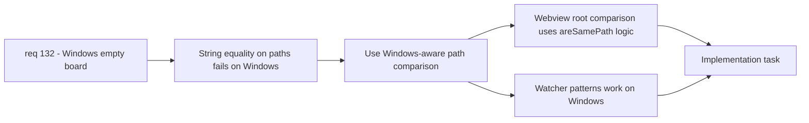

## item_252_normalize_workspace_root_comparison_with_windows_aware_path_logic - Normalize workspace root comparison with Windows-aware path logic
> From version: 1.22.0
> Schema version: 1.0
> Status: Ready
> Understanding: 95%
> Confidence: 80%
> Progress: 0%
> Complexity: Medium
> Theme: Runtime
> Reminder: Update status/understanding/confidence/progress and linked task references when you edit this doc.

# Problem
- In `media/main.js`, the webview compares persisted workspace root with the incoming payload root using strict string equality: `persistedWorkspaceRoot !== payload.root`.
- On Windows this comparison is fragile: `C:\Users\project` vs `c:\users\project`, backslashes vs forward slashes, and path resolution variants can all cause a false mismatch.
- A false mismatch triggers `resetPersistedUiState()`, which wipes the UI state and can compound with other issues to produce an empty or reset board.
- A Windows-aware helper `areSamePath` already exists in `src/logicsProviderUtils.ts` but is not used in the webview path.
- The FileSystemWatcher setup in `src/extension.ts` also uses paths that may behave differently on Windows with `RelativePattern` and glob brace patterns.

# Scope
- In: replace strict string equality for root comparison in `media/main.js` with a Windows-aware comparison. Audit and normalize any other raw path comparisons on the webview/extension boundary. Verify watcher RelativePattern behavior on Windows.
- Out: async pipeline resilience (item_251), test coverage (item_253).

# Acceptance criteria
- AC1: Workspace root comparison in `media/main.js` uses a case-insensitive, slash-normalized comparison equivalent to `areSamePath` instead of strict string equality.
- AC2: FileSystemWatcher glob patterns in `src/extension.ts` are verified to work on Windows (no silent failures from brace expansion or path separator issues).
- AC3: No UI state reset occurs when the only difference between persisted and incoming root is casing or slash direction.

# AC Traceability
- AC1 -> req_132 AC4: Windows-aware path comparison in webview. Proof: code review + unit test with Windows-style paths.
- AC2 -> req_132 AC3: FileSystemWatcher patterns fire on Windows. Proof: manual test or documented VS Code API behavior.
- AC3 -> req_132 AC5: board displays docs on Windows. Proof: no spurious resetPersistedUiState calls with Windows paths.

# Decision framing
- Product framing: Not required (internal fix, no user-facing contract change)
- Architecture framing: Not required (reusing existing `areSamePath` pattern)

# Links
- Product brief(s): (none yet)
- Architecture decision(s): (none yet)
- Request: `req_132_fix_empty_board_on_windows_due_to_indexing_and_path_issues`
- Primary task(s): `task_115_fix_windows_empty_board_orchestration`

# AI Context
- Summary: Replace string equality root comparison with Windows-aware path normalization in webview and verify watcher patterns
- Keywords: areSamePath, persistedWorkspaceRoot, path normalization, case-insensitive, backslash, RelativePattern, watcher
- Use when: Modifying path comparison logic in media/main.js or watcher setup in extension.ts
- Skip when: Working on async pipeline resilience or test infrastructure

# References
- `media/main.js`
- `src/logicsProviderUtils.ts`
- `src/extension.ts`

# Priority
- Impact: Medium - prevents UI state reset on Windows, compounds with item_251
- Urgency: Medium - secondary to the pipeline fix but needed for full Windows support

# Notes
- Derived from request `req_132_fix_empty_board_on_windows_due_to_indexing_and_path_issues`.
- Source file: `logics/request/req_132_fix_empty_board_on_windows_due_to_indexing_and_path_issues.md`.
- The `areSamePath` helper is already imported in `src/logicsViewProvider.ts`; the webview side needs an equivalent inline or injected function since it runs in a sandboxed context.
