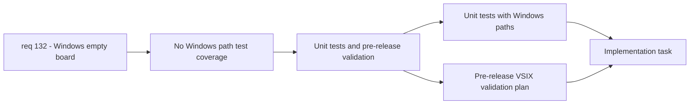

## item_253_add_windows_path_normalization_unit_tests_and_pre_release_validation - Add Windows path normalization unit tests and pre-release validation
> From version: 1.22.0
> Schema version: 1.0
> Status: Ready
> Understanding: 90%
> Confidence: 80%
> Progress: 0%
> Complexity: Low
> Theme: Runtime
> Reminder: Update status/understanding/confidence/progress and linked task references when you edit this doc.

# Problem
- The codebase has no unit tests covering Windows-specific path scenarios (case variations, mixed slashes, backslash paths).
- Without a Windows CI environment, regressions on Windows paths can go undetected.
- The issue reporter needs a way to validate fixes before release.

# Scope
- In: write unit tests for `areSamePath` and root comparison logic with Windows-style paths. Define a pre-release VSIX validation workflow for the issue reporter.
- Out: actual code fixes (item_251, item_252). This item covers test infrastructure and validation strategy only.

# Acceptance criteria
- AC1: Unit tests cover `areSamePath` with Windows-style inputs: `C:\Users\project` vs `c:\users\project`, mixed slashes (`C:/Users\project`), trailing slashes, UNC paths (`\\server\share`).
- AC2: Unit tests cover the webview root comparison logic with the same Windows path variants.
- AC3: A pre-release VSIX can be built and shared with the issue reporter for manual validation on Windows.
- AC4: Validation checklist documented: install VSIX, open repo with logics/ folder, verify board displays items, verify filters work, verify watcher-driven refresh.

# AC Traceability
- AC1 -> req_132 AC6: unit tests with Windows paths. Proof: test suite passes with mocked Windows paths.
- AC2 -> req_132 AC6: unit tests with Windows paths. Proof: webview comparison tests pass.
- AC3 -> req_132 validation strategy: pre-release VSIX. Proof: VSIX built and shared.
- AC4 -> req_132 validation strategy: reporter validation. Proof: checklist completed by reporter.

# Decision framing
- Product framing: Not required (test infrastructure)
- Architecture framing: Not required (test infrastructure)

# Links
- Product brief(s): (none yet)
- Architecture decision(s): (none yet)
- Request: `req_132_fix_empty_board_on_windows_due_to_indexing_and_path_issues`
- Primary task(s): `task_115_fix_windows_empty_board_orchestration`

# AI Context
- Summary: Add unit tests for Windows path scenarios and define pre-release validation workflow
- Keywords: unit test, areSamePath, Windows paths, VSIX, pre-release, validation, case-insensitive, backslash
- Use when: Writing or reviewing tests for path normalization logic
- Skip when: Working on the actual code fixes in logicsViewProvider or main.js

# References
- `src/logicsProviderUtils.ts`
- `tests/logicsViewProvider.test.ts`

# Priority
- Impact: Medium - ensures fixes are tested and validated
- Urgency: Medium - should be delivered alongside or right after item_251 and item_252

# Notes
- Derived from request `req_132_fix_empty_board_on_windows_due_to_indexing_and_path_issues`.
- Source file: `logics/request/req_132_fix_empty_board_on_windows_due_to_indexing_and_path_issues.md`.
- This item depends on item_251 and item_252 being at least in progress so the tests validate actual fixes.
