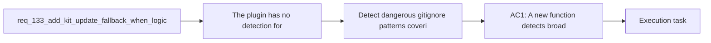

## item_254_detect_dangerous_gitignore_patterns_covering_logics_skills_and_warn_the_user - Detect dangerous gitignore patterns covering logics skills and warn the user
> From version: 1.22.1
> Schema version: 1.0
> Status: Done
> Understanding: 95%
> Confidence: 92%
> Progress: 100%
> Complexity: Low
> Theme: General
> Reminder: Update status/understanding/confidence/progress and linked task references when you edit this doc.

# Problem
- The plugin has no detection for broad `.gitignore` patterns (e.g. `logics/`, `logics/*`, `logics/**`) that would prevent `logics/skills` from being tracked by git.
- Users who add such patterns break the submodule-based kit update without any warning from the plugin.
- The existing `REQUIRED_GITIGNORE_ENTRIES` in `src/logicsProviderUtils.ts` only covers cache and runtime artifacts, not structural patterns.

# Scope
- In: scan `.gitignore` for broad patterns covering `logics/skills`, display a proactive warning in Check Environment and at startup, explain the trade-off and the fallback available (item_255).
- Out: the fallback update mechanism itself (item_255), the adaptive update strategy (item_256), global `.gitignore` and `.git/info/exclude` scanning (best-effort only, not required).

# Acceptance criteria
- AC1: A new function detects broad `.gitignore` patterns (`logics/`, `logics/*`, `logics/**`) that would cover `logics/skills`.
- AC2: Check Environment surfaces a warning when a dangerous pattern is detected, explaining that the submodule update path is broken and a fallback exists.
- AC3: The warning does not block the user or prevent other operations; it is informational and actionable.

# AC Traceability
- AC1 -> req AC5: proactive detection of broad gitignore patterns. Proof: unit test for pattern detection function.
- AC2 -> req AC5: warning surfaces in Check Environment. Proof: manual or integration test confirming the warning appears.
- AC3 -> req AC4: existing flow unchanged, warning is non-blocking. Proof: existing tests still pass.

# Decision framing
- Product framing: Not needed
- Architecture framing: Not needed (simple detection function and warning message)

# Links
- Product brief(s): (none yet)
- Architecture decision(s): (none yet)
- Request: `req_133_add_kit_update_fallback_when_logics_is_gitignored`
- Primary task(s): (none yet)

# References
- `src/logicsProviderUtils.ts` (getMissingBootstrapGitignoreEntries, REQUIRED_GITIGNORE_ENTRIES)
- `src/logicsViewProvider.ts` (checkEnvironment flow)

# Priority
- Impact: Medium - prevents silent breakage of kit updates
- Urgency: Low - informational, no blocking behavior change

# Notes
- Derived from request `req_133_add_kit_update_fallback_when_logics_is_gitignored`.
- Corresponds to request design decision D3 (proactive detection layer).
- This item is a prerequisite for item_255 (the warning should explain the fallback before the fallback exists).
- Implemented in `src/logicsProviderUtils.ts` and surfaced in `src/logicsViewProvider.ts`.

# Used by
- `logics/backlog/item_255_fallback_kit_install_via_global_kit_copy_or_direct_clone_when_submodule_is_unavailable.md`
