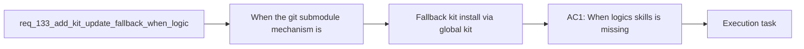

## item_255_fallback_kit_install_via_global_kit_copy_or_direct_clone_when_submodule_is_unavailable - Fallback kit install via global kit copy or direct clone when submodule is unavailable
> From version: 1.22.1
> Schema version: 1.0
> Status: Done
> Understanding: 95%
> Confidence: 91%
> Progress: 100%
> Complexity: Medium
> Theme: General
> Reminder: Update status/understanding/confidence/progress and linked task references when you edit this doc.

# Problem
- When the git submodule mechanism is not functional (because `logics/` is gitignored, or after a fresh clone where the submodule was never initialized), the plugin has no alternative path to install or update the kit.
- This creates a deadlock: no kit means no bootstrap script (`logics/skills/logics.py`) means no way to recover the kit.

# Scope
- In: implement a two-step fallback cascade: (1) copy from the global published kit (`~/.codex/skills/` or `~/.claude/`), then (2) direct `git clone` from the canonical URL. User confirmation before proceeding. Bootstrap convergence after successful install.
- Out: the detection/warning layer (item_254), the adaptive update strategy for subsequent updates (item_256).

# Acceptance criteria
- AC1: When `logics/skills` is missing and the submodule update fails or is not functional, the plugin offers a fallback install path with explicit user confirmation.
- AC2: The fallback first tries copying from the global kit (using the same inspection as `inspectClaudeGlobalKit` / `inspectCodexWorkspaceOverlay` to find the most recent viable source). This works offline.
- AC3: If no global kit is available, the fallback clones from the canonical URL (`https://github.com/AlexAgo83/cdx-logics-kit.git`) directly into `logics/skills/`.
- AC4: After successful fallback install, `reconcileRepoBootstrapAfterKitUpdate` runs and the plugin reaches a functional state.
- AC5: The existing submodule-based update path is unchanged when the submodule is functional.

# AC Traceability
- AC1 -> req AC1: fallback offered instead of dead-end error. Proof: test with gitignored logics/ confirms fallback prompt.
- AC2 -> req AC2 + D1 + D5: global kit copy first, using existing inspection. Proof: test with global kit present confirms copy path.
- AC3 -> req AC2 + D1: direct clone as second fallback. Proof: test with no global kit confirms clone path.
- AC4 -> req AC3: bootstrap convergence post-fallback. Proof: functional state inspection after fallback.
- AC5 -> req AC4: non-regression. Proof: existing submodule update tests still pass.

# Decision framing
- Product framing: Not needed
- Architecture framing: Required (introduces a new install path parallel to the submodule flow)
- Architecture signals: state and sync, new code path in `logicsCodexWorkflowController.ts`
- Architecture follow-up: The fallback should be clearly separated from the submodule path to avoid coupling.

# Links
- Product brief(s): (none yet)
- Architecture decision(s): (none yet)
- Request: `req_133_add_kit_update_fallback_when_logics_is_gitignored`
- Primary task(s): (none yet)

# References
- `src/logicsCodexWorkflowController.ts` (updateLogicsKit - add fallback branch)
- `src/logicsProviderUtils.ts` (inspectLogicsKitSubmodule, inspectLogicsBootstrapState)
- `src/logicsClaudeGlobalKit.ts` (inspectClaudeGlobalKit - source for copy)
- `src/logicsCodexWorkspace.ts` (inspectCodexWorkspaceOverlay - source for copy)
- `src/logicsEnvironment.ts` (inspectLogicsEnvironment, bootstrapRepair)

# Priority
- Impact: High - unblocks local-only Logics usage
- Urgency: Medium - affects users who gitignore logics/

# Notes
- Derived from request `req_133_add_kit_update_fallback_when_logics_is_gitignored`.
- Corresponds to request design decisions D1 (cascade), D4 (user confirmation), D5 (global kit source).
- Depends on item_254 for the detection/warning that makes the fallback discoverable.
- Item_256 builds on this to handle subsequent updates after the initial fallback install.
- Implemented in `src/logicsCodexWorkflowController.ts` with tests for copy-first and clone fallback paths.
