## item_256_adaptive_kit_update_strategy_for_standalone_clone_vs_submodule_installs - Adaptive kit update strategy for standalone clone vs submodule installs
> From version: 1.22.1
> Schema version: 1.0
> Status: Ready
> Understanding: 95%
> Confidence: 80%
> Progress: 0%
> Complexity: Medium
> Theme: General
> Reminder: Update status/understanding/confidence/progress and linked task references when you edit this doc.

# Problem
- After a fallback install (item_255), `logics/skills` may be a standalone git clone (has `.git/`) or a plain copy (no `.git/`). The current `updateLogicsKit` only knows how to do `git submodule update`.
- Without an adaptive strategy, subsequent kit updates after a fallback will fail or require the user to manually intervene.

# Scope
- In: detect the nature of `logics/skills` (submodule, standalone clone, or plain copy) and route subsequent updates to the appropriate strategy: `git submodule update`, `git -C logics/skills pull`, or re-copy from global kit / fresh clone.
- Out: the initial fallback install (item_255), the gitignore detection/warning (item_254).

```mermaid
%% logics-kind: backlog
%% logics-signature: backlog|adaptive-kit-update-strategy-for-standal|req-133-add-kit-update-fallback-when-log|after-a-fallback-install-item-255-logics|ac1-the-plugin-detects-whether-logics
flowchart LR
    Request[req 133 kit update fallback] --> Problem[No update path after fallback install]
    Problem --> Scope[Detect install type and route updates]
    Scope --> AC1[Detect standalone clone vs submodule vs copy]
    AC1 --> AC2[git pull for standalone clone]
    AC2 --> AC3[Re-copy or fresh clone for plain copy]
    AC3 --> AC4[Submodule path unchanged]
```

# Acceptance criteria
- AC1: The plugin detects whether `logics/skills` is a git submodule, a standalone clone (`.git` directory present but not a submodule), or a plain copy (no `.git`).
- AC2: For standalone clones, subsequent updates use `git -C logics/skills pull origin main`.
- AC3: For plain copies, subsequent updates re-copy from the global kit if available, or fall back to a fresh clone.
- AC4: For submodules, the existing `git submodule update` path is unchanged.
- AC5: If the user removes `logics/` from `.gitignore` after a fallback install, the plugin does not attempt submodule operations on a standalone clone directory (avoids corruption).

# AC Traceability
- AC1 -> req AC6: detect install type. Proof: unit test for detection function.
- AC2 -> req AC6 + D2: git pull for standalone. Proof: test with standalone clone confirms pull path.
- AC3 -> req AC6 + D2: re-copy for plain copy. Proof: test with plain copy confirms re-copy path.
- AC4 -> req AC4: non-regression. Proof: existing submodule tests pass.
- AC5 -> req Risks: no submodule ops on standalone clone. Proof: test confirming submodule update is skipped when standalone clone detected.

# Decision framing
- Product framing: Not needed
- Architecture framing: Required (routing logic in updateLogicsKit needs a new branching strategy)
- Architecture signals: state and sync, install-type detection
- Architecture follow-up: The detection should be a reusable function in `logicsProviderUtils.ts` since Check Environment and other flows may need it too.

# Links
- Product brief(s): (none yet)
- Architecture decision(s): (none yet)
- Request: `req_133_add_kit_update_fallback_when_logics_is_gitignored`
- Primary task(s): (none yet)

# References
- `src/logicsCodexWorkflowController.ts` (updateLogicsKit - add routing logic)
- `src/logicsProviderUtils.ts` (inspectLogicsKitSubmodule - extend with install-type detection)

# Priority
- Impact: Medium - ensures ongoing viability of fallback installs
- Urgency: Low - only relevant after item_255 is delivered

# Notes
- Derived from request `req_133_add_kit_update_fallback_when_logics_is_gitignored`.
- Corresponds to request design decision D2 (subsequent update strategy).
- Depends on item_255 (fallback install must exist before adaptive updates make sense).
- Risk: if user removes `logics/` from `.gitignore` after a standalone clone, the plugin must not try submodule operations on it.
