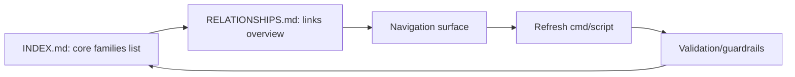

## item_257_generated_corpus_index_and_relationship_views - Generated corpus index and relationship views
> From version: 1.22.2
> Schema version: 1.0
> Status: Ready
> Understanding: 98%
> Confidence: 95%
> Progress: 50%
> Complexity: Medium
> Theme: Navigation and discoverability
> Reminder: Update status/understanding/confidence/progress and linked task references when you edit this doc.

# Problem
- Provide a generated entry point for navigating a large `logics/` corpus without manual directory scanning.
- Surface the important workflow families as a generated index or a better equivalent view that keeps navigation cheap as the corpus grows.
- Make relationship visibility first-class so requests, backlog items, tasks, product briefs, and architecture notes can be reached from one maintained surface.
- Keep the generated views reproducible from repository data and easy to refresh as docs change.
- The repository now contains a large Logics corpus with requests, backlog items, tasks, product briefs, architecture notes, and support docs.
- The current review showed that navigation is still mostly manual even though the individual files are in good shape.

# Scope
- In: one coherent delivery slice from the source request.
- Out: unrelated sibling slices that should stay in separate backlog items instead of widening this doc.

# Acceptance criteria
- AC1: A generated `logics/INDEX.md` or equivalent exists and lists the core workflow document families with titles, status or progress, and direct repo-relative paths.
- AC2: A generated `logics/RELATIONSHIPS.md` or equivalent exists and shows the important links between requests, backlog items, tasks, product briefs, architecture notes, and support docs.
- AC3: The generated views can be refreshed deterministically from repository data, with a documented command or script entry point.
- AC4: The navigation surface makes it faster to find related docs than browsing the raw directory tree, especially for large request/backlog/task clusters.
- AC5: The generated output includes validation or guardrails for stale links, missing refs, or docs that are not yet represented in the views.

# AC Traceability
- AC1 -> Scope: A generated `logics/INDEX.md` or equivalent exists and lists the core workflow document families with titles, status or progress, and direct repo-relative paths.. Proof: capture validation evidence in this doc.
- AC2 -> Scope: A generated `logics/RELATIONSHIPS.md` or equivalent exists and shows the important links between requests, backlog items, tasks, product briefs, architecture notes, and support docs.. Proof: capture validation evidence in this doc.
- AC3 -> Scope: The generated views can be refreshed deterministically from repository data, with a documented command or script entry point.. Proof: capture validation evidence in this doc.
- AC4 -> Scope: The navigation surface makes it faster to find related docs than browsing the raw directory tree, especially for large request/backlog/task clusters.. Proof: capture validation evidence in this doc.
- AC5 -> Scope: The generated output includes validation or guardrails for stale links, missing refs, or docs that are not yet represented in the views.. Proof: capture validation evidence in this doc.

# Decision framing
- Product framing: Consider
- Product signals: navigation and discoverability
- Product follow-up: Review whether a product brief is needed before scope becomes harder to change.
- Architecture framing: Consider
- Architecture signals: data model and persistence
- Architecture follow-up: Review whether an architecture decision is needed before implementation becomes harder to reverse.

# Links
- Product brief(s): `prod_005_logics_corpus_navigation_views`
- Architecture decision(s): `adr_016_use_generated_corpus_index_and_relationship_views_for_logics_navigation`
- Request: `req_134_generated_corpus_index_and_relationship_views`
- Primary task(s): `task_117_generated_corpus_index_and_relationship_views`

# AI Context
- Summary: Generated corpus index and relationship views for the Logics repository
- Keywords: index, relationships, navigation, discoverability, corpus, logics
- Use when: Use when grooming a repository-level navigation layer for a large Logics corpus.
- Skip when: Skip when the work targets a different workflow surface or a broader product redesign.
# References
- `logics/skills/logics-ui-steering/SKILL.md`

# Priority
- Impact:
- Urgency:

# Notes
- Derived from request `req_134_generated_corpus_index_and_relationship_views`.
- Source file: `logics/request/req_134_generated_corpus_index_and_relationship_views.md`.
- Keep this backlog item as one bounded delivery slice; create sibling backlog items for the remaining request coverage instead of widening this doc.
- Request context seeded into this backlog item from `logics/request/req_134_generated_corpus_index_and_relationship_views.md`.
