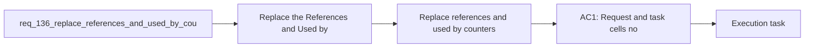

## item_258_replace_references_and_used_by_counters_with_a_discreet_progress_complexity_badge - Replace references and used by counters with a discreet progress complexity badge
> From version: 1.22.2
> Schema version: 1.0
> Status: Done
> Understanding: 96%
> Confidence: 93%
> Progress: 100%
> Complexity: Medium
> Theme: General
> Reminder: Update status/understanding/confidence/progress and linked task references when you edit this doc.

# Problem
- Replace the `References` and `Used by` counters in request and task cells with a compact badge.
- Show `progress` and `complexity` in that badge so cells still communicate delivery state at a glance.
- Keep the badge visually discreet enough for dense board and list views.
- Allow short labels if needed, but keep the meaning obvious to the user.
- Preserve the underlying relation data for details and traceability; this is only a presentation change.
- - Request and task cells currently surface relation counters that are useful for traceability but heavy for dense scanning.
- - The badge should make the cell feel lighter while still showing the most useful status signals.

# Scope
- In: one coherent delivery slice from the source request.
- Out: unrelated sibling slices that should stay in separate backlog items instead of widening this doc.

# Acceptance criteria
- AC1: Request and task cells no longer show `References` and `Used by` counters.
- AC2: Request and task cells show a discreet badge with progress and complexity instead.
- AC3: Badge labels may be abbreviated, but the meaning remains readable at a glance.
- AC4: Relation data remains available elsewhere in the UI and is not removed from the underlying document model.
- AC5: The change does not make request/task cells harder to scan in dense board or list views.

# AC Traceability
- AC1 -> Scope: Request and task cells no longer show `References` and `Used by` counters.. Proof: capture validation evidence in this doc.
- AC2 -> Scope: Request and task cells show a discreet badge with progress and complexity instead.. Proof: capture validation evidence in this doc.
- AC3 -> Scope: Badge labels may be abbreviated, but the meaning remains readable at a glance.. Proof: capture validation evidence in this doc.
- AC4 -> Scope: Relation data remains available elsewhere in the UI and is not removed from the underlying document model.. Proof: capture validation evidence in this doc.
- AC5 -> Scope: The change does not make request/task cells harder to scan in dense board or list views.. Proof: capture validation evidence in this doc.

# Decision framing
- Product framing: Not needed
- Product signals: (none detected)
- Product follow-up: No product brief follow-up is expected based on current signals.
- Architecture framing: Consider
- Architecture signals: data model and persistence
- Architecture follow-up: Review whether an architecture decision is needed before implementation becomes harder to reverse.

# Links
- Product brief(s): (none yet)
- Architecture decision(s): (none yet)
- Request: `req_136_replace_references_and_used_by_counters_with_a_discreet_progress_complexity_badge`
- Primary task(s): `task_118_replace_references_and_used_by_counters_with_a_discreet_progress_complexity_badge`

# AI Context
- Summary: Replace references and used by counters with a discreet progress complexity badge
- Keywords: references, used by, badge, progress, complexity, cells, requests, tasks
- Use when: Use when changing request/task cell chrome to emphasize progress and complexity instead of relation counters.
- Skip when: Skip when the work is about the details panel, link editing, or relation persistence itself.
# References
- `logics/skills/logics-ui-steering/SKILL.md`

# Priority
- Impact:
- Urgency:

# Notes
- Derived from request `req_136_replace_references_and_used_by_counters_with_a_discreet_progress_complexity_badge`.
- Source file: `logics/request/req_136_replace_references_and_used_by_counters_with_a_discreet_progress_complexity_badge.md`.
- Keep this backlog item as one bounded delivery slice; create sibling backlog items for the remaining request coverage instead of widening this doc.
- Request context seeded into this backlog item from `logics/request/req_136_replace_references_and_used_by_counters_with_a_discreet_progress_complexity_badge.md`.
