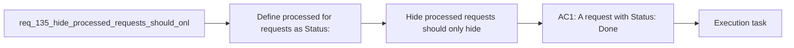

## item_259_hide_processed_requests_should_only_hide_done_requests - Hide processed requests should only hide done requests
> From version: 1.22.2
> Schema version: 1.0
> Status: Done
> Understanding: 96%
> Confidence: 94%
> Progress: 100%
> Complexity: Medium
> Theme: General
> Reminder: Update status/understanding/confidence/progress and linked task references when you edit this doc.

# Problem
- Define `processed` for requests as `Status: Done`, not as "linked to a backlog item or task".
- Keep requests that are still not done visible when `Hide processed requests` is enabled.
- Apply the rule consistently in the plugin views that list requests.
- Preserve request-to-item and request-to-task relationships for traceability, but do not use them as visibility logic.
- Add regression coverage so a request that has linked work but is not done still appears when the filter is active.
- - The current behavior treats a request as processed when it is covered by a downstream Logics item or task.
- - That makes active requests disappear too early even when they are not finished.

# Scope
- In: one coherent delivery slice from the source request.
- Out: unrelated sibling slices that should stay in separate backlog items instead of widening this doc.

# Acceptance criteria
- AC1: A request with `Status: Done` is hidden when `Hide processed requests` is enabled.
- AC2: A request that is not `Done` stays visible even if it already has linked backlog items or tasks.
- AC3: The plugin uses request status, not downstream item/task linkage, to decide whether a request is processed.
- AC4: The behavior is covered by regression tests or equivalent validation.

# AC Traceability
- AC1 -> Scope: A request with `Status: Done` is hidden when `Hide processed requests` is enabled.. Proof: capture validation evidence in this doc.
- AC2 -> Scope: A request that is not `Done` stays visible even if it already has linked backlog items or tasks.. Proof: capture validation evidence in this doc.
- AC3 -> Scope: The plugin uses request status, not downstream item/task linkage, to decide whether a request is processed.. Proof: capture validation evidence in this doc.
- AC4 -> Scope: The behavior is covered by regression tests or equivalent validation.. Proof: capture validation evidence in this doc.

# Decision framing
- Product framing: Consider
- Product signals: navigation and discoverability
- Product follow-up: Review whether a product brief is needed before scope becomes harder to change.
- Architecture framing: Consider
- Architecture signals: data model and persistence
- Architecture follow-up: Review whether an architecture decision is needed before implementation becomes harder to reverse.

# Links
- Product brief(s): (none yet)
- Architecture decision(s): (none yet)
- Request: `req_135_hide_processed_requests_should_only_hide_done_requests`
- Primary task(s): `task_119_hide_processed_requests_should_only_hide_done_requests`

# AI Context
- Summary: Hide processed requests should only hide done requests
- Keywords: hide, processed, requests, done, status, visibility
- Use when: Use when the plugin should hide only requests that are actually done, regardless of downstream item or task coverage.
- Skip when: Skip when the work is about a different filter, view mode, or workflow stage.
# Priority
- Impact:
- Urgency:

# Notes
- Derived from request `req_135_hide_processed_requests_should_only_hide_done_requests`.
- Source file: `logics/request/req_135_hide_processed_requests_should_only_hide_done_requests.md`.
- Keep this backlog item as one bounded delivery slice; create sibling backlog items for the remaining request coverage instead of widening this doc.
- Request context seeded into this backlog item from `logics/request/req_135_hide_processed_requests_should_only_hide_done_requests.md`.
