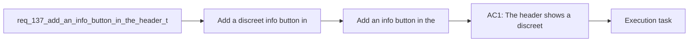

## item_260_add_an_info_button_in_the_header_to_open_logics_insights - Add an info button in the header to open Logics insights
> From version: 1.22.2
> Schema version: 1.0
> Status: Ready
> Understanding: 95%
> Confidence: 90%
> Progress: 0%
> Complexity: Medium
> Theme: General
> Reminder: Update status/understanding/confidence/progress and linked task references when you edit this doc.

# Problem
- Add a discreet info button in the plugin header, placed before the Show recent activity control, that opens Logics insights.
- Make the affordance discoverable without changing the rest of the header behavior.
- - The plugin already exposes Logics insights as a separate view.
- - Users want a faster path to that view directly from the header where activity and navigation controls live.

# Scope
- In: one coherent delivery slice from the source request.
- Out: unrelated sibling slices that should stay in separate backlog items instead of widening this doc.

# Acceptance criteria
- AC1: The header shows a discreet info button before Show recent activity.
- AC2: Clicking the info button opens Logics insights.
- AC3: The button remains compact and does not alter the behavior of adjacent header controls.
- AC4: The interaction is accessible from keyboard and has a clear label or tooltip.

# AC Traceability
- AC1 -> Scope: The header shows a discreet info button before Show recent activity.. Proof: capture validation evidence in this doc.
- AC2 -> Scope: Clicking the info button opens Logics insights.. Proof: capture validation evidence in this doc.
- AC3 -> Scope: The button remains compact and does not alter the behavior of adjacent header controls.. Proof: capture validation evidence in this doc.
- AC4 -> Scope: The interaction is accessible from keyboard and has a clear label or tooltip.. Proof: capture validation evidence in this doc.

# Decision framing
- Product framing: Consider
- Product signals: navigation and discoverability
- Product follow-up: Review whether a product brief is needed before scope becomes harder to change.
- Architecture framing: Consider
- Architecture signals: data model and persistence
- Architecture follow-up: Review whether an architecture decision is needed before implementation becomes harder to reverse.

# Links
- Product brief(s): (none yet)
- Architecture decision(s): (none yet)
- Request: `req_137_add_an_info_button_in_the_header_to_open_logics_insights`
- Primary task(s): `task_XXX_example`

# AI Context
- Summary: Add a discreet header info button that opens Logics insights
- Keywords: info button, header, show recent activity, logics insights, open insights
- Use when: Use when framing the header affordance that shortcuts to Logics insights.
- Skip when: Skip when the work targets a different toolbar control or a different panel entry point.
# Priority
- Impact:
- Urgency:

# Notes
- Derived from request `req_137_add_an_info_button_in_the_header_to_open_logics_insights`.
- Source file: `logics/request/req_137_add_an_info_button_in_the_header_to_open_logics_insights.md`.
- Keep this backlog item as one bounded delivery slice; create sibling backlog items for the remaining request coverage instead of widening this doc.
- Request context seeded into this backlog item from `logics/request/req_137_add_an_info_button_in_the_header_to_open_logics_insights.md`.
