## item_261_use_understanding_confidence_and_complexity_for_request_badges - Use Understanding Confidence and Complexity for request badges
> From version: 1.22.2
> Schema version: 1.0
> Status: Done
> Understanding: 95%
> Confidence: 90%
> Progress: 100%
> Complexity: Medium
> Theme: General
> Reminder: Update status/understanding/confidence/progress and linked task references when you edit this doc.

# Problem
- Request cells should show `Understanding`, `Confidence`, and `Complexity` instead of `Progress` and `Complexity`.
- The request header preview should render these indicators in a cleaner, more readable way.
- - Requests describe definition and certainty more than delivery progress.
- - `Progress` is more appropriate for backlog items and tasks, where execution actually advances.

# Scope
- In: one coherent delivery slice from the source request.
- Out: unrelated sibling slices that should stay in separate backlog items instead of widening this doc.

```mermaid
%% logics-kind: backlog
%% logics-signature: backlog|use-understanding-confidence-and-complex|req-138-use-understanding-confidence-and|request-cells-should-show-understanding-|ac1-request-cells-show-understanding-con
flowchart LR
    Request[req_138_use_understanding_confidence_and_c] --> Problem[Request cells should show Understanding Co]
    Problem --> Scope[Use Understanding Confidence and Complexit]
    Scope --> Acceptance[AC1: Request cells show Understanding Conf]
    Acceptance --> Tasks[task_120_orchestrate_header_and_badge_ui_u]
```

# Acceptance criteria
- AC1: Request cells show `Understanding`, `Confidence`, and `Complexity`.
- AC2: Request cells no longer show `Progress`.
- AC3: The request preview renders the indicator block in a readable compact form.
- AC4: Backlog items and tasks keep their `Progress` badge behavior unchanged.

# AC Traceability
- AC1 -> Scope: Request cells show `Understanding`, `Confidence`, and `Complexity`.. Proof: capture validation evidence in this doc.
- AC2 -> Scope: Request cells no longer show `Progress`.. Proof: capture validation evidence in this doc.
- AC3 -> Scope: The request preview renders the indicator block in a readable compact form.. Proof: capture validation evidence in this doc.
- AC4 -> Scope: Backlog items and tasks keep their `Progress` badge behavior unchanged.. Proof: capture validation evidence in this doc.

# Decision framing
- Product framing: Not needed
- Product signals: (none detected)
- Product follow-up: No product brief follow-up is expected based on current signals.
- Architecture framing: Consider
- Architecture signals: data model and persistence
- Architecture follow-up: Review whether an architecture decision is needed before implementation becomes harder to reverse.

# Links
- Product brief(s): (none yet)
- Architecture decision(s): (none yet)
- Request: `req_138_use_understanding_confidence_and_complexity_for_request_badges`
- Primary task(s): `task_XXX_example`

# AI Context
- Summary: Use Understanding, Confidence, and Complexity for request badges
- Keywords: request badges, understanding, confidence, complexity, progress, preview
- Use when: Use when changing how request cells communicate certainty and readability.
- Skip when: Skip when the work targets backlog or task progress badges.
# Priority
- Impact:
- Urgency:

# Notes
- Derived from request `req_138_use_understanding_confidence_and_complexity_for_request_badges`.
- Source file: `logics/request/req_138_use_understanding_confidence_and_complexity_for_request_badges.md`.
- Keep this backlog item as one bounded delivery slice; create sibling backlog items for the remaining request coverage instead of widening this doc.
- Request context seeded into this backlog item from `logics/request/req_138_use_understanding_confidence_and_complexity_for_request_badges.md`.
- Task `task_120_orchestrate_header_and_badge_ui_updates` was finished via `logics_flow.py finish task` on 2026-04-09.
