## item_262_remove_the_missing_docs_badge_from_the_plugin_preview - Remove the missing docs badge from the plugin preview
> From version: 1.22.2
> Schema version: 1.0
> Status: Done
> Understanding: 95%
> Confidence: 90%
> Progress: 100%
> Complexity: Medium
> Theme: General
> Reminder: Update status/understanding/confidence/progress and linked task references when you edit this doc.

# Problem
- Remove the `Missing docs` badge from the plugin preview when the missing document is not required.
- Keep the preview focused on actionable signals instead of surfacing optional-document absence as a warning.
- - Some documents are optional companions, not required dependencies.
- - Showing a `Missing docs` badge for optional material makes the preview look more alarming than the actual situation.

# Scope
- In: one coherent delivery slice from the source request.
- Out: unrelated sibling slices that should stay in separate backlog items instead of widening this doc.

```mermaid
%% logics-kind: backlog
%% logics-signature: backlog|remove-the-missing-docs-badge-from-the-p|req-139-remove-the-missing-docs-badge-fr|remove-the-missing-docs-badge-from|ac1-optional-missing-documents-no-longer
flowchart LR
    Request[req_139_remove_the_missing_docs_badge_from] --> Problem[Remove the Missing docs badge from]
    Problem --> Scope[Remove the missing docs badge from]
    Scope --> Acceptance[AC1: Optional missing documents no longer]
    Acceptance --> Tasks[task_120_orchestrate_header_and_badge_ui_u]
```

# Acceptance criteria
- AC1: Optional missing documents no longer show a `Missing docs` badge in the preview.
- AC2: Required missing documents still surface a blocking or attention signal.
- AC3: The preview language distinguishes optional gaps from true blockers.
- AC4: Removing the badge does not hide other health or dependency indicators.

# AC Traceability
- AC1 -> Scope: Optional missing documents no longer show a `Missing docs` badge in the preview.. Proof: capture validation evidence in this doc.
- AC2 -> Scope: Required missing documents still surface a blocking or attention signal.. Proof: capture validation evidence in this doc.
- AC3 -> Scope: The preview language distinguishes optional gaps from true blockers.. Proof: capture validation evidence in this doc.
- AC4 -> Scope: Removing the badge does not hide other health or dependency indicators.. Proof: capture validation evidence in this doc.

# Decision framing
- Product framing: Not needed
- Product signals: (none detected)
- Product follow-up: No product brief follow-up is expected based on current signals.
- Architecture framing: Consider
- Architecture signals: data model and persistence
- Architecture follow-up: Review whether an architecture decision is needed before implementation becomes harder to reverse.

# Links
- Product brief(s): (none yet)
- Architecture decision(s): (none yet)
- Request: `req_139_remove_the_missing_docs_badge_from_the_plugin_preview`
- Primary task(s): `task_XXX_example`

# AI Context
- Summary: Remove the Missing docs badge for optional companion gaps
- Keywords: missing docs, optional docs, required docs, preview, warnings
- Use when: Use when changing how the plugin previews document gaps.
- Skip when: Skip when the work is about required blocking dependencies or other health badges.
# Priority
- Impact:
- Urgency:

# Notes
- Derived from request `req_139_remove_the_missing_docs_badge_from_the_plugin_preview`.
- Source file: `logics/request/req_139_remove_the_missing_docs_badge_from_the_plugin_preview.md`.
- Keep this backlog item as one bounded delivery slice; create sibling backlog items for the remaining request coverage instead of widening this doc.
- Request context seeded into this backlog item from `logics/request/req_139_remove_the_missing_docs_badge_from_the_plugin_preview.md`.
- Task `task_120_orchestrate_header_and_badge_ui_updates` was finished via `logics_flow.py finish task` on 2026-04-09.
