## item_263_show_compact_document_type_and_number_before_cell_names - Show compact document type and number before cell names
> From version: 1.22.2
> Schema version: 1.0
> Status: Done
> Understanding: 95%
> Confidence: 90%
> Progress: 100%
> Complexity: Medium
> Theme: General
> Reminder: Update status/understanding/confidence/progress and linked task references when you edit this doc.

# Problem
- Show a compact document type prefix and document number before the name in each cell.
- Keep the prefix visually subtle so the title remains the primary reading target.
- - Cells already encode the document kind through color and badges, but the kind is not immediately visible in the title line.
- - A compact inline prefix such as `R002`, `I201`, `T032`, `P111`, or `A324` helps users scan mixed boards faster.

# Scope
- In: one coherent delivery slice from the source request.
- Out: unrelated sibling slices that should stay in separate backlog items instead of widening this doc.

```mermaid
%% logics-kind: backlog
%% logics-signature: backlog|show-compact-document-type-and-number-be|req-140-show-compact-document-type-and-n|show-a-compact-document-type-prefix|ac1-cell-titles-show-a-compact
flowchart LR
    Request[req_140_show_compact_document_type_and_num] --> Problem[Show a compact document type prefix]
    Problem --> Scope[Show compact document type and number]
    Scope --> Acceptance[AC1: Cell titles show a compact]
    Acceptance --> Tasks[task_120_orchestrate_header_and_badge_ui_u]
```

# Acceptance criteria
- AC1: Cell titles show a compact inline prefix before the document name.
- AC2: The prefix uses the document kind and document number.
- AC3: The prefix remains visually subtle and does not overpower the title.
- AC4: The presentation works across request, backlog, task, product, architecture, and spec cells.
- AC5: The existing name text remains readable and unchanged apart from the new prefix.

# AC Traceability
- AC1 -> Scope: Cell titles show a compact inline prefix before the document name.. Proof: capture validation evidence in this doc.
- AC2 -> Scope: The prefix uses the document kind and document number.. Proof: capture validation evidence in this doc.
- AC3 -> Scope: The prefix remains visually subtle and does not overpower the title.. Proof: capture validation evidence in this doc.
- AC4 -> Scope: The presentation works across request, backlog, task, product, architecture, and spec cells.. Proof: capture validation evidence in this doc.
- AC5 -> Scope: The existing name text remains readable and unchanged apart from the new prefix.. Proof: capture validation evidence in this doc.

# Decision framing
- Product framing: Not needed
- Product signals: (none detected)
- Product follow-up: No product brief follow-up is expected based on current signals.
- Architecture framing: Consider
- Architecture signals: data model and persistence
- Architecture follow-up: Review whether an architecture decision is needed before implementation becomes harder to reverse.

# Links
- Product brief(s): (none yet)
- Architecture decision(s): (none yet)
- Request: `req_140_show_compact_document_type_and_number_before_cell_names`
- Primary task(s): `task_XXX_example`

# AI Context
- Summary: Show a compact document type and number prefix before cell names
- Keywords: prefix, document type, number, cell title, scanability, board
- Use when: Use when improving cell title readability in mixed workflow boards.
- Skip when: Skip when the work targets detail panels, badge logic, or document content.
# Priority
- Impact:
- Urgency:

# Notes
- Derived from request `req_140_show_compact_document_type_and_number_before_cell_names`.
- Source file: `logics/request/req_140_show_compact_document_type_and_number_before_cell_names.md`.
- Keep this backlog item as one bounded delivery slice; create sibling backlog items for the remaining request coverage instead of widening this doc.
- Request context seeded into this backlog item from `logics/request/req_140_show_compact_document_type_and_number_before_cell_names.md`.
- Task `task_120_orchestrate_header_and_badge_ui_updates` was finished via `logics_flow.py finish task` on 2026-04-09.
