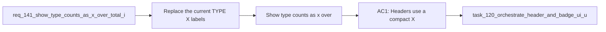

## item_264_show_type_counts_as_x_over_total_in_column_headers - Show type counts as x over total in column headers
> From version: 1.22.2
> Schema version: 1.0
> Status: Done
> Understanding: 95%
> Confidence: 90%
> Progress: 100%
> Complexity: Medium
> Theme: General
> Reminder: Update status/understanding/confidence/progress and linked task references when you edit this doc.

# Problem
- Replace the current `TYPE (X)` labels in column and list headers with a compact `X/TOTAL` counter for that type.
- Keep the type label readable while making the count format more informative at a glance.
- - The plugin already shows type counts in headers, but the current format is less expressive than `X/TOTAL`.
- - Users want to see how many items are currently visible for a type compared with the total available for that type.

# Scope
- In: one coherent delivery slice from the source request.
- Out: unrelated sibling slices that should stay in separate backlog items instead of widening this doc.

# Acceptance criteria
- AC1: Headers use a compact `X/TOTAL` count format for each type.
- AC2: The count is shown alongside the existing type label, not instead of it.
- AC3: The new format works across request, backlog, task, product, architecture, and spec views.
- AC4: The header remains compact enough for dense board layouts.
- AC5: The change preserves the underlying count data and only updates presentation.

# AC Traceability
- AC1 -> Scope: Headers use a compact `X/TOTAL` count format for each type.. Proof: capture validation evidence in this doc.
- AC2 -> Scope: The count is shown alongside the existing type label, not instead of it.. Proof: capture validation evidence in this doc.
- AC3 -> Scope: The new format works across request, backlog, task, product, architecture, and spec views.. Proof: capture validation evidence in this doc.
- AC4 -> Scope: The header remains compact enough for dense board layouts.. Proof: capture validation evidence in this doc.
- AC5 -> Scope: The change preserves the underlying count data and only updates presentation.. Proof: capture validation evidence in this doc.

# Decision framing
- Product framing: Not needed
- Product signals: (none detected)
- Product follow-up: No product brief follow-up is expected based on current signals.
- Architecture framing: Consider
- Architecture signals: data model and persistence
- Architecture follow-up: Review whether an architecture decision is needed before implementation becomes harder to reverse.

# Links
- Product brief(s): (none yet)
- Architecture decision(s): (none yet)
- Request: `req_141_show_type_counts_as_x_over_total_in_column_headers`
- Primary task(s): `task_XXX_example`

# AI Context
- Summary: Show type counts as X over total in column and list headers
- Keywords: type counts, x over total, headers, column labels, list labels
- Use when: Use when changing how the plugin summarizes per-type counts in headers.
- Skip when: Skip when the work targets card content, badge logic, or document metadata.
# Priority
- Impact:
- Urgency:

# Notes
- Derived from request `req_141_show_type_counts_as_x_over_total_in_column_headers`.
- Source file: `logics/request/req_141_show_type_counts_as_x_over_total_in_column_headers.md`.
- Keep this backlog item as one bounded delivery slice; create sibling backlog items for the remaining request coverage instead of widening this doc.
- Request context seeded into this backlog item from `logics/request/req_141_show_type_counts_as_x_over_total_in_column_headers.md`.
- Task `task_120_orchestrate_header_and_badge_ui_updates` was finished via `logics_flow.py finish task` on 2026-04-09.
