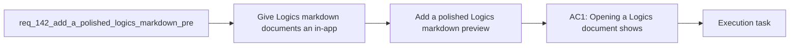

## item_265_add_a_polished_logics_markdown_preview_screen - Add a polished Logics markdown preview screen
> From version: 1.22.2
> Schema version: 1.0
> Status: Done
> Understanding: 94%
> Confidence: 88%
> Progress: 100%
> Complexity: High
> Theme: UI
> Reminder: Update status/understanding/confidence/progress and linked task references when you edit this doc.

# Problem
- Give Logics markdown documents an in-app preview that feels native to the plugin rather than relying on the raw VS Code markdown renderer.
- Render linked references, companion docs, and related workflow items as clickable navigation targets inside the preview.
- Format document names in a consistent "number - name" style so the preview is easier to scan.
- Route open and read actions to the custom preview surface so double click and read follow the same experience.
- Keep the preview aligned with the existing Logics visual theme used by insights and onboarding.
- - Users currently jump to the generic VS Code markdown preview when they want to read a Logics document.
- - The current flow does not highlight relationships well enough for workflow navigation.

# Scope
- In: one coherent delivery slice from the source request.
- Out: unrelated sibling slices that should stay in separate backlog items instead of widening this doc.

# Acceptance criteria
- AC1: Opening a Logics document shows a custom preview screen inside the plugin.
- AC2: References and related workflow items are clickable and navigate to the linked document.
- AC3: Document titles in the preview use a compact "number - name" presentation.
- AC4: Double click and read actions both open the custom preview instead of the default markdown preview.
- AC5: The preview visually matches the existing Logics app theme and remains readable in the current dark UI.

# AC Traceability
- AC1 -> Scope: Opening a Logics document shows a custom preview screen inside the plugin.. Proof: capture validation evidence in this doc.
- AC2 -> Scope: References and related workflow items are clickable and navigate to the linked document.. Proof: capture validation evidence in this doc.
- AC3 -> Scope: Document titles in the preview use a compact "number - name" presentation.. Proof: capture validation evidence in this doc.
- AC4 -> Scope: Double click and read actions both open the custom preview instead of the default markdown preview.. Proof: capture validation evidence in this doc.
- AC5 -> Scope: The preview visually matches the existing Logics app theme and remains readable in the current dark UI.. Proof: capture validation evidence in this doc.

# Decision framing
- Product framing: Required
- Product signals: conversion journey, navigation and discoverability
- Product follow-up: Create or link a product brief before implementation moves deeper into delivery.
- Architecture framing: Required
- Architecture signals: data model and persistence, contracts and integration
- Architecture follow-up: Create or link an architecture decision before irreversible implementation work starts.

# Links
- Product brief(s): `prod_006_custom_logics_markdown_preview_experience`
- Architecture decision(s): `adr_017_route_logics_document_reads_to_a_native_preview`
- Request: `req_142_add_a_polished_logics_markdown_preview_screen`
- Primary task(s): `task_121_add_a_polished_logics_markdown_preview_screen`

# AI Context
- Summary: Add a polished Logics markdown preview screen
- Keywords: preview, markdown, navigation, references, clickable, theme, read, double click
- Use when: Use when designing the custom document preview experience for Logics markdown files.
- Skip when: Skip when the request is about board badges, counts, or other unrelated UI elements.
# References
- `logics/skills/logics-ui-steering/SKILL.md`

# Priority
- Impact:
- Urgency:

# Notes
- Derived from request `req_142_add_a_polished_logics_markdown_preview_screen`.
- Source file: `logics/request/req_142_add_a_polished_logics_markdown_preview_screen.md`.
- Keep this backlog item as one bounded delivery slice; create sibling backlog items for the remaining request coverage instead of widening this doc.
- Request context seeded into this backlog item from `logics/request/req_142_add_a_polished_logics_markdown_preview_screen.md`.
