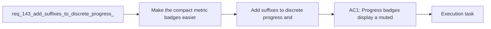

## item_266_add_suffixes_to_discrete_progress_and_understanding_badges - Add suffixes to discrete progress and understanding badges
> From version: 1.22.2
> Schema version: 1.0
> Status: Done
> Understanding: 93%
> Confidence: 90%
> Progress: 100%
> Complexity: Medium
> Theme: UI
> Reminder: Update status/understanding/confidence/progress and linked task references when you edit this doc.

# Problem
- Make the compact metric badges easier to read at a glance by prefixing the metric letter directly before the value.
- Use `P` for Progress, `U` for Understanding, and `C` for Confidence, while keeping Complexity label-free.
- Keep the prefix visually de-emphasized so the number or value remains the main focal point.
- Apply the same visual treatment consistently across request and non-request cells.
- - The current compact badges already condense workflow state into a small footprint.
- - Prefix letters would make the meaning of the value more obvious without increasing badge length much.

# Scope
- In: one coherent delivery slice from the source request.
- Out: unrelated sibling slices that should stay in separate backlog items instead of widening this doc.

# Acceptance criteria
- AC1: Progress badges display a muted `P` prefix before the value.
- AC2: Understanding badges display a muted `U` prefix before the value.
- AC3: Confidence badges display a muted `C` prefix before the value.
- AC4: Complexity remains unprefixed.
- AC5: The prefix styling keeps the numeric value visually dominant.

# AC Traceability
- AC1 -> Scope: Progress badges display a muted `P` prefix before the value.. Proof: capture validation evidence in this doc.
- AC2 -> Scope: Understanding badges display a muted `U` prefix before the value.. Proof: capture validation evidence in this doc.
- AC3 -> Scope: Confidence badges display a muted `C` prefix before the value.. Proof: capture validation evidence in this doc.
- AC4 -> Scope: Complexity remains unprefixed.. Proof: capture validation evidence in this doc.
- AC5 -> Scope: The prefix styling keeps the numeric value visually dominant.. Proof: capture validation evidence in this doc.

# Decision framing
- Product framing: Consider
- Product signals: navigation and discoverability
- Product follow-up: Review whether a product brief is needed before scope becomes harder to change.
- Architecture framing: Consider
- Architecture signals: data model and persistence
- Architecture follow-up: Review whether an architecture decision is needed before implementation becomes harder to reverse.

# Links
- Product brief(s): (none yet)
- Architecture decision(s): (none yet)
- Request: `req_143_add_suffixes_to_discrete_progress_and_understanding_badges`
- Primary task(s): `task_122_add_suffixes_to_discrete_progress_and_understanding_badges`

# AI Context
- Summary: Add suffixes to discrete progress and understanding badges
- Keywords: badges, progress, understanding, confidence, prefix, compact, muted
- Use when: Use when refining the compact badge wording and visual treatment in the plugin UI.
- Skip when: Skip when the work is about the preview screen or unrelated navigation changes.
# References
- `logics/skills/logics-ui-steering/SKILL.md`

# Priority
- Impact:
- Urgency:

# Notes
- Derived from request `req_143_add_suffixes_to_discrete_progress_and_understanding_badges`.
- Source file: `logics/request/req_143_add_suffixes_to_discrete_progress_and_understanding_badges.md`.
- Keep this backlog item as one bounded delivery slice; create sibling backlog items for the remaining request coverage instead of widening this doc.
- Request context seeded into this backlog item from `logics/request/req_143_add_suffixes_to_discrete_progress_and_understanding_badges.md`.
