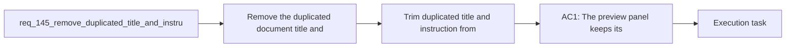

## item_268_trim_duplicated_title_and_instruction_from_board_preview - Trim duplicated title and instruction from board preview
> From version: 1.23.0
> Schema version: 1.0
> Status: Ready
> Understanding: 91%
> Confidence: 88%
> Progress: 0%
> Complexity: Medium
> Theme: Board preview and markdown rendering
> Reminder: Update status/understanding/confidence/progress and linked task references when you edit this doc.

# Problem
- Remove the duplicated document title and top instruction block from the board item preview panel so the preview starts with the actual body content.
- Keep the panel header as the identity surface for the selected item, instead of repeating the same title inside the preview body.
- Preserve the underlying Markdown source and the rendered document content outside this preview surface.
- Avoid changing the meaning of the document or the workflow data model; this is a presentation-only cleanup.
- - The board and detail surfaces already show the selected item identity in the surrounding header chrome.
- - The preview currently repeats the document title and the leading instruction or reminder block, for example:

# Scope
- In: one coherent delivery slice from the source request.
- Out: unrelated sibling slices that should stay in separate backlog items instead of widening this doc.

# Acceptance criteria
- AC1: The preview panel keeps its header identity, but the rendered preview body no longer repeats the document title that already appears in the panel chrome.
- AC2: The preview body no longer shows the leading instruction or reminder block at the top when that information is already redundant in the surrounding preview surface.
- AC3: The underlying Markdown document remains unchanged on disk; only the preview rendering changes.
- AC4: The same document still renders correctly in other document-reading surfaces, including normal Markdown preview flows, unless those surfaces explicitly choose the same trimming rule.
- AC5: The preview still begins at a sensible content boundary, so the first visible lines are the actual body of the request, backlog item, or task rather than the duplicated metadata block.
- AC6: The change is covered by UI or rendering tests that verify the trimmed preview no longer includes the duplicated title and instruction block.

# AC Traceability
- AC1 -> Scope: The preview panel keeps its header identity, but the rendered preview body no longer repeats the document title that already appears in the panel chrome.. Proof: capture validation evidence in this doc.
- AC2 -> Scope: The preview body no longer shows the leading instruction or reminder block at the top when that information is already redundant in the surrounding preview surface.. Proof: capture validation evidence in this doc.
- AC3 -> Scope: The underlying Markdown document remains unchanged on disk; only the preview rendering changes.. Proof: capture validation evidence in this doc.
- AC4 -> Scope: The same document still renders correctly in other document-reading surfaces, including normal Markdown preview flows, unless those surfaces explicitly choose the same trimming rule.. Proof: capture validation evidence in this doc.
- AC5 -> Scope: The preview still begins at a sensible content boundary, so the first visible lines are the actual body of the request, backlog item, or task rather than the duplicated metadata block.. Proof: capture validation evidence in this doc.
- AC6 -> Scope: The change is covered by UI or rendering tests that verify the trimmed preview no longer includes the duplicated title and instruction block.. Proof: capture validation evidence in this doc.

# Decision framing
- Product framing: Not needed
- Product signals: (none detected)
- Product follow-up: No product brief follow-up is expected based on current signals.
- Architecture framing: Required
- Architecture signals: data model and persistence, runtime and boundaries
- Architecture follow-up: Create or link an architecture decision before irreversible implementation work starts.

# Links
- Product brief(s): (none yet)
- Architecture decision(s): (none yet)
- Request: `req_145_remove_duplicated_title_and_instruction_from_board_preview_panel`
- Primary task(s): `task_XXX_example`

# AI Context
- Summary: Remove the duplicated title and top instruction block from the board item preview panel so the preview body...
- Keywords: board preview, markdown preview, title trim, instruction block, header, body, UI cleanup
- Use when: Use when the preview surface repeats the document title or top metadata block and the panel chrome already provides that identity.
- Skip when: Skip when the change is about the stored Markdown document itself, not the preview rendering.
# References
- `media/renderDetails.js`
- `media/logicsModel.js`
- `media/renderMarkdown.js`
- `src/logicsReadPreviewHtml.ts`
- `src/logicsViewDocumentController.ts`
- `logics/skills/logics-ui-steering/SKILL.md`

# Priority
- Impact:
- Urgency:

# Notes
- Derived from request `req_145_remove_duplicated_title_and_instruction_from_board_preview_panel`.
- Source file: `logics/request/req_145_remove_duplicated_title_and_instruction_from_board_preview_panel.md`.
- Keep this backlog item as one bounded delivery slice; create sibling backlog items for the remaining request coverage instead of widening this doc.
- Request context seeded into this backlog item from `logics/request/req_145_remove_duplicated_title_and_instruction_from_board_preview_panel.md`.
