## item_269_improve_mermaid_orientation_and_diagram_variety - Improve Mermaid orientation and diagram variety
> From version: 1.23.0
> Schema version: 1.0
> Status: Done
> Understanding: 91%
> Confidence: 88%
> Progress: 100%
> Complexity: Medium
> Theme: Logics doc quality and Mermaid relevance
> Reminder: Update status/understanding/confidence/progress and linked task references when you edit this doc.

# Problem
- Make generated Mermaid diagrams in Logics docs feel closer to the actual document context instead of generic template filler.
- Prefer vertical Mermaid layouts by default so diagrams read top to bottom instead of as flat linear lists.
- Reduce the tendency to generate diagrams that just enumerate `1/2/3/4/5` style steps when the document is really about relationships, states, choices, or feedback loops.
- Allow the generator to choose different Mermaid shapes when they better fit the document, such as flowchart, sequence, state, pie, mindmap, or other supported diagram families.
- Keep the diagrams compact, readable, and safe for the current Logics rendering and linting rules.
- - The repository already has a request that made Mermaid diagrams more context aware and less generic, but the current output can still feel too templated and too linear.
- - In practice, the generated diagrams often default to a plain step list even when the document would be clearer as a branching flow, a state progression, a sequence of interactions, or a compact topical map.

# Scope
- In: one coherent delivery slice from the source request.
- Out: unrelated sibling slices that should stay in separate backlog items instead of widening this doc.

```mermaid
%% logics-kind: backlog
%% logics-signature: backlog|improve-mermaid-orientation-and-diagram-|req-061-generate-context-aware-mermaid-d|make-generated-mermaid-diagrams-in-logic|ac1-generated-mermaid-blocks-default-to
flowchart LR
    Request[req_061_generate_context_aware_mermaid_dia] --> Problem[Make generated Mermaid diagrams in Logics]
    Problem --> Scope[Improve Mermaid orientation and diagram va]
    Scope --> Acceptance[AC1: Generated Mermaid blocks default to]
    Acceptance --> Tasks[task_074_orchestration_delivery_for_req_06]
```

# Acceptance criteria
- AC1: Generated Mermaid blocks default to a vertical orientation when that improves readability, instead of flattening every diagram into a horizontal or list-like shape.
- AC2: The generator uses document context to choose a diagram form that fits the need, rather than always producing the same generic flowchart structure.
- AC3: The generated diagram avoids needless linear step lists when the document is better represented by a branching, stateful, or relational structure.
- AC4: The generator can produce different Mermaid families when appropriate, including at least one non-flowchart option for cases where a sequence, state, or topical map is a better fit.
- AC5: The diagram remains compact and business-readable, with node text that reflects the actual request, backlog slice, or task rather than boilerplate placeholders.
- AC6: The implementation preserves current Mermaid safety and rendering constraints in Logics docs.
- AC7: The new behavior is covered by tests or fixtures that prove the generator selects a better-shaped diagram for representative document types.

# AC Traceability
- AC1 -> Scope: Generated Mermaid blocks default to a vertical orientation when that improves readability, instead of flattening every diagram into a horizontal or list-like shape.. Proof: capture validation evidence in this doc.
- AC2 -> Scope: The generator uses document context to choose a diagram form that fits the need, rather than always producing the same generic flowchart structure.. Proof: capture validation evidence in this doc.
- AC3 -> Scope: The generated diagram avoids needless linear step lists when the document is better represented by a branching, stateful, or relational structure.. Proof: capture validation evidence in this doc.
- AC4 -> Scope: The generator can produce different Mermaid families when appropriate, including at least one non-flowchart option for cases where a sequence, state, or topical map is a better fit.. Proof: capture validation evidence in this doc.
- AC5 -> Scope: The diagram remains compact and business-readable, with node text that reflects the actual request, backlog slice, or task rather than boilerplate placeholders.. Proof: capture validation evidence in this doc.
- AC6 -> Scope: The implementation preserves current Mermaid safety and rendering constraints in Logics docs.. Proof: capture validation evidence in this doc.
- AC7 -> Scope: The new behavior is covered by tests or fixtures that prove the generator selects a better-shaped diagram for representative document types.. Proof: capture validation evidence in this doc.

# Decision framing
- Product framing: Not needed
- Product signals: (none detected)
- Product follow-up: No product brief follow-up is expected based on current signals.
- Architecture framing: Required
- Architecture signals: data model and persistence, contracts and integration
- Architecture follow-up: Create or link an architecture decision before irreversible implementation work starts.

# Links
- Product brief(s): (none yet)
- Architecture decision(s): (none yet)
- Request: `req_146_improve_generated_mermaid_diagrams_for_logics_docs`
- Primary task(s): `task_123_orchestration_delivery_for_req_144_to_req_147_board_preview_and_doc_quality_improvements`

# AI Context
- Summary: Improve the Mermaid generator so Logics docs get more contextual, vertical, and shape-appropriate diagrams instead of generic linear...
- Keywords: mermaid, vertical layout, context aware, flowchart, sequence, state, pie, mindmap, diagram quality
- Use when: Use when the generated Mermaid block is too generic, too linear, or the wrong diagram family for the document.
- Skip when: Skip when the work is about Mermaid linting, signature refresh, or preview rendering rather than diagram generation itself.
# References
- `logics/request/req_061_generate_context_aware_mermaid_diagrams_and_keep_them_updated_in_logics_docs.md`
- `logics/tasks/task_074_orchestration_delivery_for_req_061_context_aware_mermaid_in_logics_docs.md`
- `logics/skills/logics-flow-manager/SKILL.md`
- `logics/skills/logics-flow-manager/scripts/logics_flow_core.py`
- `logics/skills/logics-flow-manager/scripts/logics_flow_doc_commands.py`
- `logics/skills/logics-flow-manager/scripts/logics_flow_hybrid_runtime_core.py`
- `src/logicsReadPreviewHtml.ts`
- `logics/skills/logics-ui-steering/SKILL.md`

# Priority
- Impact:
- Urgency:

# Notes
- Derived from request `req_146_improve_generated_mermaid_diagrams_for_logics_docs`.
- Source file: `logics/request/req_146_improve_generated_mermaid_diagrams_for_logics_docs.md`.
- Keep this backlog item as one bounded delivery slice; create sibling backlog items for the remaining request coverage instead of widening this doc.
- Request context seeded into this backlog item from `logics/request/req_146_improve_generated_mermaid_diagrams_for_logics_docs.md`.
- Implemented in wave 3 of `task_123_orchestration_delivery_for_req_144_to_req_147_board_preview_and_doc_quality_improvements` and validated with the Mermaid generator tests.
