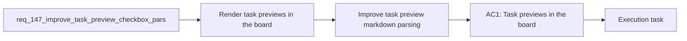

## item_270_improve_task_preview_markdown_parsing - Improve task preview markdown parsing
> From version: 1.23.0
> Schema version: 1.0
> Status: Ready
> Understanding: 91%
> Confidence: 87%
> Progress: 0%
> Complexity: Medium
> Theme: Board preview and task markdown rendering
> Reminder: Update status/understanding/confidence/progress and linked task references when you edit this doc.

# Problem
- Render task previews in the board more faithfully when the document contains checkboxes, styled list items, and similar Markdown task syntax.
- Make unchecked and checked items visually clearer in preview so task progress reads at a glance instead of looking like plain text.
- Preserve the task markdown source while improving how the preview interprets the body.
- Keep the preview compact and operational, not decorative.
- - Tasks in Logics docs often use Markdown checklist syntax such as `- [ ]` and `- [x]` to express progress, validation steps, and remaining work.
- - The current board preview surface can make those items feel too raw or too flat, which reduces the value of the preview when the selected object is a task.

# Scope
- In: one coherent delivery slice from the source request.
- Out: unrelated sibling slices that should stay in separate backlog items instead of widening this doc.

# Acceptance criteria
- AC1: Task previews in the board present checklist items in a visibly distinct form so checked and unchecked items are easy to tell apart.
- AC2: The preview recognizes common task markdown patterns, including checkbox lists and lightly styled inline elements, instead of flattening them into plain text where practical.
- AC3: The preview preserves the meaning and ordering of the task body so progress steps, validation notes, and remaining items stay understandable.
- AC4: The change improves readability without requiring a full markdown editor experience in the board preview.
- AC5: The underlying markdown files remain unchanged on disk; only the preview rendering changes.
- AC6: The new rendering behavior is covered by tests or fixtures for representative task documents with checkboxes and nested list content.

# AC Traceability
- AC1 -> Scope: Task previews in the board present checklist items in a visibly distinct form so checked and unchecked items are easy to tell apart.. Proof: capture validation evidence in this doc.
- AC2 -> Scope: The preview recognizes common task markdown patterns, including checkbox lists and lightly styled inline elements, instead of flattening them into plain text where practical.. Proof: capture validation evidence in this doc.
- AC3 -> Scope: The preview preserves the meaning and ordering of the task body so progress steps, validation notes, and remaining items stay understandable.. Proof: capture validation evidence in this doc.
- AC4 -> Scope: The change improves readability without requiring a full markdown editor experience in the board preview.. Proof: capture validation evidence in this doc.
- AC5 -> Scope: The underlying markdown files remain unchanged on disk; only the preview rendering changes.. Proof: capture validation evidence in this doc.
- AC6 -> Scope: The new rendering behavior is covered by tests or fixtures for representative task documents with checkboxes and nested list content.. Proof: capture validation evidence in this doc.

# Decision framing
- Product framing: Not needed
- Product signals: (none detected)
- Product follow-up: No product brief follow-up is expected based on current signals.
- Architecture framing: Consider
- Architecture signals: data model and persistence
- Architecture follow-up: Review whether an architecture decision is needed before implementation becomes harder to reverse.

# Links
- Product brief(s): (none yet)
- Architecture decision(s): (none yet)
- Request: `req_147_improve_task_preview_checkbox_parsing_in_board_preview`
- Primary task(s): `task_XXX_example`

# AI Context
- Summary: Improve how task previews in the board render checklist syntax and lightly styled markdown so task progress and...
- Keywords: task preview, checkbox parsing, markdown rendering, board preview, checklist, nested lists, progress
- Use when: Use when task bodies in board previews need clearer rendering for checkboxes and other common markdown patterns.
- Skip when: Skip when the work is about the persisted task markdown content or unrelated board layout changes.
# References
- `media/renderDetails.js`
- `media/renderMarkdown.js`
- `media/logicsModel.js`
- `src/logicsReadPreviewHtml.ts`
- `src/logicsViewDocumentController.ts`
- `logics/skills/logics-ui-steering/SKILL.md`

# Priority
- Impact:
- Urgency:

# Notes
- Derived from request `req_147_improve_task_preview_checkbox_parsing_in_board_preview`.
- Source file: `logics/request/req_147_improve_task_preview_checkbox_parsing_in_board_preview.md`.
- Keep this backlog item as one bounded delivery slice; create sibling backlog items for the remaining request coverage instead of widening this doc.
- Request context seeded into this backlog item from `logics/request/req_147_improve_task_preview_checkbox_parsing_in_board_preview.md`.
