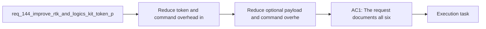

## item_271_reduce_optional_payload_and_command_overhead - Reduce optional payload and command overhead
> From version: 1.23.0
> Schema version: 1.0
> Status: Done
> Understanding: 91%
> Confidence: 86%
> Progress: 100%
> Complexity: High
> Theme: Token performance and repeated assistant workflows
> Reminder: Update status/understanding/confidence/progress and linked task references when you edit this doc.

# Problem
- Reduce token and command overhead in repetitive Logics delivery flows so operator sessions stay fast even when the same context is rebuilt many times.
- Treat `rtk` as an optional accelerator, not a hard dependency, so the underlying Logics kit improvements still pay off when the proxy is absent.
- Turn the six performance hypotheses into bounded backlog slices with measurable effects on context size, cache hit rate, command count, and repeated-run latency.
- Preserve current behavior for normal workflows unless a change demonstrably reduces cost, context size, or repeated work.
- - The repository already advertises compact assistant handoffs, token estimates, budget labels, and `summary-only` / `diff-first` context modes in the plugin and the flow manager.
- - The current hybrid context path still rebuilds the workflow neighborhood and serializes a fresh context pack on each run in [`logics/skills/logics-flow-manager/scripts/logics_flow_core.py`](logics/skills/logics-flow-manager/scripts/logics_flow_core.py).

# Scope
- In: one coherent delivery slice from the source request.
- Out: unrelated sibling slices that should stay in separate backlog items instead of widening this doc.

# Acceptance criteria
- AC1: The request documents all six hypotheses with clear expected impact and enough detail to split them into backlog items without reopening the scope.
- AC2: Each hypothesis is framed so it can be implemented and validated in the Logics kit even when `rtk` is not installed, with `rtk` treated as an optional terminal accelerator.
- AC3: The request makes the current performance bottlenecks explicit, including repeated context-pack assembly, noisy cache invalidation, optional payload loading, and repeated command round-trips.
- AC4: The request defines measurable success signals for the follow-up work, such as higher cache hit rate, smaller context packs, fewer shell invocations, or lower repeated-run latency.
- AC5: The scope explicitly excludes unrelated product expansion, new AI backends, or broad workflow redesign so the follow-up work stays performance-focused.
- AC6: The request is ready to promote into one or more backlog items without needing another clarification pass.

# AC Traceability
- AC1 -> Scope: The request documents all six hypotheses with clear expected impact and enough detail to split them into backlog items without reopening the scope.. Proof: capture validation evidence in this doc.
- AC2 -> Scope: Each hypothesis is framed so it can be implemented and validated in the Logics kit even when `rtk` is not installed, with `rtk` treated as an optional terminal accelerator.. Proof: capture validation evidence in this doc.
- AC3 -> Scope: The request makes the current performance bottlenecks explicit, including repeated context-pack assembly, noisy cache invalidation, optional payload loading, and repeated command round-trips.. Proof: capture validation evidence in this doc.
- AC4 -> Scope: The request defines measurable success signals for the follow-up work, such as higher cache hit rate, smaller context packs, fewer shell invocations, or lower repeated-run latency.. Proof: capture validation evidence in this doc.
- AC5 -> Scope: The scope explicitly excludes unrelated product expansion, new AI backends, or broad workflow redesign so the follow-up work stays performance-focused.. Proof: capture validation evidence in this doc.
- AC6 -> Scope: The request is ready to promote into one or more backlog items without needing another clarification pass.. Proof: capture validation evidence in this doc.

# Decision framing
- Product framing: Consider
- Product signals: experience scope
- Product follow-up: Review whether a product brief is needed before scope becomes harder to change.
- Architecture framing: Required
- Architecture signals: data model and persistence, contracts and integration, state and sync, delivery and operations
- Architecture follow-up: Create or link an architecture decision before irreversible implementation work starts.

# Links
- Product brief(s): (none yet)
- Architecture decision(s): `adr_011_keep_hybrid_assist_runtime_contracts_shared_backend_agnostic_and_safely_bounded`
- Request: `req_144_improve_rtk_and_logics_kit_token_performance`
- Primary task(s): `task_123_orchestration_delivery_for_req_144_to_req_147_board_preview_and_doc_quality_improvements`

# AI Context
- Summary: Reduce repeated token and command overhead in Logics workflows by validating six performance hypotheses that improve the kit...
- Keywords: rtk, token performance, cache, context pack, lazy loading, budget, command round trips, derived artifacts
- Use when: Use when planning or implementing performance improvements that should reduce repeated context rebuilds, cache misses, and shell overhead.
- Skip when: Skip when the work is unrelated to repeated assistant workflows, cache behavior, or context assembly.
# References
- `README.md`
- `logics/skills/RTK.md`
- `logics/skills/logics-flow-manager/scripts/logics_flow_core.py`
- `logics/skills/logics-flow-manager/scripts/logics_flow_runtime_support.py`
- `logics/skills/logics-flow-manager/scripts/logics_flow_hybrid_transport_core.py`
- `logics/skills/logics-flow-manager/scripts/logics_flow_hybrid_runtime_core.py`
- `logics/skills/logics-flow-manager/scripts/logics_flow_hybrid_observability.py`

# Priority
- Impact:
- Urgency:

# Notes
- Derived from request `req_144_improve_rtk_and_logics_kit_token_performance`.
- Source file: `logics/request/req_144_improve_rtk_and_logics_kit_token_performance.md`.
- Keep this backlog item as one bounded delivery slice; create sibling backlog items for the remaining request coverage instead of widening this doc.
- Request context seeded into this backlog item from `logics/request/req_144_improve_rtk_and_logics_kit_token_performance.md`.
- Implemented in wave 1 of `task_123_orchestration_delivery_for_req_144_to_req_147_board_preview_and_doc_quality_improvements` and validated with the targeted runtime tests.
