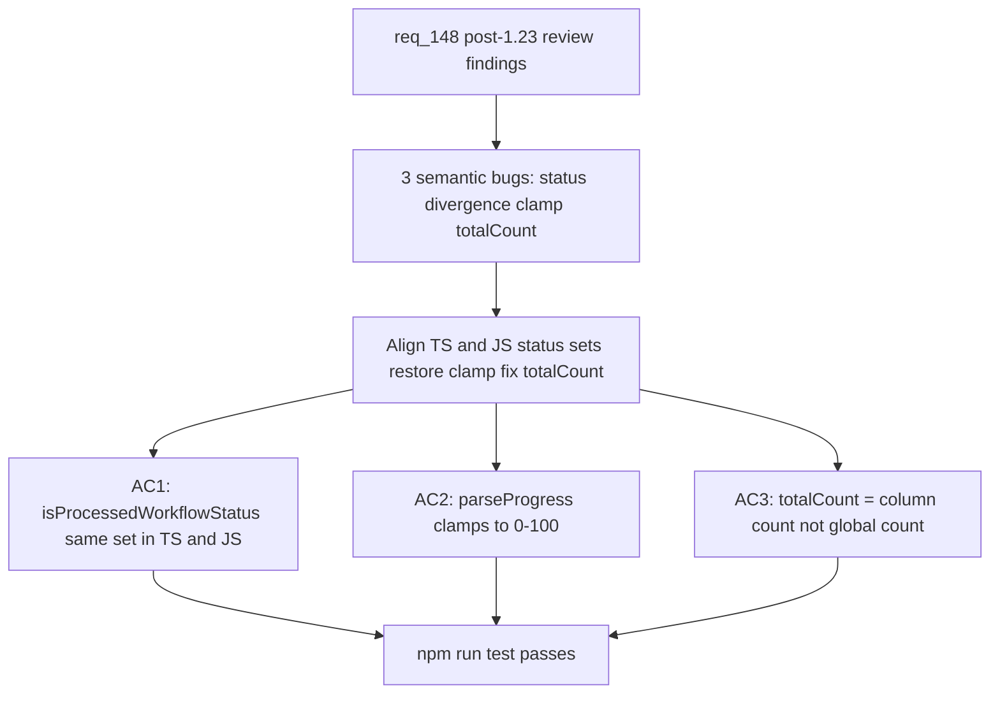

## item_272_fix_isprocessedworkflowstatus_divergence_parseprogress_clamp_and_totalcount_semantics - Fix isProcessedWorkflowStatus divergence parseProgress clamp and totalCount semantics
> From version: 1.23.2
> Schema version: 1.0
> Status: Draft
> Understanding: 95%
> Confidence: 90%
> Progress: 0%
> Complexity: Low
> Theme: UI
> Reminder: Update status/understanding/confidence/progress and linked request/task references when you edit this doc.

# Problem
- `isProcessedWorkflowStatus` exists in two places with different accepted values: `src/logicsIndexer.ts` accepts `ready | done | complete | completed | archived` while `media/webviewSelectors.js` accepts only `done`. Items with `Status: ready` are treated as processed by the indexer but visible as active in the webview.
- `parseProgress` in `logicsIndexer.ts` removed the `[0, 100]` clamp in the 1.23.x wave. Since `isProcessedWorkflowItem` checks `progress === 100`, a document with `Progress: 150` is no longer detected as complete.
- `totalCount` added to board column groups in `webviewSelectors.js` is set to `visibleItems.length` (global total), not the column item count, distorting any per-column ratio or progress display.

# Scope
- In: align `isProcessedWorkflowStatus` between TS and JS; restore clamping in `parseProgress`; fix `totalCount` to reflect the column item count.
- Out: toolbar state, proxy behavior, test coverage (handled in items 273 and 274).

# Acceptance criteria
- AC1: `isProcessedWorkflowStatus` in `src/logicsIndexer.ts` and `media/webviewSelectors.js` accept the same set of statuses and this is covered by at least one test.
- AC2: `parseProgress` in `logicsIndexer.ts` clamps its return value to `[0, 100]`; `isProcessedWorkflowItem` correctly identifies `Progress: 150` as complete.
- AC3: `totalCount` on board column groups in `webviewSelectors.js` reflects the item count of that column, not `visibleItems.length`.

# AC Traceability
- AC1 -> req_148 AC1: `isProcessedWorkflowStatus` divergence resolved. Proof: test asserts same statuses trigger true in both implementations.
- AC2 -> req_148 AC2: `parseProgress` clamp restored. Proof: test asserts `parseProgress("150") <= 100` and `isProcessedWorkflowItem` returns true.
- AC3 -> req_148 AC4: `totalCount` reflects column count. Proof: test asserts `group.totalCount === group.items.length`.

# Decision framing
- Product framing: Not needed
- Architecture framing: Not needed

# Links
- Product brief(s): (none)
- Architecture decision(s): (none)
- Request: `logics/request/req_148_fix_post_1_23_review_findings_across_indexer_semantics_render_consistency_and_test_coverage.md`
- Primary task(s): `task_124_fix_isprocessedworkflowstatus_divergence_parseprogress_clamp_and_totalcount_semantics`

# Priority
- Impact: High — silent correctness regressions on processed-item detection
- Urgency: Medium — no user-visible crash but filtering behaviour is wrong

# AI Context
- Summary: Align isProcessedWorkflowStatus TS/JS, restore parseProgress clamp, fix totalCount to column scope
- Keywords: isProcessedWorkflowStatus, parseProgress, clamp, totalCount, logicsIndexer, webviewSelectors
- Use when: Fixing semantic data bugs from the 1.23.x review wave (AC1 AC2 AC4 of req_148).
- Skip when: Work targets UI rendering, state management, or test coverage.

# Notes
- Files: `src/logicsIndexer.ts:510`, `media/webviewSelectors.js:147`, `media/webviewSelectors.js:346`
- The TS version added `complete`, `completed`, `archived` — verify intended canonical set before aligning the JS side.
