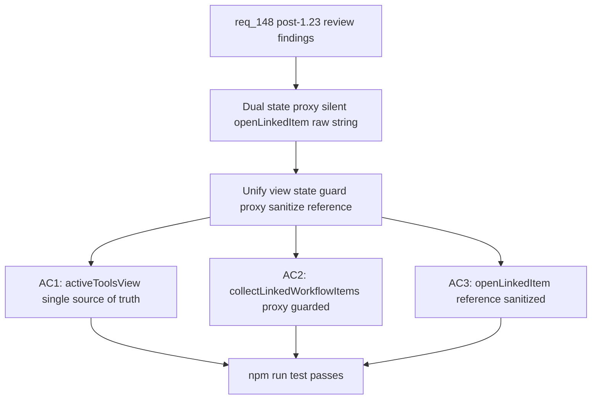

## item_273_fix_activetoolsview_dual_state_collectlinkedworkflowitems_proxy_and_openlinkeditem_safety - Fix activeToolsView dual state collectLinkedWorkflowItems proxy and openLinkedItem safety
> From version: 1.23.2 (refreshed)
> Schema version: 1.0
> Status: Done
> Understanding: 91% (refreshed)
> Confidence: 86% (refreshed)
> Progress: 100% (refreshed)
> Complexity: Low
> Theme: UI
> Reminder: Update status/understanding/confidence/progress and linked request/task references when you edit this doc.

# Problem
- `activeToolsView` is tracked independently in `webviewChrome.js` (local `let activeToolsView`) and in `toolsPanelLayout.js` (its own internal state). When `setToolsPanelOpen(viewName, isOpen)` in `webviewChrome.js` calls `toolsPanelLayout.setActiveToolsView(viewName)`, both copies update, but subsequent re-renders or direct calls to `toolsPanelLayout` do not sync back to `webviewChrome.js`. Two sources of truth for the same view state.
- `collectLinkedWorkflowItems` was removed from its inline JS implementation and replaced by a `modelApi` proxy in `webviewSelectors.js`. If `modelApi` does not expose the function (e.g. in test harnesses or degraded model states), the proxy silently returns `[]` with no warning or fallback.
- `openLinkedItem` in `logicsViewDocumentController.ts` interpolates the raw `reference` argument directly into a `vscode.window.showWarningMessage` call without sanitization. While VS Code's message API is not a browser XSS surface, consistent sanitization is expected across the codebase.

# Scope
- In: unify `activeToolsView` into a single source of truth; guard the `collectLinkedWorkflowItems` proxy; sanitize `reference` in `openLinkedItem`.
- Out: data semantics and test coverage are handled in the merged orchestration task.

# Acceptance criteria
- AC1: `activeToolsView` has a single authoritative source; `webviewChrome.js` and `toolsPanelLayout.js` do not maintain independent copies that can diverge.
- AC2: The `collectLinkedWorkflowItems` proxy in `webviewSelectors.js` does not silently return `[]` when `modelApi` does not expose the function — either the proxy logs a warning, throws, or the model contract guarantees the function is always present.
- AC3: `openLinkedItem` in `logicsViewDocumentController.ts` encodes or validates the `reference` value before interpolating it into the warning message.

# AC Traceability
- AC1 -> req_148 AC3: single `activeToolsView` source. Proof: grep confirms no second independent copy; behaviour test shows view switches correctly.
- AC2 -> req_148 AC5: proxy does not silently fail. Proof: test with model missing function shows explicit fallback or error.
- AC3 -> req_148 AC7: `openLinkedItem` safe. Proof: code review shows encoded value in warning string.

# Decision framing
- Product framing: Not needed
- Architecture framing: Not needed

# Links
- Product brief(s): (none)
- Architecture decision(s): (none)
- Request: `logics/request/req_148_fix_post_1_23_review_findings_across_indexer_semantics_render_consistency_and_test_coverage.md`
- Primary task(s): `task_124_fix_post_1_23_review_findings_with_targeted_delivery_slices`

# Priority
- Impact: Medium — toolbar state divergence is a latent UX bug; proxy silent failure hides linked-doc misses
- Urgency: Low — no crash path, but correctness degrades silently

# AI Context
- Summary: Unify activeToolsView state, guard collectLinkedWorkflowItems proxy, sanitize openLinkedItem reference
- Keywords: activeToolsView, toolsPanelLayout, webviewChrome, collectLinkedWorkflowItems, modelApi, openLinkedItem
- Use when: Fixing state management and proxy safety bugs from the 1.23.x review wave (AC3 AC5 AC7 of req_148).
- Skip when: Work targets semantic data bugs or test coverage.

# Notes
- Files: `media/webviewChrome.js:71`, `media/toolsPanelLayout.js`, `media/webviewSelectors.js:76`, `src/logicsViewDocumentController.ts:314`
- Unifying `activeToolsView` may require making `toolsPanelLayout` expose a getter so `webviewChrome.js` can read the authoritative value instead of maintaining its own copy.
