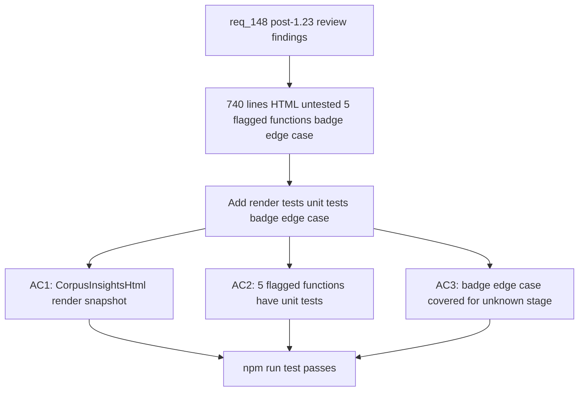

## item_274_add_missing_render_tests_for_corpusinsightshtml_untested_functions_and_badge_edge_cases - Add missing render tests for CorpusInsightsHtml untested functions and badge edge cases
> From version: 1.23.2 (refreshed)
> Schema version: 1.0
> Status: Done
> Understanding: 93% (refreshed)
> Confidence: 89% (refreshed)
> Progress: 100% (refreshed)
> Complexity: Low
> Theme: UI
> Reminder: Update status/understanding/confidence/progress and linked request/task references when you edit this doc.

# Problem
- `logicsCorpusInsightsHtml.ts` is 740 lines of HTML-generating code (SVG pie charts, metric badges, relative dates, tables) with no snapshot or render tests. Only the controller is tested via mocks that bypass `buildLogicsCorpusInsightsHtml` entirely.
- Five functions flagged as untested by the knowledge graph: `openHarnessReadTab`, `assistCommitAll`, `isProcessedWorkflowStatus`, `parseProgress`, `collectLinkedWorkflowItems`. Bugs in these are invisible until a user-facing regression surfaces.
- `createProgressComplexityBadge` in `renderBoard.js` branches on stage names including unknown values, with no test covering unknown stage to verify fallback behavior.

# Scope
- In: snapshot/render tests for `logicsCorpusInsightsHtml.ts`; direct unit tests for the 5 flagged functions; edge-case test for `createProgressComplexityBadge` with unknown stage.
- Out: fixing bugs and new features are handled in the merged orchestration task.

# Acceptance criteria
- AC1: `logicsCorpusInsightsHtml.ts` has at least one snapshot or render test covering the main HTML output paths: pie chart present, metric badge present, relative date present, empty-state fallback.
- AC2: Each of the 5 flagged functions (`openHarnessReadTab`, `assistCommitAll`, `isProcessedWorkflowStatus`, `parseProgress`, `collectLinkedWorkflowItems`) has at least one direct unit test exercising its core logic.
- AC3: `createProgressComplexityBadge` in `renderBoard.js` has at least one test passing an unknown or empty stage value to verify the fallback renders without throwing.
- AC4: All existing tests continue to pass after additions (`npm run test` green).

# AC Traceability
- AC1 -> req_148 AC6: CorpusInsightsHtml render coverage. Proof: snapshot file exists and test output matches.
- AC2 -> req_148 AC8: 5 untested functions covered. Proof: grep for test names in test files.
- AC3 -> req_148 AC9: badge edge case. Proof: test file contains unknown-stage assertion.
- AC4 -> req_148 AC10: full test suite green. Proof: CI output or local `npm run test` log.

# Decision framing
- Product framing: Not needed
- Architecture framing: Not needed

# Links
- Product brief(s): (none)
- Architecture decision(s): (none)
- Request: `logics/request/req_148_fix_post_1_23_review_findings_across_indexer_semantics_render_consistency_and_test_coverage.md`
- Primary task(s): `task_124_fix_post_1_23_review_findings_with_targeted_delivery_slices`

# Priority
- Impact: Medium — untested paths accumulate silent regressions over time
- Urgency: Low — no current crash, but coverage gap grows with each wave

# AI Context
- Summary: Snapshot tests for CorpusInsightsHtml, unit tests for 5 flagged functions, badge edge-case test
- Keywords: logicsCorpusInsightsHtml, snapshot, openHarnessReadTab, assistCommitAll, isProcessedWorkflowStatus, parseProgress, collectLinkedWorkflowItems, createProgressComplexityBadge
- Use when: Adding missing test coverage for the 1.23.x wave (AC6 AC8 AC9 AC10 of req_148).
- Skip when: Work targets semantic data bugs or state management fixes.

# Notes
- Files: `src/logicsCorpusInsightsHtml.ts`, `media/renderBoard.js:createProgressComplexityBadge`, `tests/logicsCorpusInsightsController.test.ts` (extend or add sibling)
- For CorpusInsightsHtml snapshot tests, consider a new `tests/logicsCorpusInsightsHtml.test.ts` mirroring the pattern in `tests/logicsHtml.test.ts`.
