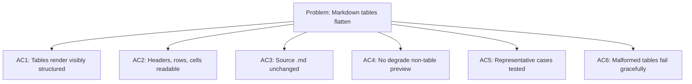

## item_275_improve_markdown_preview_table_rendering_in_claude_authored_docs - Improve Markdown preview table rendering in Claude-authored docs
> From version: 1.23.3
> Schema version: 1.0
> Status: Ready
> Understanding: 94%
> Confidence: 91%
> Progress: 0%
> Complexity: Medium
> Theme: Board preview and markdown rendering
> Reminder: Update status/understanding/confidence/progress and linked request/task references when you edit this doc.

# Problem
- Render Markdown tables in preview surfaces so they stay visually structured instead of collapsing into hard-to-scan plain text.
- Preserve headers, rows, and cell boundaries well enough that comparison tables remain readable at a glance.
- Keep the underlying `.md` source unchanged and limit the fix to preview rendering behavior.
- Handle partially formed or malformed tables gracefully so other document content still previews correctly.
- Claude often writes tables when comparing roles, states, options, or responsibilities in Logics docs.
- The current preview tool struggles to present those tables graphically, which makes the document harder to review even when the Markdown source is valid.

# Scope
- In: one coherent delivery slice from the source request.
- Out: unrelated sibling slices that should stay in separate backlog items instead of widening this doc.

# Acceptance criteria
- AC1: Markdown tables render in preview with a visibly structured layout instead of flattening into plain text.
- AC2: Table headers, rows, and cell separation remain readable enough to support quick comparison across columns.
- AC3: The preview keeps the original `.md` source unchanged on disk.
- AC4: The fix does not degrade preview behavior for non-table Markdown content.
- AC5: Representative table cases, including the example above, are covered by tests or fixtures.
- AC6: Malformed or partial table-like input fails gracefully without breaking the rest of the preview.

# AC Traceability
- AC1 -> Scope: Markdown tables render in preview with a visibly structured layout instead of flattening into plain text.. Proof: capture validation evidence in this doc.
- AC2 -> Scope: Table headers, rows, and cell separation remain readable enough to support quick comparison across columns.. Proof: capture validation evidence in this doc.
- AC3 -> Scope: The preview keeps the original `.md` source unchanged on disk.. Proof: capture validation evidence in this doc.
- AC4 -> Scope: The fix does not degrade preview behavior for non-table Markdown content.. Proof: capture validation evidence in this doc.
- AC5 -> Scope: Representative table cases, including the example above, are covered by tests or fixtures.. Proof: capture validation evidence in this doc.
- AC6 -> Scope: Malformed or partial table-like input fails gracefully without breaking the rest of the preview.. Proof: capture validation evidence in this doc.

# Decision framing
- Product framing: Not needed
- Product signals: (none detected)
- Product follow-up: No product brief follow-up is expected based on current signals.
- Architecture framing: Consider
- Architecture signals: data model and persistence
- Architecture follow-up: Review whether an architecture decision is needed before implementation becomes harder to reverse.

# Links
- Product brief(s): (none yet)
- Architecture decision(s): (none yet)
- Request: `req_149_improve_markdown_preview_table_rendering_in_claude_authored_docs`
- Primary task(s): `task_125_improve_markdown_preview_table_rendering_in_claude_authored_docs`

# AI Context
- Summary: Make the Markdown preview render standard tables in a readable structured form so Claude-authored docs remain easy to...
- Keywords: markdown, preview, table, rendering, claude-authored docs, structured layout, comparison tables
- Use when: Use when the preview surface cannot present authored Markdown tables clearly enough for review.
- Skip when: Skip when the problem is unrelated to table rendering or the Markdown preview pipeline.
# References
- `media/renderMarkdown.js`
- `src/logicsReadPreviewHtml.ts`
- `src/logicsViewDocumentController.ts`
- `logics/skills/logics-ui-steering/SKILL.md`

# Priority
- Impact: High
- Urgency: Medium

# Notes
- Derived from request `req_149_improve_markdown_preview_table_rendering_in_claude_authored_docs`.
- Source file: `logics/request/req_149_improve_markdown_preview_table_rendering_in_claude_authored_docs.md`.
- Keep this backlog item as one bounded delivery slice; create sibling backlog items for the remaining request coverage instead of widening this doc.
- Request context seeded into this backlog item from `logics/request/req_149_improve_markdown_preview_table_rendering_in_claude_authored_docs.md`.
