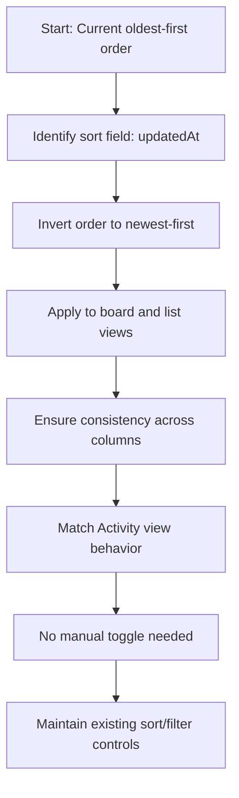

## item_276_invert_default_sort_order_in_board_and_list_so_most_recent_items_appear_first - Invert default sort order in board and list so most recent items appear first
> From version: 1.24.0
> Schema version: 1.0
> Status: Ready
> Understanding: 100%
> Confidence: 100%
> Progress: 0%
> Complexity: Low
> Theme: UI
> Reminder: Update status/understanding/confidence/progress and linked request/task references when you edit this doc.

# Problem
- In the board and list views, cells within each category/column are currently sorted oldest-first (ascending by date). The order should be inverted so the most recent item always appears at the top, for every item type (requests, backlog, tasks, specs, etc.).
- The sort field is `updatedAt` — a recently modified item is more relevant than one recently created but never touched since.
- This matches the existing behaviour already in place in the Activity view, where the most recent entry is always shown first.
- Today, when a user opens the board or the list, items inside each column/category are ranked oldest-to-newest. This means the freshest work is buried at the bottom and the user must scroll to find it. The Activity view already uses newest-first ordering and users expect the same convention in the board and list.
- ```mermaid
%% logics-kind: backlog
%% logics-signature: backlog|invert-default-sort-order-in-board-and-l|req-150-invert-default-sort-order-in-boa|in-the-board-and-list-views|ac1-board-and-list-cells-are
flowchart TD
    OldestFirst[Oldest First Sorting]
    Problem[Problem: Fresh work buried]
    Desired[Desired: Newest First Sorting]
    AC1[AC1: Sort newest-first by updatedAt]
    AC2[AC2: Consistent order across columns]
    AC3[AC3: Matches Activity view]
    AC4[AC4: No manual toggle needed]
    AC5[AC5: Existing controls still work]
    OldestFirst --> Problem
    Problem --> Desired
    Desired --> AC1
    Desired --> AC2
    Desired --> AC3
    Desired --> AC4
    Desired --> AC5


# Acceptance criteria
- AC1: Board and list cells are sorted newest-first (descending by `updatedAt`) by default, for all item types including specs.
- AC2: The ordering is consistent across all category columns in both board and list modes.
- AC3: The behaviour matches the Activity view, where the most recent entry is always first.
- AC4: No manual sort toggle is required — the inversion applies as the new default.
- AC5: Existing sort/filter controls (if any) remain functional and compose correctly with the new default order.

# AC Traceability
- AC1 -> Scope: Board and list cells are sorted newest-first (descending by `updatedAt`) by default, for all item types including specs.. Proof: capture validation evidence in this doc.
- AC2 -> Scope: The ordering is consistent across all category columns in both board and list modes.. Proof: capture validation evidence in this doc.
- AC3 -> Scope: The behaviour matches the Activity view, where the most recent entry is always first.. Proof: capture validation evidence in this doc.
- AC4 -> Scope: No manual sort toggle is required — the inversion applies as the new default.. Proof: capture validation evidence in this doc.
- AC5 -> Scope: Existing sort/filter controls (if any) remain functional and compose correctly with the new default order.. Proof: capture validation evidence in this doc.

# Decision framing
- Product framing: Consider
- Product signals: navigation and discoverability
- Product follow-up: Review whether a product brief is needed before scope becomes harder to change.
- Architecture framing: Consider
- Architecture signals: data model and persistence
- Architecture follow-up: Review whether an architecture decision is needed before implementation becomes harder to reverse.

# Links
- Product brief(s): (none yet)
- Architecture decision(s): (none yet)
- Request: `req_150_invert_default_sort_order_in_board_and_list_so_most_recent_items_appear_first`
- Primary task(s): `task_XXX_example`

# AI Context
- Summary: In the board and list views, cells within each category/column are currently sorted oldest-first (ascending by date). The...
- Keywords: invert, default, sort, order, board, and, list, most
- Use when: Use when implementing or reviewing the delivery slice for Invert default sort order in board and list so most recent items appear first.
- Skip when: Skip when the change is unrelated to this delivery slice or its linked request.
# References
- `logics/skills/logics-ui-steering/SKILL.md`

# Priority
- Impact:
- Urgency:

# Notes
- Derived from request `req_150_invert_default_sort_order_in_board_and_list_so_most_recent_items_appear_first`.
- Source file: `logics/request/req_150_invert_default_sort_order_in_board_and_list_so_most_recent_items_appear_first.md`.
- Keep this backlog item as one bounded delivery slice; create sibling backlog items for the remaining request coverage instead of widening this doc.
- Request context seeded into this backlog item from `logics/request/req_150_invert_default_sort_order_in_board_and_list_so_most_recent_items_appear_first.md`.
