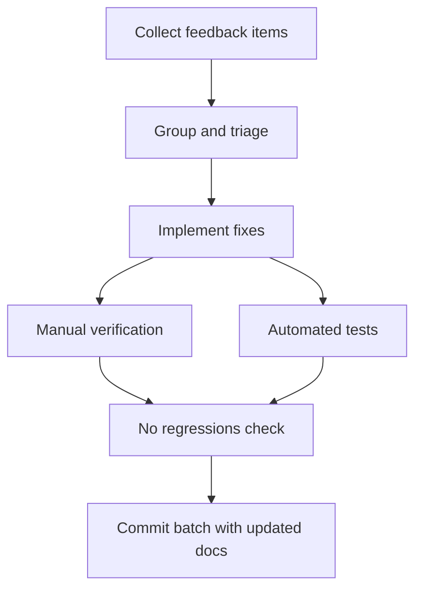

## item_277_address_miscellaneous_post_release_feedback_across_the_plugin - Address miscellaneous post-release feedback across the plugin
> From version: 1.24.0
> Schema version: 1.0
> Status: Ready
> Understanding: 100%
> Confidence: 100%
> Progress: 0%
> Complexity: Low
> Theme: UI
> Reminder: Update status/understanding/confidence/progress and linked request/task references when you edit this doc.

# Problem
- Collect and resolve small, independent feedback items that surface after each release but are too minor or unrelated to each other to warrant their own dedicated request.
- Keep the plugin polished by ensuring these loose ends are triaged, grouped, and closed as a single delivery wave rather than accumulated as noise in the backlog.
- After each release cycle, a set of small observations accumulates: minor visual inconsistencies, wording adjustments, edge-case behaviours that are slightly off, and low-effort UX improvements. Individually they are too small to track as standalone requests, but left unaddressed they degrade the overall quality of the experience. This request acts as a landing zone for that category of feedback so it can be groomed, batched, and shipped efficiently.
- ```mermaid
%% logics-kind: backlog
%% logics-signature: backlog|address-miscellaneous-post-release-feedb|req-151-address-miscellaneous-post-relea|collect-and-resolve-small-independent-fe|ac1-all-feedback-items-listed-in
flowchart TD
    P[Problem: minor feedback items]
    T[Triaged & grouped]
    C[Closed as single wave]
    V[Verified fixes]
    N[No regressions]
    W[Wave committed]
    P --> T --> C --> V --> N --> W


# Acceptance criteria
- AC1: All feedback items listed in scope are addressed or explicitly deferred with a reason.
- AC2: Each fix is covered by at least a manual verification step or an automated test where practical.
- AC3: No regressions are introduced in existing board, list, activity, or preview behaviours.
- AC4: The batch is committed as a coherent wave with updated Logics docs.

# AC Traceability
- AC1 -> Scope: All feedback items listed in scope are addressed or explicitly deferred with a reason.. Proof: capture validation evidence in this doc.
- AC2 -> Scope: Each fix is covered by at least a manual verification step or an automated test where practical.. Proof: capture validation evidence in this doc.
- AC3 -> Scope: No regressions are introduced in existing board, list, activity, or preview behaviours.. Proof: capture validation evidence in this doc.
- AC4 -> Scope: The batch is committed as a coherent wave with updated Logics docs.. Proof: capture validation evidence in this doc.

# Decision framing
- Product framing: Not needed
- Product signals: (none detected)
- Product follow-up: No product brief follow-up is expected based on current signals.
- Architecture framing: Required
- Architecture signals: data model and persistence, security and identity, delivery and operations
- Architecture follow-up: Create or link an architecture decision before irreversible implementation work starts.

# Links
- Product brief(s): (none yet)
- Architecture decision(s): (none yet)
- Request: `req_151_address_miscellaneous_post_release_feedback_across_the_plugin`
- Primary task(s): `task_XXX_example`

# AI Context
- Summary: Collect and resolve small, independent feedback items that surface after each release but are too minor or unrelated...
- Keywords: address, miscellaneous, post-release, feedback, across, the, plugin, collect
- Use when: Use when implementing or reviewing the delivery slice for Address miscellaneous post-release feedback across the plugin.
- Skip when: Skip when the change is unrelated to this delivery slice or its linked request.
# References
- `logics/skills/logics-ui-steering/SKILL.md`

# Priority
- Impact:
- Urgency:

# Notes
- Derived from request `req_151_address_miscellaneous_post_release_feedback_across_the_plugin`.
- Source file: `logics/request/req_151_address_miscellaneous_post_release_feedback_across_the_plugin.md`.
- Keep this backlog item as one bounded delivery slice; create sibling backlog items for the remaining request coverage instead of widening this doc.
- Request context seeded into this backlog item from `logics/request/req_151_address_miscellaneous_post_release_feedback_across_the_plugin.md`.
