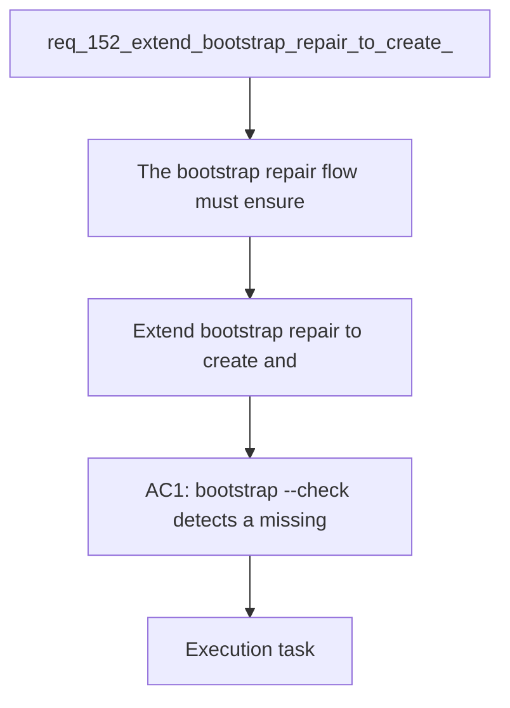

## item_278_extend_bootstrap_repair_to_create_and_maintain_agents_md_and_logics_md - Extend bootstrap repair to create and maintain AGENTS.md and LOGICS.md
> From version: 1.24.0
> Schema version: 1.0
> Status: Done
> Understanding: 100%
> Confidence: 100%
> Progress: 100%
> Complexity: Low
> Theme: UI
> Reminder: Update status/understanding/confidence/progress and linked request/task references when you edit this doc.

# Problem
- The bootstrap repair flow must ensure that `AGENTS.md` and `LOGICS.md` exist at the repo root and are correctly wired together, the same way it already ensures that `logics/` folders and `.gitkeep` files exist.
- `LOGICS.md` must be added to `.gitignore` automatically if it is not already there.
- `AGENTS.md` must contain the `@LOGICS.md` reference if the file exists but the line is missing.
- `AGENTS.md` and `LOGICS.md` are local AI assistant config files (gitignored) that teach the AI how to use the Logics kit in this repository. They are currently created manually. If a developer sets up a fresh clone, or if the files are accidentally deleted, there is no automatic recovery path — the AI loses its Logics context silently.
- The bootstrap script already handles idempotent creation of missing repo structure. Extending it to cover these two files makes the AI context as resilient as the rest of the Logics setup.

# Scope
- In: one coherent delivery slice from the source request.
- Out: unrelated sibling slices that should stay in separate backlog items instead of widening this doc.

# Acceptance criteria
- AC1: `bootstrap --check` detects a missing `AGENTS.md` and reports it as a required action.
- AC2: `bootstrap` creates `AGENTS.md` with at least the `@LOGICS.md` reference when it does not exist.
- AC3: `bootstrap` patches an existing `AGENTS.md` to add `@LOGICS.md` if the reference is absent, without overwriting other existing references.
- AC4: `bootstrap` creates `LOGICS.md` from the canonical template when it does not exist.
- AC5: `bootstrap` adds `LOGICS.md` to `.gitignore` when it is not already listed.
- AC6: All actions are idempotent — re-running bootstrap on an already-correct setup produces no changes.
- AC7: `--dry-run` mode reports what would be created or patched without writing anything.

# AC Traceability
- AC1 -> Scope: `bootstrap --check` detects a missing `AGENTS.md` and reports it as a required action.. Proof: capture validation evidence in this doc.
- AC2 -> Scope: `bootstrap` creates `AGENTS.md` with at least the `@LOGICS.md` reference when it does not exist.. Proof: capture validation evidence in this doc.
- AC3 -> Scope: `bootstrap` patches an existing `AGENTS.md` to add `@LOGICS.md` if the reference is absent, without overwriting other existing references.. Proof: capture validation evidence in this doc.
- AC4 -> Scope: `bootstrap` creates `LOGICS.md` from the canonical template when it does not exist.. Proof: capture validation evidence in this doc.
- AC5 -> Scope: `bootstrap` adds `LOGICS.md` to `.gitignore` when it is not already listed.. Proof: capture validation evidence in this doc.
- AC6 -> Scope: All actions are idempotent — re-running bootstrap on an already-correct setup produces no changes.. Proof: capture validation evidence in this doc.
- AC7 -> Scope: `--dry-run` mode reports what would be created or patched without writing anything.. Proof: capture validation evidence in this doc.

# Decision framing
- Product framing: Not needed
- Product signals: (none detected)
- Product follow-up: No product brief follow-up is expected based on current signals.
- Architecture framing: Consider
- Architecture signals: data model and persistence
- Architecture follow-up: Review whether an architecture decision is needed before implementation becomes harder to reverse.

# Links
- Product brief(s): (none yet)
- Architecture decision(s): (none yet)
- Request: `req_152_extend_bootstrap_repair_to_create_and_maintain_agents_md_and_logics_md`
- Primary task(s): `task_XXX_example`

# AI Context
- Summary: The bootstrap repair flow must ensure that AGENTS.md and LOGICS.md exist at the repo root and are correctly...
- Keywords: extend, bootstrap, repair, create, and, maintain, agents, logics
- Use when: Use when implementing or reviewing the delivery slice for Extend bootstrap repair to create and maintain AGENTS.md and LOGICS.md.
- Skip when: Skip when the change is unrelated to this delivery slice or its linked request.
# References
- `logics/skills/logics-ui-steering/SKILL.md`

# Priority
- Impact:
- Urgency:

# Notes
- Derived from request `req_152_extend_bootstrap_repair_to_create_and_maintain_agents_md_and_logics_md`.
- Source file: `logics/request/req_152_extend_bootstrap_repair_to_create_and_maintain_agents_md_and_logics_md.md`.
- Keep this backlog item as one bounded delivery slice; create sibling backlog items for the remaining request coverage instead of widening this doc.
- Request context seeded into this backlog item from `logics/request/req_152_extend_bootstrap_repair_to_create_and_maintain_agents_md_and_logics_md.md`.
- Task `task_126_orchestration_delivery_for_req_150_to_req_154_plugin_polish_and_status_selector` was finished via `logics_flow.py finish task` on 2026-04-11.
