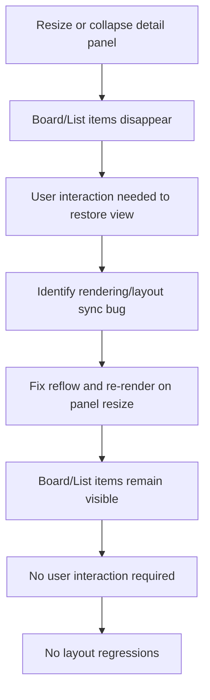

## item_279_fix_board_and_list_items_disappearing_when_the_detail_panel_is_resized_or_collapsed - Fix board and list items disappearing when the detail panel is resized or collapsed
> From version: 1.24.0
> Schema version: 1.0
> Status: Done
> Understanding: 100%
> Confidence: 90% (updated)
> Progress: 100%
> Complexity: Low
> Theme: UI
> Reminder: Update status/understanding/confidence/progress and linked request/task references when you edit this doc.

# Problem
- When the detail panel is resized or collapsed, board and list items intermittently disappear from the view.
- The items must remain visible and correctly rendered at any panel size, including when the detail panel is fully collapsed.
- The plugin layout includes a resizable detail panel alongside the board/list. When the user reduces or collapses that panel, the available space for the board/list changes. In some cases this resize event causes the item list to go blank — the items are no longer rendered even though they still exist. The user must interact with the view (scroll, click, switch tabs) to get them to reappear. This is a rendering/layout synchronisation bug: the board/list does not correctly reflow or re-render when the panel geometry changes.
- ```mermaid
%% logics-kind: backlog
%% logics-signature: backlog|fix-board-and-list-items-disappearing-wh|req-153-fix-board-and-list-items-disappe|when-the-detail-panel-is-resized|ac1-board-and-list-items-remain
flowchart TD
    A[Resize or collapse detail panel] --> B[Board/List items disappear]
    B --> C[User interaction needed to restore view]
    C --> D[Identify rendering/layout sync bug]
    D --> E[Fix reflow and re-render on panel resize]
    E --> F[Items remain visible at any panel size]
    F --> G[No layout regressions introduced]
    G --> H[Acceptance criteria met]


# Acceptance criteria
- AC1: Board and list items remain visible and correctly rendered when the detail panel is resized to any width.
- AC2: Board and list items remain visible and correctly rendered when the detail panel is fully collapsed.
- AC3: No user interaction (scroll, click, tab switch) is required to restore the view after a resize.
- AC4: The fix does not introduce layout regressions in normal panel states (open, half-open).

# AC Traceability
- AC1 -> Scope: Board and list items remain visible and correctly rendered when the detail panel is resized to any width.. Proof: capture validation evidence in this doc.
- AC2 -> Scope: Board and list items remain visible and correctly rendered when the detail panel is fully collapsed.. Proof: capture validation evidence in this doc.
- AC3 -> Scope: No user interaction (scroll, click, tab switch) is required to restore the view after a resize.. Proof: capture validation evidence in this doc.
- AC4 -> Scope: The fix does not introduce layout regressions in normal panel states (open, half-open).. Proof: capture validation evidence in this doc.

# Decision framing
- Product framing: Not needed
- Product signals: (none detected)
- Product follow-up: No product brief follow-up is expected based on current signals.
- Architecture framing: Not needed
- Architecture signals: (none detected)
- Architecture follow-up: No architecture decision follow-up is expected based on current signals.

# Links
- Product brief(s): (none yet)
- Architecture decision(s): no ADR required; this is a low-complexity UI fix.
- Request: `req_153_fix_board_and_list_items_disappearing_when_the_detail_panel_is_resized_or_collapsed`
- Primary task(s): `task_XXX_example`

# AI Context
- Summary: When the detail panel is resized or collapsed, board and list items intermittently disappear from the view.
- Keywords: fix, board, and, list, items, disappearing, the, detail
- Use when: Use when implementing or reviewing the delivery slice for Fix board and list items disappearing when the detail panel is resized or collapsed.
- Skip when: Skip when the change is unrelated to this delivery slice or its linked request.
# References
- `logics/skills/logics-ui-steering/SKILL.md`

# Priority
- Impact:
- Urgency:

# Notes
- Derived from request `req_153_fix_board_and_list_items_disappearing_when_the_detail_panel_is_resized_or_collapsed`.
- Source file: `logics/request/req_153_fix_board_and_list_items_disappearing_when_the_detail_panel_is_resized_or_collapsed.md`.
- Keep this backlog item as one bounded delivery slice; create sibling backlog items for the remaining request coverage instead of widening this doc.
- Request context seeded into this backlog item from `logics/request/req_153_fix_board_and_list_items_disappearing_when_the_detail_panel_is_resized_or_collapsed.md`.
- Task `task_126_orchestration_delivery_for_req_150_to_req_154_plugin_polish_and_status_selector` was finished via `logics_flow.py finish task` on 2026-04-11.
