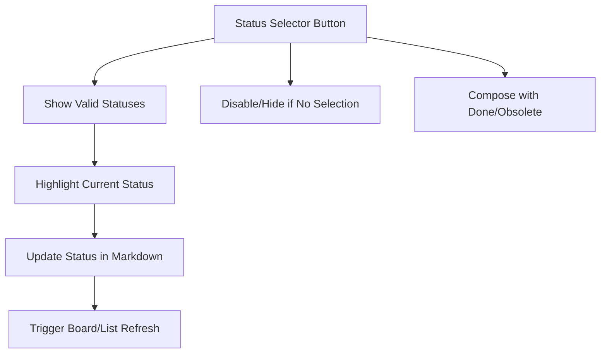

## item_281_implement_status_write_to_markdown_file_and_board_refresh_on_status_change - Implement status write to markdown file and board refresh on status change
> From version: 1.24.0
> Schema version: 1.0
> Status: Ready
> Understanding: 100%
> Confidence: 100% (refreshed)
> Progress: 0%
> Complexity: Medium
> Theme: UI
> Reminder: Update status/understanding/confidence/progress and linked request/task references when you edit this doc.

# Problem
- Add a button in the detail panel action bar (below the Obsolete button) that opens a status selector, allowing the user to change the status of the selected item directly without opening the file.
- The selector must show only the statuses that are valid for the item's type.
- Currently, the detail panel exposes a fixed set of actions: Edit, Read, Promote, Done, Obsolete. There is no way to set arbitrary statuses (e.g. `Ready`, `In progress`, `Blocked`, `Archived`) without manually editing the markdown file. This forces the user out of the plugin for a common workflow operation. A status selector button would close this gap and make status management fully accessible from the panel.
- The valid status sets per type are:

# Scope
- In: one coherent delivery slice from the source request.
- Out: unrelated sibling slices that should stay in separate backlog items instead of widening this doc.

# Acceptance criteria
- AC1: A status selector button appears in the detail panel action bar for all supported item types (request, backlog, task, spec).
- AC2: The selector shows only the statuses that are valid for the selected item's type.
- AC3: The current status is visually highlighted in the selector.
- AC4: Selecting a status updates the `Status:` indicator in the markdown file and triggers a board/list refresh.
- AC5: The button is disabled or hidden when no item is selected.
- AC6: The action composes correctly with the existing Done and Obsolete buttons — it does not duplicate their function but complements them.

# AC Traceability
- AC1 -> Scope: A status selector button appears in the detail panel action bar for all supported item types (request, backlog, task, spec).. Proof: capture validation evidence in this doc.
- AC2 -> Scope: The selector shows only the statuses that are valid for the selected item's type.. Proof: capture validation evidence in this doc.
- AC3 -> Scope: The current status is visually highlighted in the selector.. Proof: capture validation evidence in this doc.
- AC4 -> Scope: Selecting a status updates the `Status:` indicator in the markdown file and triggers a board/list refresh.. Proof: capture validation evidence in this doc.
- AC5 -> Scope: The button is disabled or hidden when no item is selected.. Proof: capture validation evidence in this doc.
- AC6 -> Scope: The action composes correctly with the existing Done and Obsolete buttons — it does not duplicate their function but complements them.. Proof: capture validation evidence in this doc.

# Decision framing
- Product framing: Not needed
- Product signals: (none detected)
- Product follow-up: No product brief follow-up is expected based on current signals.
- Architecture framing: Required
- Architecture signals: data model and persistence, state and sync
- Architecture follow-up: Create or link an architecture decision before irreversible implementation work starts.

# Links
- Product brief(s): (none yet)
- Architecture decision(s): no ADR required; this is a low-complexity UI fix.
- Request: `req_154_add_a_manual_status_selector_button_in_the_detail_panel_to_change_item_status_directly`
- Primary task(s): `task_XXX_example`

# AI Context
- Summary: Add a button in the detail panel action bar (below the Obsolete button) that opens a status selector...
- Keywords: implement, status, write, markdown, file, and, board, refresh
- Use when: Use when implementing or reviewing the delivery slice for Implement status write to markdown file and board refresh on status change.
- Skip when: Skip when the change is unrelated to this delivery slice or its linked request.
# References
- `logics/skills/logics-ui-steering/SKILL.md`

# Priority
- Impact:
- Urgency:

# Notes
- Derived from request `req_154_add_a_manual_status_selector_button_in_the_detail_panel_to_change_item_status_directly`.
- Source file: `logics/request/req_154_add_a_manual_status_selector_button_in_the_detail_panel_to_change_item_status_directly.md`.
- Keep this backlog item as one bounded delivery slice; create sibling backlog items for the remaining request coverage instead of widening this doc.
- Request context seeded into this backlog item from `logics/request/req_154_add_a_manual_status_selector_button_in_the_detail_panel_to_change_item_status_directly.md`.
