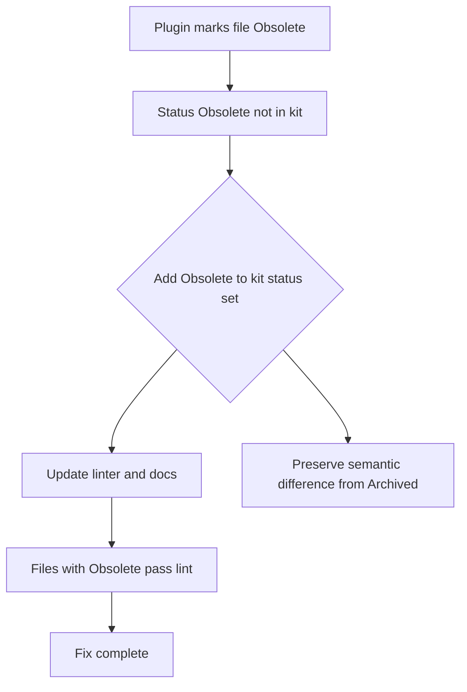

## item_282_align_obsolete_status_between_plugin_and_logics_kit - Align Obsolete status between plugin and Logics kit
> From version: 1.24.0
> Schema version: 1.0
> Status: Ready
> Understanding: 100%
> Confidence: 100%
> Progress: 0%
> Complexity: Low
> Theme: UI
> Reminder: Update status/understanding/confidence/progress and linked request/task references when you edit this doc.

# Problem
- The plugin's "Obsolete" button writes `Status: Obsolete` to markdown files, but `Obsolete` is not a valid status in the Logics kit — the linter rejects it.
- The valid kit statuses are: `Draft | Ready | In progress | Blocked | Done | Archived`.
- This mismatch must be resolved by adding `Obsolete` to the kit's canonical allowed set, preserving the distinct semantic between "abandoned without delivery" (Obsolete) and "completed and shelved" (Archived).
- The plugin implements a "mark as Obsolete" action that sets `Status: Obsolete` and `Progress: 100%` directly in the markdown file. This value is not in the canonical allowed set defined by the doc linter (`logics/skills/logics-doc-linter/scripts/logics_lint.py`). Any file marked Obsolete by the plugin would fail `lint --require-status`.
- The two resolution paths are:

# Scope
- In: one coherent delivery slice from the source request.
- Out: unrelated sibling slices that should stay in separate backlog items instead of widening this doc.

# Acceptance criteria
- AC1: After the fix, no file marked by the plugin's Obsolete action fails `lint --require-status`.
- AC2: `Obsolete` is added to the kit's allowed status set for request, backlog, and task doc types.
- AC3: The linter, SKILL.md, instructions.md, and README in the kit are updated consistently.
- AC4: Existing files already written with `Status: Obsolete` pass lint after the kit update.

# AC Traceability
- AC1 -> Scope: After the fix, no file marked by the plugin's Obsolete action fails `lint --require-status`.. Proof: capture validation evidence in this doc.
- AC2 -> Scope: `Obsolete` is added to the kit's allowed status set for request, backlog, and task doc types.. Proof: capture validation evidence in this doc.
- AC3 -> Scope: The linter, SKILL.md, instructions.md, and README in the kit are updated consistently.. Proof: capture validation evidence in this doc.
- AC4 -> Scope: Existing files already written with `Status: Obsolete` pass lint after the kit update.. Proof: capture validation evidence in this doc.

# Decision framing
- Product framing: Not needed
- Product signals: (none detected)
- Product follow-up: No product brief follow-up is expected based on current signals.
- Architecture framing: Required
- Architecture signals: data model and persistence, state and sync
- Architecture follow-up: Create or link an architecture decision before irreversible implementation work starts.

# Links
- Product brief(s): (none yet)
- Architecture decision(s): (none yet)
- Request: `req_155_align_obsolete_status_between_plugin_and_logics_kit`
- Primary task(s): `task_XXX_example`

# AI Context
- Summary: The plugin's "Obsolete" button writes Status: Obsolete to markdown files, but Obsolete is not a valid status in...
- Keywords: align, obsolete, status, plugin, and, logics, kit, the
- Use when: Use when implementing or reviewing the delivery slice for Align Obsolete status between plugin and Logics kit.
- Skip when: Skip when the change is unrelated to this delivery slice or its linked request.
# References
- `logics/skills/logics-ui-steering/SKILL.md`

# Priority
- Impact:
- Urgency:

# Notes
- Derived from request `req_155_align_obsolete_status_between_plugin_and_logics_kit`.
- Source file: `logics/request/req_155_align_obsolete_status_between_plugin_and_logics_kit.md`.
- Keep this backlog item as one bounded delivery slice; create sibling backlog items for the remaining request coverage instead of widening this doc.
- Request context seeded into this backlog item from `logics/request/req_155_align_obsolete_status_between_plugin_and_logics_kit.md`.
