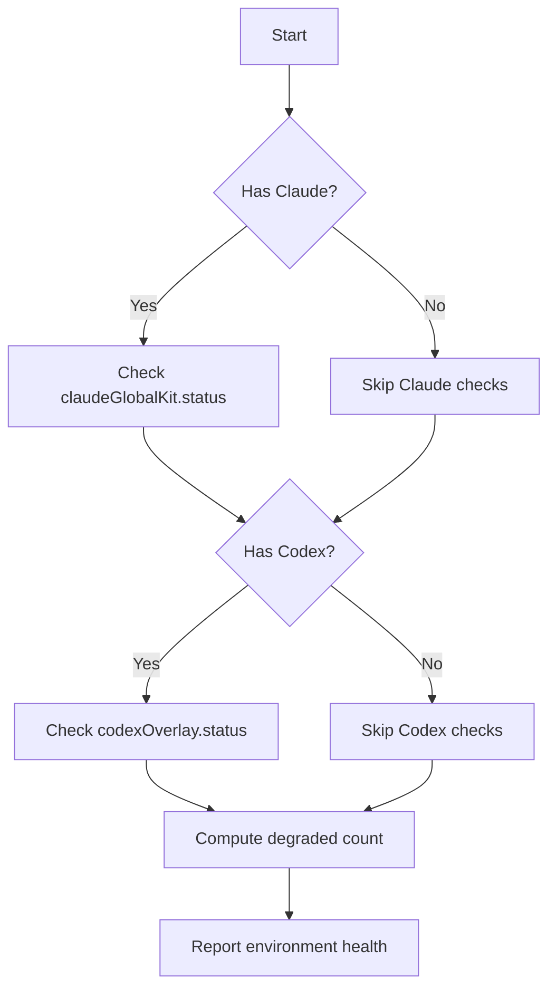

## item_283_gate_claude_and_codex_environment_checks_on_whether_those_assistants_are_installed_and_used - Gate Claude and Codex environment checks on whether those assistants are installed and used
> From version: 1.24.0
> Schema version: 1.0
> Status: Done
> Understanding: 100%
> Confidence: 100%
> Progress: 100%
> Complexity: Low
> Theme: UI
> Reminder: Update status/understanding/confidence/progress and linked request/task references when you edit this doc.

# Problem
- The plugin currently checks `codexOverlay.status`, `claudeGlobalKit.status`, and `claudeBridgeAvailable` unconditionally and includes them in the "Degraded" environment count regardless of whether the user has Claude or Codex installed.
- These checks should only be evaluated and surfaced as issues when the corresponding assistant is actually installed and in use on the user's machine.
- A user who does not use Claude or Codex should see a clean, healthy environment without spurious degradation warnings about tools they have not installed.
- `inspectRuntimeLaunchers` in `src/runtimeLaunchers.ts` already detects whether the `claude` and `codex` binaries are present on PATH (`hasClaude`, `hasCodex`). However, the environment health computation in `src/logicsViewProviderSupport.ts` does not use these flags as a gate — it counts `codexOverlay.status !== "healthy"` and `claudeGlobalKit.status` issues unconditionally.
- The result is that users who only use Ollama, OpenAI, or no AI assistant at all are shown degradation warnings about Claude and Codex configuration, which are irrelevant to them and create noise in the environment check panel.

# Scope
- In: one coherent delivery slice from the source request.
- Out: unrelated sibling slices that should stay in separate backlog items instead of widening this doc.

# Acceptance criteria
- AC1: When the `claude` binary is not detected on PATH, `claudeGlobalKit` and `claudeBridgeAvailable` checks are excluded from the degraded count and not surfaced as issues.
- AC2: When the `codex` binary is not detected on PATH, `codexOverlay` checks are excluded from the degraded count and not surfaced as issues.
- AC3: When both binaries are absent, the environment reports as healthy (assuming no other issues), with no Claude or Codex warnings.
- AC4: When a binary is present, the existing checks behave exactly as before — no regression for users who do have the assistants installed.
- AC5: The environment summary text does not mention Claude or Codex configuration issues if the corresponding binary is absent.

# AC Traceability
- AC1 -> Scope: When the `claude` binary is not detected on PATH, `claudeGlobalKit` and `claudeBridgeAvailable` checks are excluded from the degraded count and not surfaced as issues.. Proof: capture validation evidence in this doc.
- AC2 -> Scope: When the `codex` binary is not detected on PATH, `codexOverlay` checks are excluded from the degraded count and not surfaced as issues.. Proof: capture validation evidence in this doc.
- AC3 -> Scope: When both binaries are absent, the environment reports as healthy (assuming no other issues), with no Claude or Codex warnings.. Proof: capture validation evidence in this doc.
- AC4 -> Scope: When a binary is present, the existing checks behave exactly as before — no regression for users who do have the assistants installed.. Proof: capture validation evidence in this doc.
- AC5 -> Scope: The environment summary text does not mention Claude or Codex configuration issues if the corresponding binary is absent.. Proof: capture validation evidence in this doc.

# Decision framing
- Product framing: Not needed
- Product signals: (none detected)
- Product follow-up: No product brief follow-up is expected based on current signals.
- Architecture framing: Consider
- Architecture signals: data model and persistence
- Architecture follow-up: Review whether an architecture decision is needed before implementation becomes harder to reverse.

# Links
- Product brief(s): (none yet)
- Architecture decision(s): (none yet)
- Request: `req_156_gate_claude_and_codex_environment_checks_on_whether_those_assistants_are_installed_and_used`
- Primary task(s): `task_XXX_example`

# AI Context
- Summary: The plugin currently checks codexOverlay.status, claudeGlobalKit.status, and claudeBridgeAvailable unconditionally and includes them in the "Degraded" enviro...
- Keywords: gate, claude, and, codex, environment, checks, whether, those
- Use when: Use when implementing or reviewing the delivery slice for Gate Claude and Codex environment checks on whether those assistants are installed and used.
- Skip when: Skip when the change is unrelated to this delivery slice or its linked request.
# References
- `logics/skills/logics-ui-steering/SKILL.md`

# Priority
- Impact:
- Urgency:

# Notes
- Derived from request `req_156_gate_claude_and_codex_environment_checks_on_whether_those_assistants_are_installed_and_used`.
- Source file: `logics/request/req_156_gate_claude_and_codex_environment_checks_on_whether_those_assistants_are_installed_and_used.md`.
- Keep this backlog item as one bounded delivery slice; create sibling backlog items for the remaining request coverage instead of widening this doc.
- Request context seeded into this backlog item from `logics/request/req_156_gate_claude_and_codex_environment_checks_on_whether_those_assistants_are_installed_and_used.md`.
- Task `task_126_orchestration_delivery_for_req_150_to_req_154_plugin_polish_and_status_selector` was finished via `logics_flow.py finish task` on 2026-04-11.
