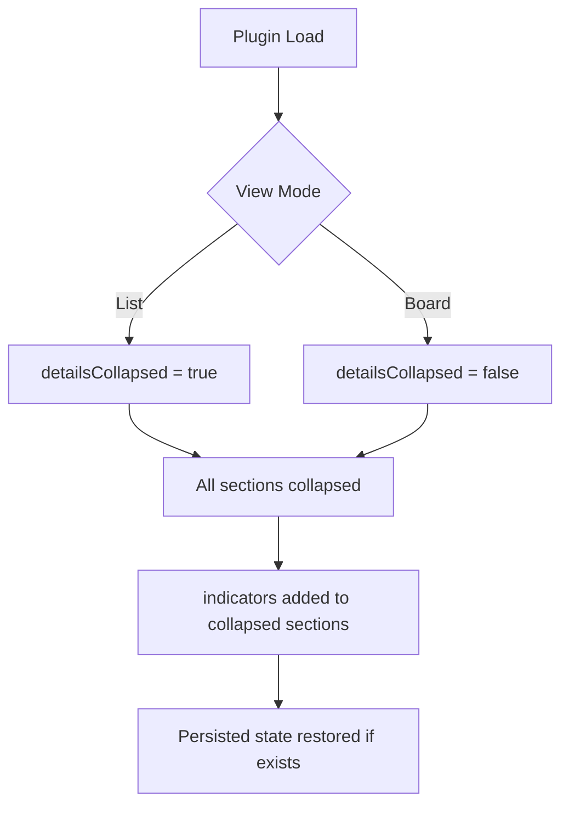

## item_284_initialize_detail_panel_collapsed_in_list_mode_and_all_collapsable_sections_closed_by_default - Initialize detail panel collapsed in list mode and all collapsable sections closed by default
> From version: 1.24.0
> Schema version: 1.0
> Status: Done
> Understanding: 100%
> Confidence: 100%
> Progress: 100%
> Complexity: Low
> Theme: UI
> Reminder: Update status/understanding/confidence/progress and linked request/task references when you edit this doc.

# Problem
- **Need 1** — When the plugin loads in list mode (`viewMode: "list"`), the detail panel must initialize as collapsed (`detailsCollapsed: true`). Currently it always starts open regardless of the view mode.
- **Need 2** — All collapsable sections inside the detail panel must initialize closed. Currently the `indicators` section starts open; all others already default to collapsed.
- In `media/main.js`, `uiState` is initialized with `detailsCollapsed: false` unconditionally (line 138). In list mode, the detail panel occupies horizontal space that is less useful than in board mode — the list is already information-dense and having the detail panel open by default pushes content off-screen and distracts from the list.
- The `defaultCollapsedDetailSections` array (line 99) already collapses 8 of the 9 sections (`attentionExplain`, `contextPack`, `dependencyMap`, `companionDocs`, `specs`, `primaryFlow`, `references`, `usedBy`), but `indicators` (the section key defined at line 385 of `media/renderDetails.js`) is missing from this list and therefore starts expanded. All sections should start closed so the detail panel opens progressively as the user expands what they need.

# Scope
- In: one coherent delivery slice from the source request.
- Out: unrelated sibling slices that should stay in separate backlog items instead of widening this doc.

# Acceptance criteria
- AC1: On first load in list mode, the detail panel is collapsed (`detailsCollapsed: true`).
- AC2: On first load in board mode, the detail panel remains open — existing behaviour preserved.
- AC3: The `indicators` section is added to `defaultCollapsedDetailSections` and starts closed.
- AC4: All 9 collapsable sections in the detail panel start closed on plugin load.
- AC5: Persisted state (from a previous session) is still restored correctly — the new defaults only apply when there is no prior persisted state.

# AC Traceability
- AC1 -> Scope: On first load in list mode, the detail panel is collapsed (`detailsCollapsed: true`).. Proof: capture validation evidence in this doc.
- AC2 -> Scope: On first load in board mode, the detail panel remains open — existing behaviour preserved.. Proof: capture validation evidence in this doc.
- AC3 -> Scope: The `indicators` section is added to `defaultCollapsedDetailSections` and starts closed.. Proof: capture validation evidence in this doc.
- AC4 -> Scope: All 9 collapsable sections in the detail panel start closed on plugin load.. Proof: capture validation evidence in this doc.
- AC5 -> Scope: Persisted state (from a previous session) is still restored correctly — the new defaults only apply when there is no prior persisted state.. Proof: capture validation evidence in this doc.

# Decision framing
- Product framing: Not needed
- Product signals: (none detected)
- Product follow-up: No product brief follow-up is expected based on current signals.
- Architecture framing: Consider
- Architecture signals: data model and persistence
- Architecture follow-up: Review whether an architecture decision is needed before implementation becomes harder to reverse.

# Links
- Product brief(s): (none yet)
- Architecture decision(s): (none yet)
- Request: `req_157_initialize_detail_panel_collapsed_in_list_mode_and_all_collapsable_sections_closed_by_default`
- Primary task(s): `task_XXX_example`

# AI Context
- Summary: **Need 1** — When the plugin loads in list mode (viewMode: "list"), the detail panel must initialize as...
- Keywords: initialize, detail, panel, collapsed, list, mode, and, all
- Use when: Use when implementing or reviewing the delivery slice for Initialize detail panel collapsed in list mode and all collapsable sections closed by default.
- Skip when: Skip when the change is unrelated to this delivery slice or its linked request.
# References
- `logics/skills/logics-ui-steering/SKILL.md`

# Priority
- Impact:
- Urgency:

# Notes
- Derived from request `req_157_initialize_detail_panel_collapsed_in_list_mode_and_all_collapsable_sections_closed_by_default`.
- Source file: `logics/request/req_157_initialize_detail_panel_collapsed_in_list_mode_and_all_collapsable_sections_closed_by_default.md`.
- Keep this backlog item as one bounded delivery slice; create sibling backlog items for the remaining request coverage instead of widening this doc.
- Request context seeded into this backlog item from `logics/request/req_157_initialize_detail_panel_collapsed_in_list_mode_and_all_collapsable_sections_closed_by_default.md`.
- Task `task_126_orchestration_delivery_for_req_150_to_req_154_plugin_polish_and_status_selector` was finished via `logics_flow.py finish task` on 2026-04-11.
