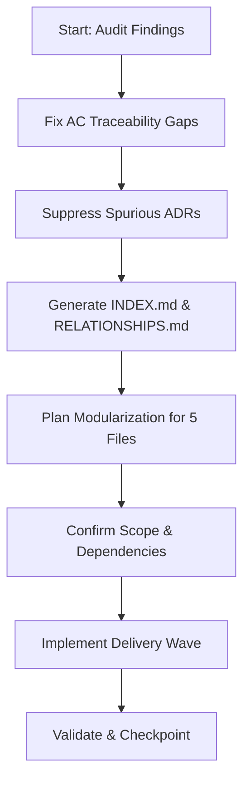

## item_287_create_modularization_plan_for_the_five_oversized_source_files - Create modularization plan for the five oversized source files
> From version: 1.24.0
> Schema version: 1.0
> Status: Ready
> Understanding: 100%
> Confidence: 95%
> Progress: 0%
> Complexity: Medium
> Theme: UI
> Reminder: Update status/understanding/confidence/progress and linked request/task references when you edit this doc.

# Problem
- Fix AC traceability gaps: the 10 new requests (req_150 → req_157) promoted to task_126 are missing per-request AC proof lines in the task doc — the audit flags them as untraced.
- Suppress spurious ADR suggestions: item_277, item_279, item_280, item_281, item_282 are all Low complexity UI fixes. The audit suggests ADRs, but they are not warranted. Their backlog docs should explicitly record "no ADR required" to silence the signal.
- Generate `logics/INDEX.md` and `logics/RELATIONSHIPS.md` so the growing doc set (158 requests, 285 backlog items, 121 tasks) is navigable without scanning every folder.
- Plan modularization of the largest source files: `logicsViewProviderSupport.ts` (1 025 lines), `logicsViewProvider.ts` (1 004 lines), `media/main.js` (1 002 lines), `media/renderBoard.js` (935 lines), `media/logicsModel.js` (910 lines). These are the highest-risk files in the codebase.
- A full project audit (global review + workflow audit) surfaced four categories of improvement. The first two (AC traceability and ADR noise) are documentation hygiene. The third (INDEX/RELATIONSHIPS) is a navigation aid. The fourth (oversized files) is a risk flag — the three files above 1 000 lines are each single points of failure for large surface areas of the plugin.
- ```mermaid
%% logics-kind: backlog
%% logics-signature: backlog|create-modularization-plan-for-the-five-|req-158-address-post-audit-improvements-|fix-ac-traceability-gaps-the-10|ac1-ac-traceability-proof-lines-are
flowchart TD
    Request[req_158_address_post_audit_improvements_ac] --> Problem[Fix AC traceability gaps: the 10]
    Problem --> Scope[Create modularization plan for the five]
    Scope --> Acceptance[AC1: AC traceability proof lines are]
    Acceptance --> Tasks[Execution task]


# Acceptance criteria
- AC1: AC traceability proof lines are added to task_126 for each of req_150 to req_157, so the audit no longer reports traceability gaps.
- AC2: item_277, item_279, item_280, item_281, item_282 each have an explicit note in their Architecture decision section stating no ADR is required, silencing the audit signal.
- AC3: `logics/INDEX.md` is generated and up to date.
- AC4: `logics/RELATIONSHIPS.md` is generated and up to date.
- AC5: A modularization plan exists for the 5 oversized files — either as a new request/backlog item or as explicit notes in `logics/architecture/`.

# AC Traceability
- AC1 -> Scope: AC traceability proof lines are added to task_126 for each of req_150 to req_157, so the audit no longer reports traceability gaps.. Proof: capture validation evidence in this doc.
- AC2 -> Scope: item_277, item_279, item_280, item_281, item_282 each have an explicit note in their Architecture decision section stating no ADR is required, silencing the audit signal.. Proof: capture validation evidence in this doc.
- AC3 -> Scope: `logics/INDEX.md` is generated and up to date.. Proof: capture validation evidence in this doc.
- AC4 -> Scope: `logics/RELATIONSHIPS.md` is generated and up to date.. Proof: capture validation evidence in this doc.
- AC5 -> Scope: A modularization plan exists for the 5 oversized files — either as a new request/backlog item or as explicit notes in `logics/architecture/`.. Proof: capture validation evidence in this doc.

# Decision framing
- Product framing: Required
- Product signals: pricing and packaging, navigation and discoverability
- Product follow-up: Create or link a product brief before implementation moves deeper into delivery.
- Architecture framing: Consider
- Architecture signals: data model and persistence
- Architecture follow-up: Review whether an architecture decision is needed before implementation becomes harder to reverse.

# Links
- Product brief(s): (none yet)
- Architecture decision(s): (none yet)
- Request: `req_158_address_post_audit_improvements_across_workflow_traceability_docs_and_oversized_source_files`
- Primary task(s): `task_XXX_example`

# AI Context
- Summary: Fix AC traceability gaps: the 10 new requests (req_150 → req_157) promoted to task_126 are missing per-request AC...
- Keywords: create, modularization, plan, for, the, five, oversized, source
- Use when: Use when implementing or reviewing the delivery slice for Create modularization plan for the five oversized source files.
- Skip when: Skip when the change is unrelated to this delivery slice or its linked request.
# References
- `logics/skills/logics-ui-steering/SKILL.md`

# Priority
- Impact:
- Urgency:

# Notes
- Derived from request `req_158_address_post_audit_improvements_across_workflow_traceability_docs_and_oversized_source_files`.
- Source file: `logics/request/req_158_address_post_audit_improvements_across_workflow_traceability_docs_and_oversized_source_files.md`.
- Keep this backlog item as one bounded delivery slice; create sibling backlog items for the remaining request coverage instead of widening this doc.
- Request context seeded into this backlog item from `logics/request/req_158_address_post_audit_improvements_across_workflow_traceability_docs_and_oversized_source_files.md`.
