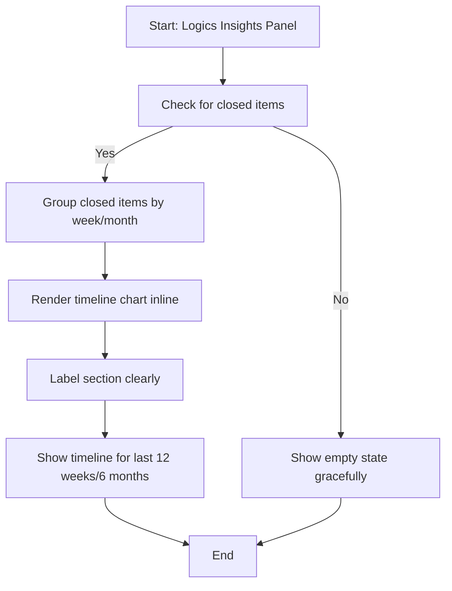

## item_288_add_a_timeline_view_in_logics_insights_showing_delivery_activity_over_time - Add a timeline view in Logics Insights showing delivery activity over time
> From version: 1.24.0
> Schema version: 1.0
> Status: Done
> Understanding: 100% (refreshed)
> Confidence: 100% (refreshed)
> Progress: 100%
> Complexity: Medium
> Theme: UI
> Reminder: Update status/understanding/confidence/progress and linked request/task references when you edit this doc.

# Problem
- Add a timeline section inside the Logics Insights panel that shows delivery activity over time: which items were closed (Done/Archived/Obsolete) per week or month.
- Give the user a visual sense of project rhythm and pace without leaving VS Code.
- The Logics Insights panel (`src/logicsCorpusInsightsHtml.ts`) already aggregates corpus stats (counts by type, status distribution, stale signals). It does not yet show a temporal dimension. A timeline view would answer "what did we ship this week?", "has the pace slowed down?", "when was the last active delivery period?".
- The data is available: every Logics doc has an `updatedAt` timestamp (file mtime or git log). Items with `Status: Done` and a known close date can be bucketed per week/month and rendered as a simple bar chart or sparkline directly in the webview, consistent with the existing Insights HTML generation pattern.

# Scope
- In: one coherent delivery slice from the source request.
- Out: unrelated sibling slices that should stay in separate backlog items instead of widening this doc.

# Acceptance criteria
- AC1: Logics Insights includes a timeline section showing closed items (Done/Archived/Obsolete) grouped by week or month.
- AC2: The timeline covers at least the last 12 weeks or 6 months of activity.
- AC3: The chart renders inline in the existing Insights webview without a new panel or external chart library dependency.
- AC4: The section is clearly labelled and visually distinct from existing stats sections.
- AC5: An empty state is shown gracefully when no closed items exist in the selected window.

# AC Traceability
- AC1 -> Scope: Logics Insights includes a timeline section showing closed items (Done/Archived/Obsolete) grouped by week or month.. Proof: capture validation evidence in this doc.
- AC2 -> Scope: The timeline covers at least the last 12 weeks or 6 months of activity.. Proof: capture validation evidence in this doc.
- AC3 -> Scope: The chart renders inline in the existing Insights webview without a new panel or external chart library dependency.. Proof: capture validation evidence in this doc.
- AC4 -> Scope: The section is clearly labelled and visually distinct from existing stats sections.. Proof: capture validation evidence in this doc.
- AC5 -> Scope: An empty state is shown gracefully when no closed items exist in the selected window.. Proof: capture validation evidence in this doc.

# Decision framing
- Product framing: Consider
- Product signals: experience scope
- Product follow-up: Review whether a product brief is needed before scope becomes harder to change.
- Architecture framing: Not needed
- Architecture signals: (none detected)
- Architecture follow-up: No architecture decision follow-up is expected based on current signals.

# Links
- Product brief(s): (none yet)
- Architecture decision(s): (none yet)
- Request: `req_159_add_a_timeline_view_in_logics_insights_showing_delivery_activity_over_time`
- Primary task(s): `task_XXX_example`

# AI Context
- Summary: Add a timeline section inside the Logics Insights panel that shows delivery activity over time: which items were...
- Keywords: add, timeline, view, logics, insights, showing, activity, over
- Use when: Use when implementing or reviewing the delivery slice for Add a timeline view in Logics Insights showing delivery activity over time.
- Skip when: Skip when the change is unrelated to this delivery slice or its linked request.
# References
- `logics/skills/logics-ui-steering/SKILL.md`

# Priority
- Impact:
- Urgency:

# Notes
- Derived from request `req_159_add_a_timeline_view_in_logics_insights_showing_delivery_activity_over_time`.
- Source file: `logics/request/req_159_add_a_timeline_view_in_logics_insights_showing_delivery_activity_over_time.md`.
- Keep this backlog item as one bounded delivery slice; create sibling backlog items for the remaining request coverage instead of widening this doc.
- Request context seeded into this backlog item from `logics/request/req_159_add_a_timeline_view_in_logics_insights_showing_delivery_activity_over_time.md`.
- Task `task_126_orchestration_delivery_for_req_150_to_req_154_plugin_polish_and_status_selector` was finished via `logics_flow.py finish task` on 2026-04-11.
