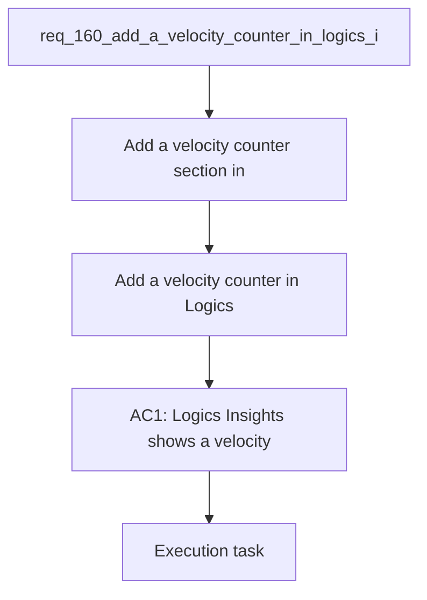

## item_289_add_a_velocity_counter_in_logics_insights_showing_items_closed_per_week_and_month - Add a velocity counter in Logics Insights showing items closed per week and month
> From version: 1.24.0
> Schema version: 1.0
> Status: Done
> Understanding: 100% (refreshed)
> Confidence: 100% (refreshed)
> Progress: 100%
> Complexity: Low
> Theme: UI
> Reminder: Update status/understanding/confidence/progress and linked request/task references when you edit this doc.

# Problem
- Add a velocity counter section in Logics Insights showing how many items were closed (Done/Archived/Obsolete) in the current week and the current month.
- Provide a simple, motivating signal of delivery pace — visible at a glance without any interaction.
- The Logics Insights panel shows corpus stats but no delivery velocity. A velocity counter answers "how productive have we been recently?" with two numbers: items closed this week and items closed this month. It is a lightweight complement to the timeline view (req_159): the timeline shows history, the counter shows current momentum.
- The data already exists in the indexed corpus. This is a small, additive section — 2–3 numbers computed from `updatedAt` + `Status` of closed items, rendered as a stat block consistent with the rest of the Insights layout.

# Scope
- In: one coherent delivery slice from the source request.
- Out: unrelated sibling slices that should stay in separate backlog items instead of widening this doc.

# Acceptance criteria
- AC1: Logics Insights shows a velocity section with the count of items closed in the current ISO week.
- AC2: Logics Insights shows the count of items closed in the current calendar month.
- AC3: The counts cover all workflow item types (requests, backlog items, tasks).
- AC4: The section updates when the Insights panel is refreshed.
- AC5: A zero count is displayed explicitly (not hidden) so the absence of activity is visible.

# AC Traceability
- AC1 -> Scope: Logics Insights shows a velocity section with the count of items closed in the current ISO week.. Proof: capture validation evidence in this doc.
- AC2 -> Scope: Logics Insights shows the count of items closed in the current calendar month.. Proof: capture validation evidence in this doc.
- AC3 -> Scope: The counts cover all workflow item types (requests, backlog items, tasks).. Proof: capture validation evidence in this doc.
- AC4 -> Scope: The section updates when the Insights panel is refreshed.. Proof: capture validation evidence in this doc.
- AC5 -> Scope: A zero count is displayed explicitly (not hidden) so the absence of activity is visible.. Proof: capture validation evidence in this doc.

# Decision framing
- Product framing: Not needed
- Product signals: (none detected)
- Product follow-up: No product brief follow-up is expected based on current signals.
- Architecture framing: Consider
- Architecture signals: data model and persistence
- Architecture follow-up: Review whether an architecture decision is needed before implementation becomes harder to reverse.

# Links
- Product brief(s): (none yet)
- Architecture decision(s): (none yet)
- Request: `req_160_add_a_velocity_counter_in_logics_insights_showing_items_closed_per_week_and_month`
- Primary task(s): `task_XXX_example`

# AI Context
- Summary: Add a velocity counter section in Logics Insights showing how many items were closed (Done/Archived/Obsolete) in the current...
- Keywords: add, velocity, counter, logics, insights, showing, items, closed
- Use when: Use when implementing or reviewing the delivery slice for Add a velocity counter in Logics Insights showing items closed per week and month.
- Skip when: Skip when the change is unrelated to this delivery slice or its linked request.
# References
- `logics/skills/logics-ui-steering/SKILL.md`

# Priority
- Impact:
- Urgency:

# Notes
- Derived from request `req_160_add_a_velocity_counter_in_logics_insights_showing_items_closed_per_week_and_month`.
- Source file: `logics/request/req_160_add_a_velocity_counter_in_logics_insights_showing_items_closed_per_week_and_month.md`.
- Keep this backlog item as one bounded delivery slice; create sibling backlog items for the remaining request coverage instead of widening this doc.
- Request context seeded into this backlog item from `logics/request/req_160_add_a_velocity_counter_in_logics_insights_showing_items_closed_per_week_and_month.md`.
