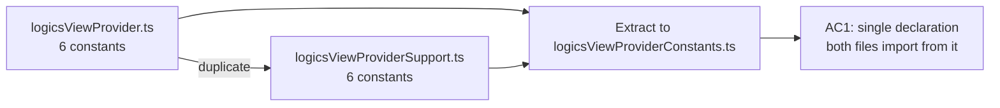

## item_290_extract_duplicated_constants_into_a_shared_plugin_module - Extract duplicated constants into a shared plugin module
> From version: 1.25.0
> Schema version: 1.0
> Status: Done
> Understanding: 95%
> Confidence: 95%
> Progress: 100%
> Complexity: Low
> Theme: Quality
> Derived from `logics/request/req_161_address_plugin_audit_findings_from_april_2026_structural_review.md`

# Problem

Six state-key and version constants are copy-pasted verbatim between `src/logicsViewProvider.ts` and `src/logicsViewProviderSupport.ts`. A change in one file does not propagate to the other, creating a silent drift risk with no compile-time guard.

Constants affected:
- `ROOT_OVERRIDE_STATE_KEY`
- `ACTIVE_AGENT_STATE_KEY`
- `ONBOARDING_LAST_VERSION_KEY`
- `STARTUP_KIT_UPDATE_PROMPT_STATE_PREFIX`
- `MIN_LOGICS_KIT_MAJOR`
- `MIN_LOGICS_KIT_MINOR`

# Scope

- In: create `src/logicsViewProviderConstants.ts`, move the six constants there, update all import sites in `logicsViewProvider.ts` and `logicsViewProviderSupport.ts`.
- Out: any other refactor of those files; no behaviour change.

# Acceptance criteria

- AC1: `ROOT_OVERRIDE_STATE_KEY`, `ACTIVE_AGENT_STATE_KEY`, `ONBOARDING_LAST_VERSION_KEY`, `STARTUP_KIT_UPDATE_PROMPT_STATE_PREFIX`, `MIN_LOGICS_KIT_MAJOR`, and `MIN_LOGICS_KIT_MINOR` are declared in exactly one file and imported everywhere else; `npm run lint:ts` passes with no new errors.

# AC Traceability

- AC1 -> `src/logicsViewProviderConstants.ts` exists and is the sole declaration point. Proof: `grep -rn "ROOT_OVERRIDE_STATE_KEY\s*=" src/` returns exactly one result.
- AC3 -> Out of scope for this item; covered by item_291. Proof: item_291 AC Traceability carries this mapping.
- AC4 -> Out of scope for this item; covered by item_292. Proof: item_292 AC Traceability carries this mapping.
- AC5 -> Out of scope for this item; covered by item_293. Proof: item_293 AC Traceability carries this mapping.

# Decision framing

- Architecture framing: Not needed — pure mechanical extraction, no boundary change.

# Links

- Product brief(s): (none)
- Architecture decision(s): (none)
- Request: `logics/request/req_161_address_plugin_audit_findings_from_april_2026_structural_review.md`
- Primary task(s): `logics/tasks/task_127_orchestrate_april_2026_audit_remediation_across_plugin_and_logics_kit.md`

# AI Context

- Summary: Extract six duplicated constants from logicsViewProvider.ts and logicsViewProviderSupport.ts into a single shared module.
- Keywords: constants, duplication, extract, shared, module, logicsViewProvider, logicsViewProviderSupport
- Use when: Implementing or reviewing the extraction of the six duplicated plugin constants.
- Skip when: The work is unrelated to this extraction or targets a different source file.

# Priority

- Impact: Medium — eliminates silent drift risk with zero behaviour change.
- Urgency: High — must precede any change to those constants.

# Notes
- Wave 1 of task_127 delivered this extraction alongside the other April 2026 audit remediation safe wins.
- Validation was captured in the parent task and remains green for the shared constants module.

# Report
- This backlog slice was delivered during the audit remediation wave and now matches the existing code state.
- Task `task_127_orchestrate_april_2026_audit_remediation_across_plugin_and_logics_kit` was finished via `logics_flow.py finish task` on 2026-04-11.
