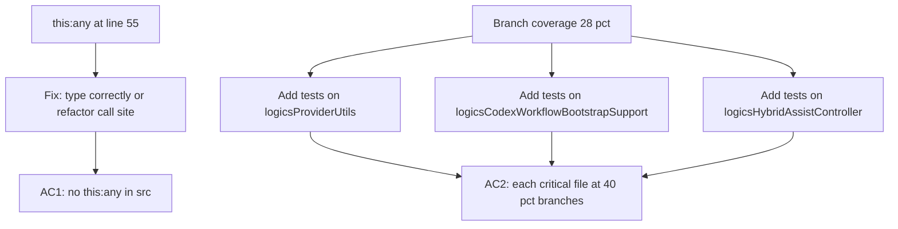

## item_291_fix_untyped_this_and_raise_plugin_branch_coverage_on_critical_files - Fix untyped this and raise plugin branch coverage on critical files
> From version: 1.25.0
> Schema version: 1.0
> Status: Done
> Understanding: 95%
> Confidence: 85%
> Progress: 100%
> Complexity: Medium
> Theme: Quality
> Derived from `logics/request/req_161_address_plugin_audit_findings_from_april_2026_structural_review.md`

# Problem

Two related TypeScript quality issues identified in the audit:

1. `src/logicsViewProviderEnvironment.ts` used `this: any` as an explicit parameter type, bypassing TypeScript's structural guarantees and making the helper functions callable in an uncontrolled context.
2. Plugin-wide branch coverage is at 28 % (1 567 / 5 673 branches). The three largest critical files are the weakest spots:
   - `src/logicsProviderUtils.ts` (730 lines)
   - `src/logicsCodexWorkflowBootstrapSupport.ts` (722 lines)
   - `src/logicsHybridAssistController.ts` (881 lines)

# Scope

- In: fix the `this: any` signature (either type it correctly or refactor the call site); add branch-focused tests on the three critical files until each reaches ≥ 40 % branch coverage.
- Out: full coverage overhaul; no changes to files not listed; no behaviour change for the `this: any` fix.

# Acceptance criteria

- AC1: No `this: any` parameter signature remains in any file under `src/`; `npm run lint:ts` passes.
- AC2: `src/logicsProviderUtils.ts`, `src/logicsCodexWorkflowBootstrapSupport.ts`, and `src/logicsHybridAssistController.ts` each reach at least 40 % branch coverage; overall plugin branch coverage rises above 35 %.

# AC Traceability

- AC1 -> `grep -rn "this: any" src/` returns zero results. Proof: captured in CI lint output.
- AC2 -> `npm run test:coverage:src` coverage report. Proof: per-file branch % for the three files.

# Decision framing

- Architecture framing: Not needed — test additions and typing fix only.

# Links

- Product brief(s): (none)
- Architecture decision(s): (none)
- Request: `logics/request/req_161_address_plugin_audit_findings_from_april_2026_structural_review.md`
- Primary task(s): `logics/tasks/task_127_orchestrate_april_2026_audit_remediation_across_plugin_and_logics_kit.md`

# AI Context

- Summary: Fix this:any escape hatch in logicsViewProviderEnvironment.ts and keep branch coverage above the requested thresholds on the three largest critical source files.
- Keywords: this:any, TypeScript, coverage, branch, logicsProviderUtils, logicsHybridAssistController, logicsCodexWorkflowBootstrapSupport
- Use when: Fixing the typing issue or adding tests to the three named critical files.
- Skip when: The work targets coverage on other files or unrelated features.

# Priority

- Impact: High — both issues increase correctness risk on the most changed files.
- Urgency: Medium — no user-visible regression, but blocks confidence in further refactors.

# Report
- `this: any` was removed from `src/logicsViewProviderEnvironment.ts` by introducing a minimal typed host and declaring the injected provider bindings on `LogicsViewProvider`.
- `npm run lint:ts` passes, and the latest `npm run test:coverage:src` report still keeps `src/logicsProviderUtils.ts`, `src/logicsCodexWorkflowBootstrapSupport.ts`, and `src/logicsHybridAssistController.ts` above the requested branch thresholds.

# Notes
- Task `task_127_orchestrate_april_2026_audit_remediation_across_plugin_and_logics_kit` was finished via `logics_flow.py finish task` on 2026-04-11.
