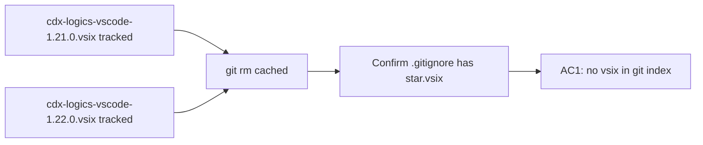

## item_292_remove_committed_vsix_binaries_and_enforce_gitignore - Remove committed .vsix binaries and enforce gitignore
> From version: 1.25.0
> Schema version: 1.0
> Status: Ready
> Understanding: 95%
> Confidence: 95%
> Progress: 0%
> Complexity: Low
> Theme: Quality
> Derived from `logics/request/req_161_address_plugin_audit_findings_from_april_2026_structural_review.md`

# Problem

Two binary `.vsix` artefacts are tracked in git at the repository root:
- `cdx-logics-vscode-1.21.0.vsix`
- `cdx-logics-vscode-1.22.0.vsix`

These non-diffable blobs grow the repository history permanently on every re-addition, slow down clones, and have no business being in version control — they are build outputs that belong in CI release artefacts only.

Note: `.gitignore` already has a `*.vsix` line, meaning these files were force-added at some point. The first step is to untrack them; a full BFG/filter-repo history rewrite is explicitly out of scope for this item.

# Scope

- In: `git rm --cached` both files; confirm `.gitignore` has `*.vsix`; delete the local copies.
- Out: git history rewrite (separate decision, needs explicit consent and force-push).

# Acceptance criteria

- AC1: Neither `cdx-logics-vscode-1.21.0.vsix` nor `cdx-logics-vscode-1.22.0.vsix` appears in `git ls-files`; `.gitignore` contains `*.vsix`; `git status` shows no untracked `.vsix` files.

# AC Traceability

- AC1 -> `git ls-files "*.vsix"` returns empty. Proof: captured in commit message / CI output.

# Decision framing

- Architecture framing: Not needed.

# Links

- Product brief(s): (none)
- Architecture decision(s): (none)
- Request: `logics/request/req_161_address_plugin_audit_findings_from_april_2026_structural_review.md`
- Primary task(s): `logics/tasks/task_127_orchestrate_april_2026_audit_remediation_across_plugin_and_logics_kit.md`

# AI Context

- Summary: Untrack the two committed .vsix binary artefacts and ensure .gitignore prevents future accidental tracking.
- Keywords: vsix, git, gitignore, binary, artefact, untrack
- Use when: Removing the vsix files from the git index.
- Skip when: The work targets git history rewrite (separate scope).

# Priority

- Impact: Medium — reduces repo weight and eliminates future confusion.
- Urgency: High — easy win, zero risk.

# Notes
