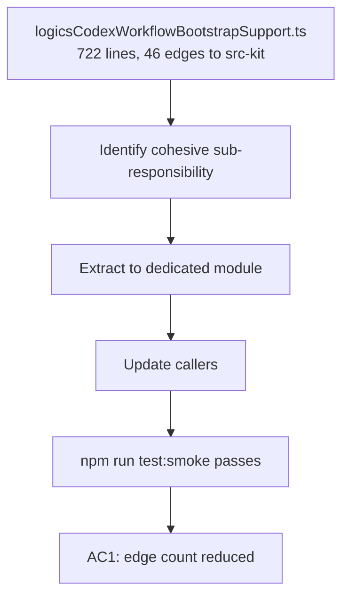

## item_293_reduce_src_bootstrap_hub_coupling_by_extracting_a_dedicated_module - Reduce src-bootstrap hub coupling by extracting a dedicated module
> From version: 1.25.0
> Schema version: 1.0
> Status: Ready
> Understanding: 90%
> Confidence: 80%
> Progress: 100%
> Complexity: High
> Theme: Quality
> Derived from `logics/request/req_161_address_plugin_audit_findings_from_april_2026_structural_review.md`

# Problem

The knowledge graph flags `src-bootstrap` (centred on `src/logicsCodexWorkflowBootstrapSupport.ts`, 722 lines) as a hub node appearing in 6 high-coupling pairs:

| Pair | Edges |
|---|---|
| src-bootstrap ↔ src-kit | 46 |
| src-bootstrap ↔ src-item | 20 |
| src-bootstrap ↔ src-tools | 16 |
| src-bootstrap ↔ tests-canonical | 29 |

This concentration of decision logic makes every change risky: a modification to bootstrap can silently break kit update, item indexing, and tooling in a single edit.

# Scope

- In: identify the most cohesive sub-responsibility in `logicsCodexWorkflowBootstrapSupport.ts` (likely the kit-version inspection logic or the bootstrap-state determination logic); extract it into a new focused module; update all callers; verify smoke tests pass.
- Out: changes to `logicsViewProvider.ts` or `logicsViewProviderSupport.ts`; full rewrite of bootstrap; coverage changes (covered by item_291).

# Acceptance criteria

- AC1: At least one cohesive sub-responsibility is extracted from `src/logicsCodexWorkflowBootstrapSupport.ts` into a new dedicated module; `npm run test:smoke`, `npm run test:lifecycle`, and `npm run lint:ts` all pass; the cross-community edge count between `src-bootstrap` and `src-kit` decreases by at least 30 % (from 46 to ≤ 32).

# AC Traceability

- AC1 -> New module exists with a clear single responsibility. Proof: graph re-run showing reduced edge count; smoke and lifecycle test output.

# Decision framing

- Architecture framing: Required — extraction of a module boundary is an architecture decision.
- Architecture follow-up: Link or create an ADR covering the new module boundary before implementation starts (can reference `adr_020`).

# Links

- Product brief(s): (none)
- Architecture decision(s): `logics/architecture/adr_020_split_the_oversized_plugin_and_workflow_surfaces_into_focused_modules.md`
- Request: `logics/request/req_161_address_plugin_audit_findings_from_april_2026_structural_review.md`
- Primary task(s): `logics/tasks/task_127_orchestrate_april_2026_audit_remediation_across_plugin_and_logics_kit.md`

# AI Context

- Summary: Extract a cohesive sub-responsibility from logicsCodexWorkflowBootstrapSupport.ts to reduce its hub-node coupling in the knowledge graph.
- Keywords: bootstrap, coupling, hub, extract, module, logicsCodexWorkflowBootstrapSupport, graph
- Use when: Planning or implementing the extraction of the bootstrap decision logic.
- Skip when: The work targets other source files or coverage changes.

# Priority

- Impact: High — reduces blast radius for all future bootstrap-adjacent changes.
- Urgency: Medium — depends on item_290 being done first (shared constants must be extracted before further splits).

# Notes
