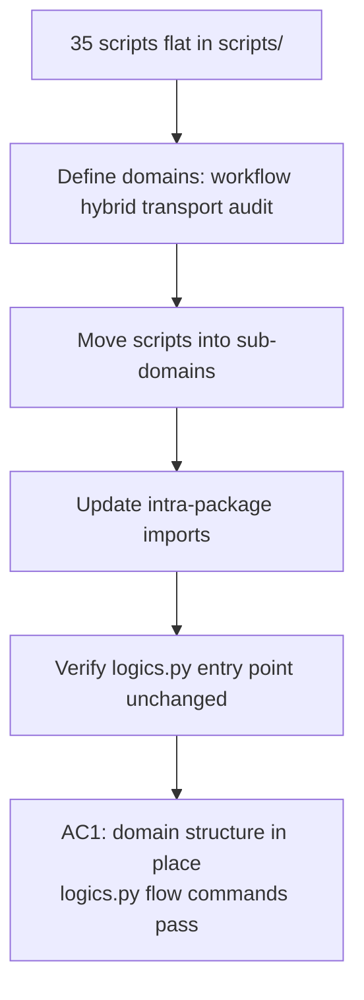

## item_294_reorganise_flow_manager_scripts_by_functional_domain - Reorganise flow-manager scripts by functional domain
> From version: 1.25.0
> Schema version: 1.0
> Status: Done
> Understanding: 90%
> Confidence: 80%
> Progress: 100%
> Complexity: High
> Theme: Quality
> Derived from `logics/request/req_162_address_logics_kit_audit_findings_from_april_2026_structural_review.md`

# Problem

`logics/skills/logics-flow-manager/scripts/` contains 35 Python scripts (~13 000 lines). The current naming convention (`*_core.py`, `*_extra.py`, `*_support.py`) is horizontal by size rather than vertical by responsibility. This makes it hard to find code, reason about boundaries, or scope a change without reading multiple files.

Key files without a clear owning domain:
- `logics_flow_hybrid_transport_core.py` (981 lines)
- `logics_flow_support_workflow_core.py` (974 lines)
- `logics_flow_hybrid_runtime_core.py` (974 lines)
- `logics_flow_hybrid_runtime_fallbacks.py`, `*_metrics.py`, `*_impl.py`, `*_helpers.py` — all floating at the same level

# Scope

- In: define 4 functional sub-domains (`workflow/`, `hybrid/`, `transport/`, `audit/`); move scripts into them; update all intra-package imports; keep the `logics.py` top-level entry point working unchanged.
- Out: logic changes inside the scripts; coverage changes (covered by item_295); plugin-side import path changes (verified but not refactored here).

# Acceptance criteria

- AC1: `logics-flow-manager/scripts/` contains at least the sub-directories `workflow/`, `hybrid/`, `transport/`, and `audit/`; no file remains at the top level with a bare `*_core.py` / `*_extra.py` / `*_support.py` name that lacks a domain prefix; `python logics/skills/logics.py flow new request --title "test"` succeeds end-to-end; `python logics/skills/logics.py audit` exits 0; kit version is bumped.

# AC Traceability

- AC1 -> `ls logics/skills/logics-flow-manager/scripts/` shows domain sub-directories. Proof: smoke test output from `logics.py flow` commands; `audit` exit code.
- AC3 -> Out of scope for this item; covered by item_295. Proof: item_295 AC Traceability carries this mapping.
- AC4 -> Out of scope for this item; covered by item_296. Proof: item_296 AC Traceability carries this mapping.

# Decision framing

- Architecture framing: Not needed — structural rename only, no logic change.

# Links

- Product brief(s): (none)
- Architecture decision(s): `logics/architecture/adr_001_keep_logics_kit_hardening_incremental_generic_and_agent_productive.md`
- Request: `logics/request/req_162_address_logics_kit_audit_findings_from_april_2026_structural_review.md`
- Primary task(s): `logics/tasks/task_127_orchestrate_april_2026_audit_remediation_across_plugin_and_logics_kit.md`

# AI Context

- Summary: Reorganise the 35 flat flow-manager scripts into functional sub-domains (workflow/, hybrid/, transport/, audit/) without changing any logic.
- Keywords: flow-manager, scripts, domain, reorganise, kit, import, structure
- Use when: Planning or executing the structural reorganisation of the flow-manager scripts directory.
- Skip when: The work involves changing script logic, coverage, or unrelated kit scripts.

# Priority

- Impact: High — dramatically reduces cognitive load for any future kit change.
- Urgency: Medium — should precede item_295 (coverage) to keep test paths stable.

# Notes
- Task `task_127_orchestrate_april_2026_audit_remediation_across_plugin_and_logics_kit` was finished via `logics_flow.py finish task` on 2026-04-11.

# Report
- The flow-manager `scripts/` tree already exposes the requested domain sub-directories: `workflow/`, `hybrid/`, `transport/`, and `audit/`.
- The root-level entrypoints are thin shims that redirect execution into the domain folders, so the command surface stays stable while the structure is now domain-oriented.
- No script logic was changed for this backlog slice.
