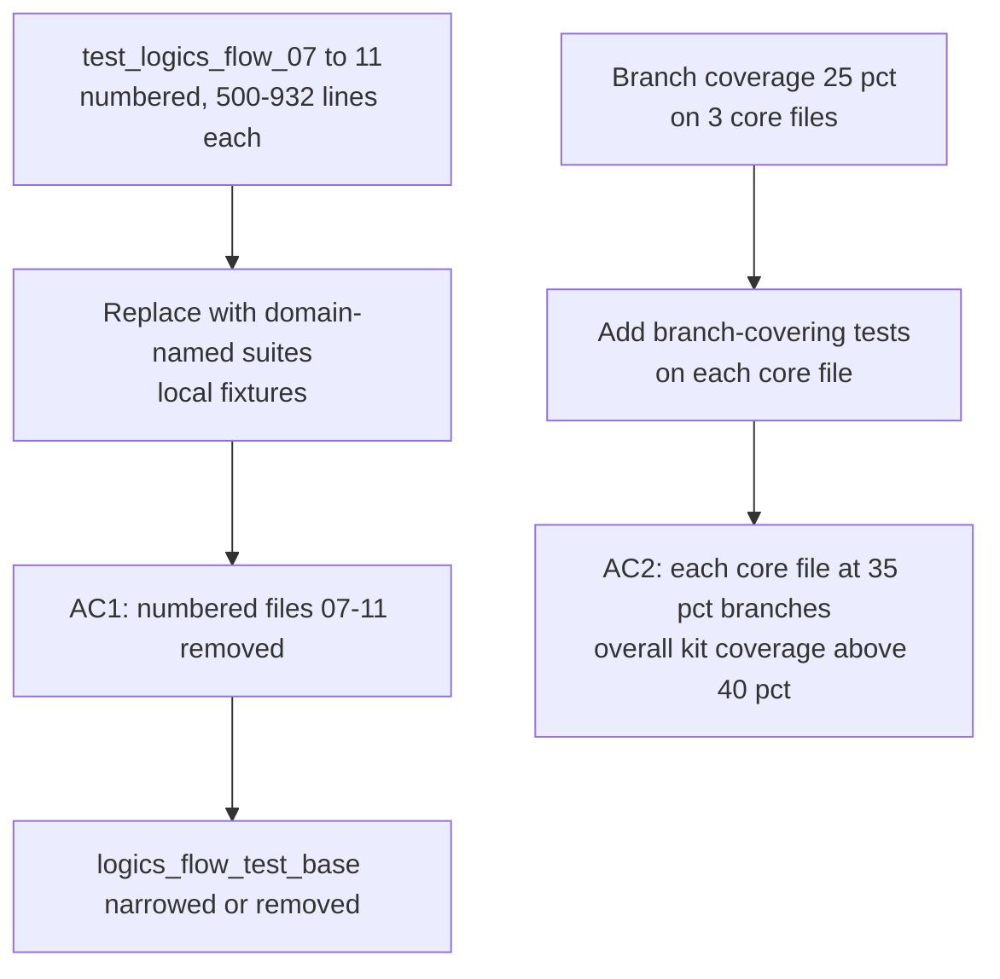

## item_295_raise_kit_branch_coverage_and_reorganise_numbered_test_suites_by_domain - Raise kit branch coverage and reorganise numbered test suites by domain
> From version: 1.25.0
> Schema version: 1.0
> Status: Ready
> Understanding: 90%
> Confidence: 80%
> Progress: 0%
> Complexity: High
> Theme: Quality
> Derived from `logics/request/req_162_address_logics_kit_audit_findings_from_april_2026_structural_review.md`

# Problem

Two interrelated test quality issues in the kit:

1. **Branch coverage at 25 %** (668 / 2 636). The three largest `*_core.py` files are the highest-risk untested surface:
   - `logics_flow_hybrid_transport_core.py` (981 lines)
   - `logics_flow_support_workflow_core.py` (974 lines)
   - `logics_flow_hybrid_runtime_core.py` (974 lines)

2. **Numbered test files grow additively**: `test_logics_flow_01.py` → `test_logics_flow_11.py` (up to 932 lines each), all sharing `logics_flow_test_base.py` as a global fixture base. Adding a test means either widening an existing file or creating yet another number. Finding a test for a specific behaviour requires reading multiple files.

Both issues compound each other: low coverage is partly caused by the test structure making it hard to target a specific module.

# Scope

- In: replace `test_logics_flow_07.py` through `test_logics_flow_11.py` with domain-named suites (`test_hybrid_transport.py`, `test_hybrid_runtime.py`, `test_workflow_core.py`, etc.) with local fixtures; add branch-covering tests on the three `*_core.py` files until each reaches ≥ 35 % branch coverage; narrow or eliminate `logics_flow_test_base.py`.
- Out: reorganisation of `test_logics_flow_01.py` through `test_logics_flow_06.py` (lower risk, deferred); plugin-side test changes.

# Acceptance criteria

- AC1: `test_logics_flow_07.py` through `test_logics_flow_11.py` no longer exist; their coverage is provided by domain-named replacement suites; `npm run coverage:kit` exits 0.
- AC2: `logics_flow_hybrid_transport_core.py`, `logics_flow_support_workflow_core.py`, and `logics_flow_hybrid_runtime_core.py` each reach at least 35 % branch coverage; overall kit branch coverage rises above 40 %.

# AC Traceability

- AC1 -> `ls logics/skills/tests/test_logics_flow_0[7-9].py logics/skills/tests/test_logics_flow_1[01].py` returns nothing. Proof: coverage run exits 0.
- AC2 -> `coverage.xml` branch-rate for each of the three files. Proof: extracted from CI output.

# Decision framing

- Architecture framing: Not needed — test additions and renames only.

# Links

- Product brief(s): (none)
- Architecture decision(s): (none)
- Request: `logics/request/req_162_address_logics_kit_audit_findings_from_april_2026_structural_review.md`
- Primary task(s): `logics/tasks/task_127_orchestrate_april_2026_audit_remediation_across_plugin_and_logics_kit.md`

# AI Context

- Summary: Replace numbered test_logics_flow_07 to 11 with domain-named suites and add branch-covering tests on the three largest core files to raise kit coverage above 40%.
- Keywords: coverage, branch, tests, domain, numbered, logics_flow_test_base, core, kit
- Use when: Adding tests or reorganising test files in the Logics kit.
- Skip when: The work targets plugin tests or scripts outside the flow-manager.

# Priority

- Impact: High — 25 % branch coverage on the workflow engine is the main quality risk in the kit.
- Urgency: Medium — should run after item_294 (domain reorganisation) to keep paths stable.

# Notes
